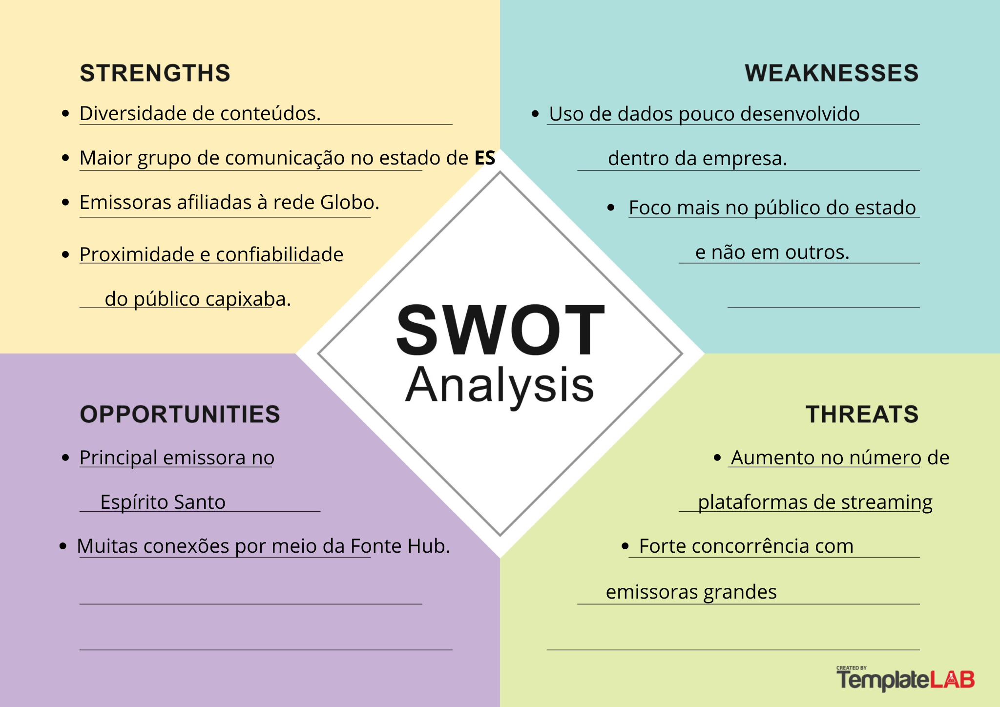
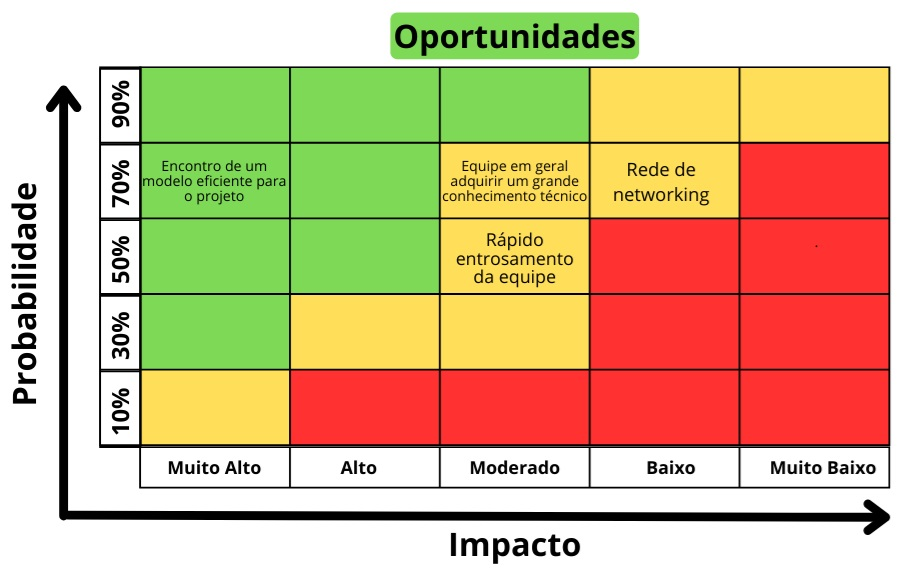
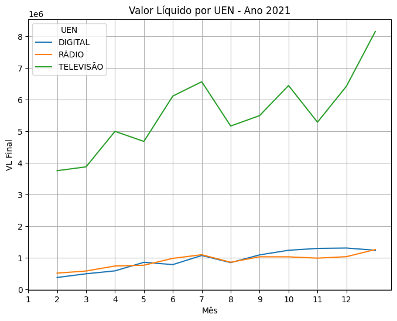
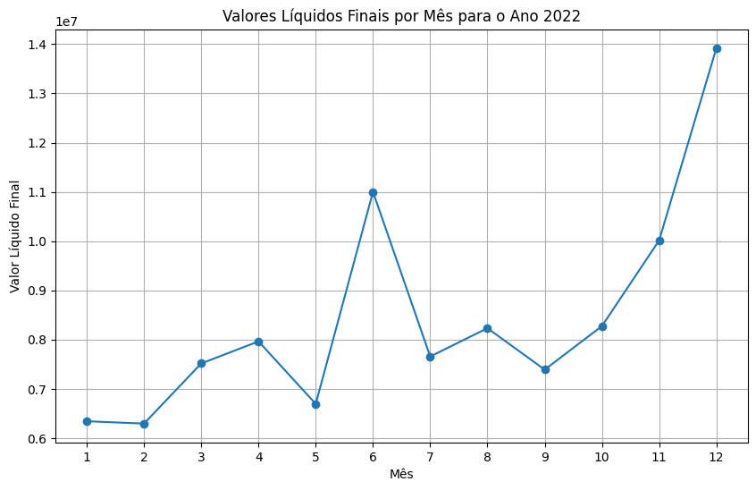

# Documentação Modelo Preditivo - Inteli

## GazeTech Solutions
### GazeTech

Para conhecer mais sobre cada membro, clique em seus nomes ou fotos e visite seus perfis no LinkedIn.
 
<div align="center">
  <table>
     <tr>
      <td align="center"><a href="https://www.linkedin.com/in/andre-lobo-dev/">André Lobo</a></td>
      <td align="center"><a href="https://www.linkedin.com/in/fernanda-correia04/"><br>Fernanda Correia</a></td>
       <td align="center"><a href="https://www.linkedin.com/in/kauanmassuia/"><br>Kauan Massuia</a></td>
     <td align="center"><a href="https://www.linkedin.com/in/miguelclaret/"><br>Miguel Claret</a></td>
      <td align="center"><a href="https://www.linkedin.com/in/raphaelfelipesilva/"><br>Raphael Silva</a></td>
      <td align="center"><a href="https://www.linkedin.com/in/thalyta-viana/"><br>Thalyta Viana</a></td>
    </tr>
  </table>
</div>

## Sumário

[1. Introdução](#1-introdução)

[2. Objetivos e Justificativa](#2-objetivos-e-justificativa)
- [2.1 Objetivos](#21-objetivos)
- [2.2 Proposta de solução](#22-proposta-de-solução)
- [2.3 Justificativa](#23-justificativa)

[3. Metodologia](#3-metodologia)
- [3.1 Entendimento do Negócio (Business Understanding)](#entendimento-do-negocio)
- [3.2 Entendimento dos Dados (Data Understanding)](#entendimento-dos-dados)
- [3.3 Preparação dos Dados (Data Preparation)](#preparacao-dos-dados)
- [3.4 Modelagem (Modeling)](#modelagem)
- [3.5 Avaliação (Evaluation)](#avaliacao)
- [3.6 Implantação (Deployment)](#implantacao)

[4. Desenvolvimento e Resultados](#4-desenvolvimento-e-resultados)
- [4.1 Compreensão do Problema](#41-compreensão-do-problema)
  - [4.1.1 Contexto da indústria](#411-contexto-da-indústria)
    - [Modelos de Negócio](#modelo)
    - [Tendências e Desafios](#tendencias)
    - [Regulamentação e Compliance](#regulamentacao-compliance)
    - [4.1.1.1. 5 Forças de Porter](#4111-5-forças-de-porter)
      - [Rivalidade entre Concorrentes](#rivalidade-entre-concorrentes)
      - [Poder de Barganha dos Fornecedores](#poder-de-barganha-dos-fornecedores)
      - [Poder de Barganha dos Compradores](#poder-de-barganha-dos-compradores)
      - [Ameaça de Novos Entrantes](#ameaca-de-novos-entrantes)
      - [Ameaça de Produtos ou Serviços Substitutos](#ameaca-de-produtos-ou-servicos-substitutos)
  - [4.1.2 Análise SWOT](#412-análise-swot)
    - [Forças](#forcas)
    - [Fraquezas](#fraquezas)
    - [Oportunidades](#oportunidades)
    - [Ameaças](#ameacas)
  - [4.1.3 Planejamento Geral da Solução](#413-planejamento-geral-da-solução)
    - [Dados Disponíveis](#dados-disponíveis)
    - [Solução Proposta](#solução-proposta)
    - [Tipo de Tarefa](#tipo-de-tarefa)
    - [Utilização da Solução Proposta](#utilização-da-solução-proposta)
    - [Benefícios da Solução Proposta](#benefícios-da-solução-proposta)
    - [Critérios de Sucesso e Métricas](#critérios-de-sucesso-e-métricas)
  - [4.1.4 Value Proposition Canvas](#414-value-proposition-canvas)
    - [Produtos e Serviços](#produtos-e-serviços)
    - [Criadores de Ganho](#criadores-de-ganho)
    - [Aliviadores de Dores](#aliviadores-de-dores)
    - [Ganhos](#ganhos)
    - [Tarefas do Cliente](#tarefas-do-cliente)
    - [Dores](#dores)
  - [4.1.5 Matriz de Riscos e Oportunidades](#415-matriz-de-riscos)
    - [Prioridade dos Riscos](#prioridade-dos-riscos)
      - [Baixa](#prioridade-baixa)
      - [Média](#prioridade-média)
      - [Alta](#prioridade-alta)
    - [Prioridade das Oportunidades](#prioridade-das-oportunidades)
      - [Alta](#prioridade-alta2)
      - [Média](#prioridade-média2)
  - [4.1.6 Personas](#416-personas)
  - [4.1.7 Jornadas do Usuário](#417-jornadas-do-usuário)
  - [4.1.8 Política de Privacidade](#418-política-de-privacidade)
    - [Informações de Contato do *Data Protection Officer* (DPO)](#contato-dpo)
    - [Informações gerais sobre o GazeTech](informações-gerais-sobre-o-gazetech)
    - [Informações sobre o tratamento de dados](informações-sobre-o-tratamento-de-dados)
      - [Quais dados pessoais são coletados](quais-dados-pessoais-são-coletados)
      - [Onde os dados são coletados (fonte)](onde-os-dados-são-coletados-fonte)
      - [Para quais finalidades os dados são utilizados](para-quais-finalidades-os-dados-são-utilizados)
      - [Onde os dados ficam armazenados](onde-os-dados-ficam-armazenados)
      - [Qual o período de armazenamento dos dados (retenção)](qual-o-período-de-armazenamento-dos-dados-retenção)
      - [Uso de cookies e/ou tecnologias semelhantes](uso-de-cookies-eou-tecnologias-semelhantes)
      - [Com quem os dados são compartilhados](com-quem-os-dados-são-compartilhados)
    - [Medidas de Segurança Adotadas pelo GazeTech](medidas-de-segurança)
    - [Atendimento aos direitos dos usuários](atendimento-aos-direitos)
    - [Base legal para o tratamento de dados](base-legal)
- [4.2 Compreensão dos Dados](#42-compreensão-dos-dados)
  - [4.2.1 Exploração de dados](#421-exploração-de-dados)
  - [4.2.2 Pré-processamento dos dados](#422-pré-processamento-dos-dados)
  - [4.2.3 Hipóteses](#423-hipóteses)
- [4.3 Preparação dos Dados e Modelagem](#43-preparação-dos-dados-e-modelagem)
- [4.4 Comparação de Modelos](#44-comparação-de-modelos)
  - [4.4.1 Justificativa das métricas](#441-justificativa-das-métricas)
  - [4.4.2 Modelos Candidatos Comparativos](#442-modelos-candidatos-comparativos)
      - [Grid Search](#gridsearchcv)
      - [Light GBM (Modelo de Comparação)](#light-gradient-boosting-machine---modelo-de-comparação)
      - [XGBoost (Modelo de Comparação)](#xgboost-extreme-gradient-boosting---modelo-de-comparação)
      - [XGBoost na base logarítimica (Modelo de Comparação)](#xgboost-extreme-gradient-boosting-na-base-logarítmica---modelo-de-comparação)
      - [Tensor Flow (Modelo de Comparação)](#tensor-flow---modelo-de-comparação)
      - [Sarimax (Modelo de Comparação)](#sarimax-seasonal-autoregressive-integrated-moving-average-with-exogenous-variables)
    - [Explicablidade](#explicabilidade)
      - [Explicabilidade XGBoost](#xgboost)
      - [Explicabilidade LightGBM](#lightgbm)
    - [Comparação entre as métricas do modelo](#comparação-entre-as-métricas-dos-modelos)
- [4.5 Avaliação](#45-avaliação)
  - [Discussão da explicabilidade](#discussão-da-explicabilidade)
  - [Plano de contingência](#plano-de-contingência)
  - [Interface do Modelo](#interface-do-modelo)

[5. Conclusões e Recomendações](#5-conclusões-e-recomendações)
  - [Recomendações de Uso e aspectos Éticos](#recomendações-de-uso-e-aspectos-éticos)
  - [Refutação ou Aceitação das Hipóteses](#refutação-ou-aceitação-das-hipóteses)
  - [Sugestões e Apontamentos](#sugestões-e-apontamentos)
  - [Conclusões finais](#conclusões-finais)

[6. Referências](#6-referências)


## 1. Introdução
&nbsp;&nbsp;&nbsp;&nbsp;A Rede Gazeta, maior grupo de comunicação do Espírito Santo, foi fundada em 1928 com o jornal A Gazeta. Com mais de 500 funcionários, a empresa se dedica a informar, entreter e prestar serviços de comunicação ao público capixaba com qualidade, ética e inovação, contribuindo para o desenvolvimento socioeconômico, cultural e da cidadania. O grupo inclui um site de notícias, oito rádios, quatro emissoras de TV aberta afiliadas à Rede Globo e dois portais de notícias locais (Rede Gazeta, 2023)<sup>[32](#foot32)</sup>.

&nbsp;&nbsp;&nbsp;&nbsp;Atualmente, a definição de metas de venda de publicidade na Rede Gazeta é baseada unicamente no desempenho do ano anterior e na experiência do gestores, desconsiderando fatores críticos como sazonalidade, evolução de desempenho dos principais setores dos clientes e eventos extraordinários. Além disso, métricas relevantes como taxas de ocupação do inventário e descontos aplicados não são levados em conta nas metas, impactando a receita total e a rentabilidade da empresa.

## 2. Objetivos e Justificativa
### 2.1 Objetivos
&nbsp;&nbsp;&nbsp;&nbsp;
O projeto tem como objetivos o desenvolvimento de um modelo preditivo para prever o potencial de receitas futuras com maior assertividade, além de buscar a alocação de metas baseadas em inteligência de dados para ajustar a previsão das receitas da empresa, considerando eventualidades tais como sazonalidade e desempenho econômico.

&nbsp;&nbsp;&nbsp;&nbsp; Em resumo, o projeto visa não apenas melhorar a precisão das previsões de receitas futuras, mas também otimizar a definição de metas através da análise inteligente de dados, levando em conta fatores críticos como sazonalidade e desempenho econômico, garantindo uma estratégia mais eficaz e ajustada à realidade do mercado.

### 2.2 Proposta de solução
&nbsp;&nbsp;&nbsp;&nbsp;A proposta de modelo preditivo para prever a receita líquida da Gazeta utiliza um modelo de regressão múltipla. Esse modelo demonstra maior adequação porque permite prever uma variável dependente contínua, no caso da Gazeta, a receita líquida, com base em variáveis independentes disponíveis nas planilhas fornecidas pelo parceiro, como o valor pago, os descontos aplicados, o meio utilizado para o anúncio, audiência, dados econômicos do Espírito Santo, entre outros.

&nbsp;&nbsp;&nbsp;&nbsp;Por fim, por mais que a lógica dos descontos não seja padronizada, é possível que o modelo possa ajudar a identificar tendências nos dados. Esses insights poderão ser utilizados para futuras negociações e estratégias de vendas.

### 2.3 Justificativa
&nbsp;&nbsp;&nbsp;&nbsp;Nossa proposta de solução visa ser inovadora, reconhecendo a necessidade de aprimorar a previsão da receita líquida da Gazeta. Com a implementação da ferramenta, a Gazeta será capaz de prever suas receitas futuras com maior precisão. Isso é fundamental para o planejamento financeiro e para a tomada de decisões estratégicas, dado que atualmente isso é feito com poucos ou nenhum dado, e na boa-fé dos gestores. Nosso modelo se diferencia quando tentamos achar uma lógica nos descontos aplicados, além do já previsto cálculo da receita líquida, sendo assim mais precisos na previsão. Além disso, ao obter previsões mais concisas, a Gazeta terá a capacidade de ajustar suas estratégias de venda e marketing, sendo possível focar em campanhas mais lucrativas, e assim resultando em um melhor desempenho financeiro e uma gestão mais eficiente.

## 3. Metodologia
&nbsp;&nbsp;&nbsp;&nbsp;A metodologia CRISP-DM *(Cross Industry Standard Process for Data Mining)* é um modelo de processo abrangente e amplamente aceito para mineração de dados, oferecendo um framework detalhado que orienta projetos de análise de dados (SOUZA, 2014)<sup>[41](#foot41)</sup>. Desenvolvido em 1996, este modelo é composto por seis fases principais: entendimento do negócio, entendimento dos dados, preparação dos dados, modelagem, avaliação e implantação. Este processo é totalmente passível de revisões e adaptações ao longo de sua aplicação. No entanto, neste projeto específico, a fase de implantação não será realizada, pois o objetivo é desenvolver um modelo preditivo que será implementado pelo parceiro. A imagem abaixo ilustra o funcionamento da metodologia CRISP-DM em ciclo, assim como suas etapas (HOTZ, 2024)<sup>[19](#foot19)</sup>.

<div align="center">
<sub>Figura 01 - Diagrama do Modelo CRISP-DM </sub><br>
<br>
<sup>Fonte: Medium (2019)</sup>
</div>

<span id="entendimento-do-negocio"></span>

1. **Entendimento do Negócio (Business Understanding):** Esta fase envolve compreender os objetivos do projeto e os requisitos do negócio, traduzindo-os em um problema de mineração de dados bem-definido, através de uma análise do problema e do entendimento do negócio do cliente.

<span id="entendimento-dos-dados"></span>

2. **Entendimento dos Dados (Data Understanding):** Consiste em coletar dados iniciais e usá-los para familiarizar-se com os dados, identificar problemas de qualidade e descobrir insights preliminares.

<span id="preparacao-dos-dados"></span>

3. **Preparação dos Dados (Data Preparation):** Envolve a seleção, limpeza, construção, formatação e transformação dos dados para criar o *dataset* final que será usado nas fases de modelagem e análise. Esta etapa tem como objetivo torná-los mais consistentes e adequados para a modelagem.

<span id="modelagem"></span>

4. **Modelagem (Modeling):** Nesta etapa, diversas técnicas de modelagem são selecionadas e aplicadas aos dados, ajustando parâmetros para otimizar os resultados dos modelos. Nessa etapa, vale destacar que se os resultados não forem os esperados é necessário retornar à etapa de preparação dos dados.

<span id="avaliacao"></span>

5. **Avaliação (Evaluation):** Avalia-se a qualidade e a eficácia dos modelos criados para garantir que os objetivos do negócio sejam atendidos. Decisões sobre o próximo passo são tomadas com base nesta avaliação.

<span id="implantacao"></span>

6. **Implantação (Deployment):** A fase final envolve a implementação prática dos modelos em um ambiente real, podendo incluir a criação de relatórios, a automação de processos ou a integração dos modelos em sistemas de produção. Essa fase consiste em utilizar métricas de desempenho e comparar os resultados com as metas estabelecidas na etapa de entendimento do negócio.

&nbsp;&nbsp;&nbsp;&nbsp;Em conclusão, a metodologia CRISP-DM é ideal para o projeto, pois oferece uma abordagem estruturada e flexível que garante que as análises e modelos desenvolvidos estejam alinhados com os objetivos de negócio, desde a definição do problema até a implantação das soluções.

## 4. Desenvolvimento e Resultados
### 4.1. Compreensão do Problema
#### 4.1.1. Contexto da indústria 

&nbsp;&nbsp;&nbsp;&nbsp;Esta seção explora o ambiente da mídia e comunicação no Espírito Santo, com um olhar focado na Rede Gazeta. Entender o contexto da indústria é crucial para perceber as forças que moldam o mercado e a posição estratégica da Rede Gazeta nesse cenário. O objetivo aqui é oferecer uma visão clara das tendências atuais, dos desafios enfrentados pelas emissoras e das oportunidades que estão surgindo. Analisando o panorama competitivo, os modelos de negócios predominantes, e as regulamentações em vigor, buscamos contextualizar a atuação da Rede Gazeta para apoiar uma formulação de estratégias mais eficaz e decisões mais bem fundamentadas.

&nbsp;&nbsp;&nbsp;&nbsp;Além disso, vamos examinar a evolução dos modelos de negócios no setor, destacando a importância de inovar e se adaptar às novas demandas dos consumidores e às mudanças tecnológicas. Observando as práticas das principais concorrentes, a Rede Gazeta pode identificar melhores práticas e oportunidades para se diferenciar, alinhando sua abordagem às tendências do mercado. Em resumo, esta seção proporciona uma visão crítica e detalhada do setor, essencial para que a Rede Gazeta se posicione com eficiência, responda às mudanças e aproveite novas oportunidades de crescimento.

&nbsp;&nbsp;&nbsp;&nbsp;O setor de mídia e comunicação no Espírito Santo é competitivo, com uma diversidade de players disputando o mercado de televisão, rádio e mídias digitais. A Rede Gazeta se destaca como a principal emissora do estado, oferecendo uma programação diversificada que inclui notícias, entretenimento e esportes. Entre suas principais concorrentes estão a TV Vitória, afiliada à Record TV, conhecida pela sua sólida base de audiência e grande atratividade para anunciantes; a TV Tribuna, afiliada ao SBT, que se destaca na competição por audiência com uma mistura de entretenimento popular e jornalismo; e a TV Capixaba, afiliada à Rede Bandeirantes, com foco em programação local e esportiva (Rede Gazeta, 2023)<sup>[32](#foot32)</sup>.


<span id="modelo"></span>

**Modelos de Negócio**

&nbsp;&nbsp;&nbsp;&nbsp;Os modelos de negócio na indústria de mídia no Espírito Santo variam entre os principais players, mas com algumas semelhanças. A publicidade continua a ser a principal fonte de receita, com anunciantes investindo em espaços publicitários durante transmissões e em mídias digitais. Além disso, algumas emissoras exploram receitas de assinaturas e pagamentos por conteúdos exclusivos, especialmente nas plataformas digitais e em transmissões especiais. Parcerias e co-produções com outras empresas de mídia e produtores independentes são comuns, ajudando a diversificar e enriquecer o conteúdo oferecido (Wikipedia, 2024)<sup>[43](#foot43)</sup>.

&nbsp;&nbsp;&nbsp;&nbsp;Além disso, de acordo com o parceiro, eventos e patrocínios desempenham um papel importante na geração de receita, com emissoras frequentemente organizando ou patrocinando eventos locais e regionais para aumentar a visibilidade e engajamento com o público. As emissoras também têm investido em parcerias e co-produções com outras empresas de mídia e produtores independentes para diversificar e enriquecer seu conteúdo, oferecendo uma gama mais ampla de programação que pode atrair diferentes segmentos de audiência.

&nbsp;&nbsp;&nbsp;&nbsp;Tendo esse contexto em mente, surge a necessidade de ficar sempre atento a estratégias que possam destacar a Rede Gazeta no mercado. E com isso, surgem os modelos preditivos, que estão se tornando cada vez mais importantes na indústria de mídia, oferecendo ferramentas para antecipar tendências e otimizar essas estratégias. Utilizando dados históricos e algoritmos avançados, esses modelos têm o potencial de ajudar as emissoras a prever padrões de audiência, identificar preferências emergentes e ajustar suas ofertas de conteúdo de forma mais eficaz (Greco, 2024)<sup>[15](#foot15)</sup>. Por exemplo, as análises preditivas podem indicar quais tipos de programas têm maior potencial de sucesso com diferentes segmentos de audiência, permitindo uma programação mais alinhada com as expectativas dos espectadores.

&nbsp;&nbsp;&nbsp;&nbsp;Além disso, os modelos preditivos podem melhorar a eficácia das campanhas publicitárias ao identificar os melhores momentos e canais para a veiculação de anúncios. Isso possibilita uma alocação mais eficiente dos recursos publicitários e aumenta a relevância dos anúncios para o público-alvo. Com a integração de dados em tempo real, as emissoras podem ajustar suas estratégias de conteúdo e publicidade dinamicamente, respondendo rapidamente às mudanças nas preferências dos consumidores e às condições do mercado. Essa abordagem tem o potencial de transformar a forma como as emissoras gerenciam suas receitas e ofertam pacotes publicitários, criando oportunidades para maximizar o retorno sobre o investimento.

&nbsp;&nbsp;&nbsp;&nbsp;A crescente integração com plataformas digitais também reflete uma adaptação ao mercado moderno. Muitas emissoras têm expandido suas operações para incluir serviços de streaming e plataformas de vídeo sob demanda, que oferecem conteúdos exclusivos e uma experiência de usuário aprimorada (Lucarelli, 2021)<sup>[23](#foot23)</sup>. Essas mudanças visam capturar a audiência que está migrando para essas novas formas de consumo de mídia e garantir uma posição competitiva em um mercado cada vez mais digital.

&nbsp;&nbsp;&nbsp;&nbsp;Sobre os modelos de negócio, o setor de mídia está em evolução, refletindo a necessidade de diversificar fontes de receita e se adaptar às novas demandas do mercado. Embora a publicidade continue sendo uma principal fonte de receita, a integração com plataformas digitais e a oferta de conteúdos exclusivos estão se tornando cada vez mais importantes. Modelos preditivos têm o potencial de melhorar a gestão dos recursos e personalizar pacotes publicitários, oferecendo uma vantagem competitiva significativa para as emissoras que os adotam de forma eficaz.


<span id="tendencias"></span>

**Tendências e Desafios**

&nbsp;&nbsp;&nbsp;&nbsp;A indústria está atualmente passando por várias tendências e desafios significativos. A digitalização e a crescente popularidade dos serviços de streaming estão transformando a forma como o conteúdo é consumido. Os consumidores estão cada vez mais demandando acesso a conteúdos sob demanda, o que leva as emissoras a investir fortemente em suas plataformas digitais e em tecnologias que permitam o acesso multiplataforma. Um exemplo claro dessa transformação é a **GloboPlay**, lançada pelo Grupo Globo para competir com gigantes como Netflix e Amazon Prime. A Globo investiu em peso na sua plataforma digital, oferecendo conteúdos exclusivos e aprimorando a experiência do usuário. No Espírito Santo, a Rede Gazeta e suas concorrentes estão seguindo essa tendência, expandindo suas ofertas digitais e investindo em novas tecnologias para capturar a audiência que está migrando para plataformas online (Rodrigues, 2024)<sup>[36](#foot36)</sup>.

&nbsp;&nbsp;&nbsp;&nbsp;Outro desafio é a mudança nas preferências dos consumidores, que buscam cada vez mais conteúdo personalizado e interativo. A ascensão dos podcasts e mídias sociais, como exemplificado pelo crescimento dos podcasts de notícias e esportes, exige que as emissoras locais, incluindo a Rede Gazeta, inovem em seus formatos de conteúdo. A popularidade dos podcasts, como o **Café da Manhã** da Folha de S.Paulo, mostra a demanda por novos formatos que oferecem um engajamento mais direto e flexível com a audiência.

&nbsp;&nbsp;&nbsp;&nbsp;Além disso, a concorrência com novas mídias, como plataformas de mídia social e podcasts, intensifica a disputa por atenção e receita publicitária. As emissoras precisam adaptar suas estratégias para enfrentar essa concorrência crescente e atender às expectativas de uma audiência mais exigente e diversificada.

&nbsp;&nbsp;&nbsp;&nbsp;Com relação às tendências e desafios, a indústria de mídia está em meio a uma transformação significativa. A digitalização e a demanda por conteúdo personalizado estão moldando novas formas de consumo de mídia. A crescente concorrência com plataformas de streaming e mídias sociais exige que as emissoras se adaptem e inovem constantemente. Para se manter relevante e competitiva, é crucial que as emissoras diversifiquem suas ofertas e melhorem a experiência do usuário.


<span id="regulamentacao-compliance"></span>

**Regulamentação e Compliance**

&nbsp;&nbsp;&nbsp;&nbsp;A regulamentação e o compliance são aspectos cruciais na indústria de mídia, especialmente em um setor que lida com informações sensíveis e publicidade. No Brasil, a **Agência Nacional do Cinema (ANCINE)** regula a produção e distribuição de conteúdo audiovisual, garantindo a conformidade com as normas nacionais. Além disso, o **Código Brasileiro de Autorregulamentação Publicitária** orienta sobre práticas éticas na publicidade, evitando práticas enganosas e garantindo a transparência.

&nbsp;&nbsp;&nbsp;&nbsp;No Espírito Santo, a **Superintendência de Comunicação Social** supervisiona o cumprimento das leis e regulamentações locais, garantindo que as emissoras operem dentro dos padrões legais e éticos estabelecidos. As emissoras, em geral, devem estar atentas às regulamentações estaduais e federais para garantir a conformidade, o que inclui a adesão às normas de publicidade, proteção de dados e direitos autorais.

&nbsp;&nbsp;&nbsp;&nbsp;A **Lei Geral de Proteção de Dados (LGPD)**, implementada em 2020, trouxe novos desafios para o setor de mídia, exigindo que as emissoras garantam a conformidade com a legislação no tratamento de dados dos usuários, especialmente em plataformas digitais e serviços de streaming.

&nbsp;&nbsp;&nbsp;&nbsp;No âmbito da regulamentação e compliance, é evidente que as normas e regulamentações desempenham um papel crucial na operação da indústria de mídia. O cumprimento das diretrizes da ANCINE, do Código Brasileiro de Autorregulamentação Publicitária e da Lei Geral de Proteção de Dados (LGPD) não só assegura a conformidade legal, mas também fortalece a integridade e a transparência das emissoras. Seguir essas regulamentações é vital para evitar penalidades e manter a confiança do público, essencial para a sustentabilidade a longo prazo.

&nbsp;&nbsp;&nbsp;&nbsp;Em conclusão, a análise do contexto da indústria de mídia no Espírito Santo revela um ambiente dinâmico e competitivo, onde a digitalização e a diversificação das fontes de receita estão moldando o mercado. A crescente popularidade dos serviços de streaming e a mudança nas preferências dos consumidores exigem que as emissoras se adaptem rapidamente às novas demandas e tendências. Nesse cenário, os modelos preditivos se destacam como ferramentas essenciais para a indústria, permitindo às emissoras antecipar padrões de audiência e ajustar suas estratégias de conteúdo e publicidade com maior precisão. Esses modelos ajudam a otimizar a alocação de recursos e a personalização das ofertas publicitárias, oferecendo uma vantagem competitiva significativa. A capacidade das emissoras de inovar em suas ofertas de conteúdo, explorar novas plataformas e utilizar análises preditivas para adaptar suas estratégias será crucial para assegurar sua sustentabilidade e sucesso no mercado. Além disso, a conformidade com regulamentações e normas de proteção de dados continuará a ser um aspecto fundamental para garantir operações eficientes e manter a integridade e a confiança no setor.

##### 4.1.1.1. 5 Forças de Porter
&nbsp;&nbsp;&nbsp;&nbsp;As 5 Forças de Porter são uma ferramenta essencial para analisar a estrutura competitiva de uma empresa dentro de um setor. Esta análise ajuda a entender as dinâmicas do mercado e a posição estratégica da empresa, considerando cinco elementos fundamentais: o **Poder de Barganha dos Fornecedores**, a **Ameaça de Novos Entrantes**, a **Rivalidade entre Concorrentes**, o **Poder de Barganha dos Compradores** e a **Ameaça de Produtos ou Serviços Substitutos**. O infográfico abaixo oferece uma visão detalhada e visual desses aspectos no contexto da Rede Gazeta (Casarotto, 2024)<sup>[5](#foot5)</sup>.

<div align="center">
<sub>Figura 02 - 5 forças de Porter</sub><br>
<br>
<sup>Fonte: Material produzido pelos autores (2024)</sup>
</div>


- **Poder de Barganha dos Fornecedores (amarelo)**: Avalia a influência dos fornecedores sobre a empresa, afetando preços e condições de fornecimento. Fornecedores com grande poder de barganha podem impor termos menos favoráveis e custos elevados.

- **Ameaça de Novos Entrantes (laranja)**: Analisa o impacto da entrada de novos competidores no mercado. Novos entrantes podem trazer inovação e pressionar preços, influenciando a participação de mercado da Gazeta.

- **Rivalidade entre Concorrentes (verde água)**: Mede a intensidade da competição existente. Alta rivalidade pode levar a uma batalha constante por audiência e anunciantes, afetando as margens de lucro.

- **Poder de Barganha dos Compradores (verde claro)**: Examina a influência dos clientes sobre a empresa, afetando preços e qualidade. Compradores com alto poder de barganha podem exigir preços mais baixos e maior qualidade.

- **Ameaça de Produtos ou Serviços Substitutos (verde escuro)**: Considera o risco de substituição dos produtos ou serviços da empresa por alternativas. Substitutos com propostas de valor diferentes podem reduzir a demanda pelos serviços da Gazeta.

&nbsp;&nbsp;&nbsp;&nbsp;Cada seção é acompanhada por pontos detalhados que oferecem informações sobre estratégias e considerações específicas relacionadas a cada força. Este infográfico serve como uma ferramenta visual útil para entender rapidamente os fatores competitivos e estratégicos que influenciam a Rede Gazeta. Ele facilita a interpretação dos principais aspectos da análise das 5 Forças de Porter e ajuda na formulação de estratégias para enfrentar desafios e aproveitar oportunidades no mercado.

<span id="rivalidade-entre-concorrentes"></span>

**Rivalidade entre Concorrentes**

&nbsp;&nbsp;&nbsp;&nbsp;A Rede Gazeta opera em um ambiente altamente competitivo e dinâmico, com diversas empresas buscando a liderança em audiência e publicidade. Os principais concorrentes incluem:

- **TV Vitória**: Afiliada da Record TV, a TV Vitória é uma das principais rivais da Rede Gazeta. Conhecida por sua programação diversificada, incluindo programas de auditório, novelas e jornalismo, a TV Vitória tem uma forte presença regional e uma base de audiência fiel. Sua capacidade de atrair grandes anunciantes e manter uma programação de alta qualidade a torna uma concorrente significativa.

- **TV Tribuna**: Afiliada do SBT, a TV Tribuna compete diretamente com a Rede Gazeta pela audiência capixaba. A TV Tribuna oferece uma combinação de entretenimento popular, como novelas e shows, além de jornalismo local e nacional. Sua estratégia de programação e sua capacidade de atrair uma audiência diversificada a tornam uma competidora robusta no mercado.

- **TV Capixaba**: Afiliada da Rede Bandeirantes, a TV Capixaba também é uma concorrente importante. Focada em programação local e esportiva, a TV Capixaba atrai um público específico e tem uma presença sólida no mercado capixaba. Sua abordagem focada e a capacidade de se conectar com a comunidade local são pontos fortes que a tornam uma ameaça real para a Rede Gazeta.

&nbsp;&nbsp;&nbsp;&nbsp;A Rede Gazeta atua em diversos segmentos do mercado, incluindo televisão, rádio e plataformas digitais. No segmento de televisão, a Gazeta oferece uma programação variada através de seu canal **TV Gazeta**, que inclui jornalismo, entretenimento e esportes, atendendo a uma ampla gama de espectadores. No rádio, a Gazeta possui estações como Rádio Gazeta FM, que transmitem música, notícias e programas de talk-show, alcançando diferentes demografias. Nas plataformas digitais, a empresa investe em conteúdo online através de seu site, aplicativo e interação nas redes sociais, se adaptando às novas tendências de consumo de mídia (Rede Gazeta, 2023)<sup>[32](#foot32)</sup>.

&nbsp;&nbsp;&nbsp;&nbsp;A concorrência pode afetar a Gazeta de várias maneiras. Primeiramente, pode pressionar a empresa a reduzir seus preços de publicidade para competir por anunciantes, diminuindo suas margens de lucro. Além disso, a concorrência pela audiência pode forçar a Gazeta a investir mais em programação de alta qualidade e inovações tecnológicas, aumentando seus custos operacionais. Por exemplo, se a TV Vitória lançar uma nova série de grande sucesso, a Gazeta pode precisar responder com produções próprias de alta qualidade ou aquisições de conteúdo para manter sua base de audiência. A concorrência também pode levar a uma fragmentação da audiência, dificultando a atração e retenção de espectadores e anunciantes.

&nbsp;&nbsp;&nbsp;&nbsp;Para se manter competitiva, a Gazeta precisa inovar constantemente em sua programação, investir em tecnologia e manter um relacionamento próximo com seus anunciantes. Isso inclui a criação de novos formatos de programas, como reality shows e séries exclusivas, além de investimentos em tecnologias emergentes, como plataformas de streaming avançadas e integração com redes sociais para melhorar a experiência do usuário e aumentar o engajamento. A Gazeta também deve manter uma comunicação aberta e contínua com seus anunciantes, ajustando suas ofertas e campanhas publicitárias para atender melhor às necessidades e expectativas dos clientes.

&nbsp;&nbsp;&nbsp;&nbsp;Atualmente, a Gazeta está implementando várias iniciativas para se manter competitiva. A modernização de suas plataformas digitais é um passo crucial, garantindo que o conteúdo esteja disponível e acessível em múltiplos dispositivos. Por exemplo, a Gazeta lançou em junho de 2017 o aplicativo 'A Gazeta', que funciona como uma timeline com as notícias mais recentes publicadas no Gazeta Online e permite aos assinantes acessar o jornal pelo app. Além disso, a diversificação de conteúdo para atrair diferentes públicos é uma estratégia fundamental. A Gazeta tem investido em novos formatos de programas, incluindo podcasts, como o 'Conversa de Redação', que aborda temas relevantes do jornalismo e da atualidade, e vídeos curtos para plataformas digitais, como YouTube e Instagram. A empresa também estabeleceu parcerias estratégicas para co-produção de conteúdo exclusivo, como a série documental 'Histórias Capixabas', que explora aspectos culturais e históricos do Espírito Santo, e especiais jornalísticos como 'Gazeta News Especial', que oferece cobertura de eventos significativos.

&nbsp;&nbsp;&nbsp;&nbsp;Em conclusão, a rivalidade entre concorrentes no contexto da Rede Gazeta é intensa e exige inovação contínua e estratégias eficazes para manter sua posição no mercado. A empresa precisa continuar investindo em tecnologia, diversificação de conteúdo e parcerias estratégicas para se destacar em um ambiente altamente competitivo.

<span id="poder-de-barganha-dos-fornecedores"></span>

**Poder de Barganha dos Fornecedores**

&nbsp;&nbsp;&nbsp;&nbsp;Os fornecedores da Rede Gazeta são diversos e incluem grandes empresas de tecnologia, fornecedores de hardware, software e sistemas de publicidade. Esses fornecedores desempenham um papel vital nas operações diárias da emissora, e o poder de barganha deles varia de acordo com a criticidade dos serviços ou produtos fornecidos e a disponibilidade de alternativas no mercado.

&nbsp;&nbsp;&nbsp;&nbsp;A Rede Gazeta depende significativamente de grandes players de tecnologia, como Microsoft (Azure, 365 e outros), Google, VMware, Totvs e Progress. Essas empresas fornecem plataformas essenciais para a infraestrutura digital e operacional da emissora. O poder de barganha desses fornecedores é alto devido à importância dos serviços que oferecem. Por exemplo, as soluções de nuvem da Microsoft Azure e o Google Workspace são cruciais para a continuidade dos negócios e a eficiência operacional, o que confere a esses fornecedores uma posição de vantagem nas negociações. A dependência da Gazeta dessas tecnologias significa que há uma menor flexibilidade para mudar de fornecedor sem incorrer em custos significativos ou enfrentar desafios técnicos.

&nbsp;&nbsp;&nbsp;&nbsp;A Dell é o principal fornecedor de hardware da Rede Gazeta, fornecendo equipamentos de alta qualidade que são essenciais para o funcionamento diário da empresa. Como a renovação de hardware é um processo contínuo e vital para manter a eficiência e a competitividade, o poder de barganha da Dell é considerável. No entanto, a existência de alternativas competitivas no mercado de hardware pode permitir à Gazeta alguma flexibilidade nas negociações, especialmente se optar por diversificar seus fornecedores ou buscar condições mais favoráveis.

&nbsp;&nbsp;&nbsp;&nbsp;A Rede Gazeta utiliza sistemas de publicidade específicos para cada veículo de comunicação que opera. Para a televisão, utiliza-se o sistema da TDS (Mídia+), além do SIS.COM da Globo. No rádio, a Gazeta utiliza o sistema Pulsar, e no portal digital, ferramentas do Google. Esses sistemas são especializados e críticos para a operação dos veículos de comunicação, conferindo aos fornecedores um poder de barganha considerável. A especificidade desses sistemas reduz as alternativas viáveis no mercado, limitando a capacidade da Gazeta de negociar preços ou condições mais favoráveis.

&nbsp;&nbsp;&nbsp;&nbsp;Para lidar com o poder de barganha elevado de alguns fornecedores, a Rede Gazeta pode adotar uma série de estratégias robustas e diferenciadas que incluem diversificação, inovação interna e negociações estratégicas. A diversificação de fornecedores é uma abordagem fundamental, especialmente em áreas críticas como hardware e tecnologia de software. Ao diversificar suas fontes de fornecimento, a Gazeta pode reduzir sua dependência de um único fornecedor, o que permite maior flexibilidade nas negociações e minimiza o risco de interrupções na cadeia de suprimentos. Por exemplo, além de trabalhar com a Dell, a empresa poderia explorar parcerias com outras grandes fornecedoras de hardware, como HP ou Lenovo, o que fortaleceria sua posição de negociação e garantiria melhores termos e condições.

&nbsp;&nbsp;&nbsp;&nbsp;Outra estratégia importante é o investimento em soluções próprias, como o desenvolvimento de plataformas internas ou a customização de softwares já existentes para atender às necessidades específicas da empresa. Esse movimento não só reduziria a dependência de fornecedores externos, como também poderia resultar em economias de custo a longo prazo. A criação de uma equipe interna dedicada à inovação tecnológica poderia liderar a integração e o desenvolvimento de sistemas que, atualmente, são fornecidos por terceiros, diminuindo o poder de barganha desses fornecedores. Por exemplo, a Gazeta poderia investir no desenvolvimento de ferramentas próprias de gestão de conteúdo e publicidade, o que ofereceria maior controle sobre a operação e a capacidade de personalizar as ferramentas para as necessidades exatas da empresa.

&nbsp;&nbsp;&nbsp;&nbsp;A negociação de contratos de longo prazo com fornecedores estratégicos é outra tática valiosa. Tais contratos podem incluir cláusulas que garantam preços fixos, suporte técnico prioritário, ou condições especiais que beneficiem a Rede Gazeta. Além disso, esses contratos podem ser utilizados como uma forma de barganha para obter compromissos de inovação ou atualizações tecnológicas contínuas sem custos adicionais significativos. Por exemplo, ao negociar contratos de longo prazo com fornecedores de software como Microsoft ou Google, a Gazeta poderia garantir o acesso a novas funcionalidades e atualizações com condições mais favoráveis, além de suporte contínuo, reduzindo o impacto de possíveis aumentos de preços no futuro.

&nbsp;&nbsp;&nbsp;&nbsp;Por fim, a Gazeta pode considerar a formação de alianças estratégicas ou consórcios com outras empresas de mídia para a compra coletiva de tecnologias e serviços, aumentando seu poder de negociação. Isso poderia envolver a criação de um consórcio de emissoras regionais para negociar em conjunto com grandes fornecedores de tecnologia, obtendo assim melhores condições e reduzindo o poder de barganha dos fornecedores.

&nbsp;&nbsp;&nbsp;&nbsp;O poder de barganha dos fornecedores da Rede Gazeta é significativo, particularmente entre grandes empresas de tecnologia e fornecedores especializados. Para mitigar esse impacto, a Gazeta pode adotar uma abordagem estratégica que inclui a diversificação de fornecedores, o investimento em soluções internas e a negociação de contratos de longo prazo. Além disso, a formação de parcerias estratégicas e consórcios com outras empresas de mídia pode fortalecer seu poder de negociação, permitindo a obtenção de melhores condições comerciais e maior controle sobre suas operações. Essas medidas são fundamentais para manter a competitividade e a flexibilidade da emissora no cenário de mídia em constante evolução.

<span id="poder-de-barganha-dos-compradores"></span>

**Poder de Barganha dos Compradores**

&nbsp;&nbsp;&nbsp;&nbsp;Os principais compradores da Rede Gazeta são os anunciantes, que incluem empresas locais e nacionais que investem em publicidade para alcançar o público capixaba. Além disso, assinantes de jornais e revistas representam uma fonte de receita significativa, assim como os usuários de plataformas digitais que consomem conteúdo online.

&nbsp;&nbsp;&nbsp;&nbsp;Esses compradores influenciam a Gazeta demandando conteúdo de qualidade e preços competitivos. As tendências do mercado, como o aumento do consumo digital, aumentam o poder de barganha dos compradores, que esperam mais conteúdo acessível e personalizado. A crescente utilização de métricas de desempenho e análise de dados pelos anunciantes também aumenta suas expectativas em relação ao retorno sobre o investimento publicitário.

&nbsp;&nbsp;&nbsp;&nbsp;Um exemplo da Gazeta lidando com o poder de barganha dos compradores é a implementação de iniciativas como o Globo impacto. Essa estratégia garante maior visibilidade para as marcas anunciantes, impactando o público em horários estratégicos. Com um volume determinado de impactos por um CPM (Custo Por Mil impressões) fixo, oferece segurança e assertividade na escolha do público. O CPM fixo significa que os anunciantes pagam um valor estabelecido para cada mil visualizações de seu anúncio. Além disso, a Gazeta utiliza dados e tecnologia avançada para otimizar os resultados das campanhas. Anunciantes podem acompanhar o desempenho de suas campanhas em tempo real através de relatórios online, proporcionando transparência e controle sobre o investimento publicitário. Essas práticas ajudam a Gazeta a criar ofertas mais atraentes para anunciantes que buscam alcance multiplataforma e resultados eficazes.

&nbsp;&nbsp;&nbsp;&nbsp;Os cuidados que a Gazeta deve tomar incluem a necessidade de manter a qualidade do conteúdo e a inovação constante para atender às expectativas dos compradores. A empresa também deve estar atenta às tendências de mercado e adaptar suas ofertas de acordo com as demandas emergentes. Isso inclui o desenvolvimento de novas plataformas e formatos publicitários, como anúncios interativos e campanhas de marketing de influência.

&nbsp;&nbsp;&nbsp;&nbsp;Fatores que podem afetar o poder de barganha dos compradores incluem mudanças nas preferências dos consumidores e o surgimento de novas plataformas de mídia. A capacidade da Gazeta de oferecer conteúdo exclusivo e de alta qualidade é crucial para manter a lealdade dos compradores e garantir a competitividade no mercado publicitário.

&nbsp;&nbsp;&nbsp;&nbsp;Em conclusão, o poder de barganha dos compradores é alto e exige uma abordagem flexível e orientada ao cliente. A Rede Gazeta precisa continuar a inovar e adaptar suas ofertas para atender às expectativas dos anunciantes e consumidores.

<span id="ameaca-de-novos-entrantes"></span>

**Ameaça de Novos Entrantes**

&nbsp;&nbsp;&nbsp;&nbsp;A ameaça de novos entrantes no mercado de mídia e comunicação onde a Rede Gazeta atua é moderada. Existem várias barreiras de entrada que dificultam a entrada de novos concorrentes. Uma das principais barreiras é o alto custo inicial. Estabelecer uma emissora de televisão ou uma estação de rádio exige um investimento significativo em infraestrutura, licenças e tecnologia. Além disso, a criação de conteúdo de qualidade e a aquisição de direitos de transmissão também requerem recursos financeiros substanciais.

&nbsp;&nbsp;&nbsp;&nbsp;A Gazeta, com mais de 90 anos de atuação no mercado, possui uma audiência leal e uma reputação bem estabelecida, o que torna mais difícil para novos competidores atrair o mesmo nível de confiança e fidelidade do público. A longa história da Gazeta no Espírito Santo tem contribuído para uma relação sólida com a comunidade local, proporcionando um nível de confiança que é desafiador para novos entrantes replicarem.

&nbsp;&nbsp;&nbsp;&nbsp;Além disso, a lealdade da audiência e a reputação estabelecida da Gazeta são barreiras difíceis de superar para novos competidores. A Gazeta mantém sua audiência engajada através de uma programação diversificada e de alta qualidade, que inclui noticiários, entretenimento e esportes. A empresa também investe continuamente em tecnologia e inovação, como a modernização de suas plataformas digitais, para garantir que seu conteúdo seja acessível e atraente para os espectadores.

&nbsp;&nbsp;&nbsp;&nbsp;A concorrência pode intensificar a ameaça de novos entrantes, forçando a Gazeta a melhorar constantemente sua oferta para manter sua posição de mercado. Por exemplo, novas plataformas de streaming e mídias digitais podem tentar capturar uma parte da audiência da Gazeta. Para enfrentar essas ameaças, a Gazeta precisa continuar inovando e oferecendo conteúdo exclusivo que ressoe com seu público. Um exemplo disso é o investimento em produções locais e séries exclusivas que refletem a cultura e os interesses da comunidade capixaba.

&nbsp;&nbsp;&nbsp;&nbsp;Em conclusão, a ameaça de novos entrantes no mercado onde a Rede Gazeta atua é moderada, mitigada por várias barreiras de entrada significativas, incluindo altos custos iniciais, a lealdade da audiência e uma reputação bem estabelecida. A Gazeta deve continuar inovando e se adaptando às mudanças do mercado para manter sua posição de liderança e enfrentar qualquer potencial concorrência de novos entrantes.

<span id="ameaca-de-produtos-ou-servicos-substitutos"></span>

**Ameaça de Produtos ou Serviços Substitutos**

&nbsp;&nbsp;&nbsp;&nbsp;A ameaça de produtos ou serviços substitutos é uma preocupação significativa para a Rede Gazeta. Substitutos podem surgir de diversas formas, incluindo novas tecnologias, mudanças nas preferências dos consumidores e a evolução das plataformas de mídia. O impacto desses substitutos pode ser significativo, pois eles têm o potencial de atrair a audiência e os anunciantes que tradicionalmente escolheriam a Gazeta.

&nbsp;&nbsp;&nbsp;&nbsp;Além das plataformas de streaming de vídeo como Netflix, Amazon Prime Video e YouTube, que oferecem conveniência e acesso sob demanda, os podcasts também representam uma ameaça significativa. A popularização de programas de áudio que podem ser ouvidos a qualquer momento e em qualquer lugar tem atraído a audiência do rádio tradicional para essas novas formas de consumo de conteúdo. Por exemplo, podcasts como 'Café da Manhã', produzido pela Folha de S.Paulo e disponível no Spotify, têm conquistado uma audiência fiel, desafiando as emissoras de rádio tradicionais.

&nbsp;&nbsp;&nbsp;&nbsp;Outra ameaça específica enfrentada pela Gazeta é a publicidade digital nas redes sociais e no Google Ads. Essas plataformas atraem anunciantes ao oferecer segmentação precisa e métricas detalhadas de desempenho, o que pode ser mais atrativo do que a publicidade tradicional em televisão e rádio. A capacidade de atingir públicos-alvo específicos de maneira eficiente é uma vantagem competitiva significativa para essas plataformas digitais.

&nbsp;&nbsp;&nbsp;&nbsp;Para enfrentar essas ameaças, a Gazeta tem adotado várias estratégias. A empresa tem investido na modernização de suas plataformas digitais para garantir que seu público possa acessar as principais notícias e conteúdos em qualquer dispositivo, a qualquer momento. A criação de conteúdo exclusivo e de alta qualidade também é uma prioridade, com a Gazeta investindo em produções locais que reflitam a cultura e os interesses da comunidade capixaba. Essa autenticidade é algo que os grandes players globais de streaming podem não conseguir replicar com a mesma precisão.

&nbsp;&nbsp;&nbsp;&nbsp;Além disso, a Gazeta tem explorado novas formas de engajamento com a audiência através das redes sociais, utilizando essas plataformas para promover seu conteúdo, interagir com os espectadores e atrair novos públicos. Parcerias estratégicas com outras empresas de mídia também têm sido uma tática importante para a Gazeta. Por exemplo, a Gazeta já colaborou com a TV Globo na cobertura de eventos como o Carnaval e as eleições, aproveitando a expertise e os recursos de ambas as organizações para oferecer um produto final de alta qualidade.

&nbsp;&nbsp;&nbsp;&nbsp;Em conclusão, a ameaça de produtos ou serviços substitutos para a Rede Gazeta é significativa, mas a empresa está tomando medidas proativas para enfrentar esses desafios. Através da inovação contínua, investimento em tecnologia e criação de conteúdo exclusivo, a Gazeta busca manter sua relevância e liderança no mercado de mídia do Espírito Santo, garantindo que continue a ser uma escolha preferida tanto para espectadores quanto para anunciantes.

&nbsp;&nbsp;&nbsp;&nbsp;A análise das cinco forças de Porter aplicada à Rede Gazeta de Comunicações destaca um cenário competitivo complexo e em constante evolução. A Gazeta enfrenta desafios significativos, desde a necessidade de manter boas relações com uma diversidade de fornecedores até a pressão constante para inovar em um mercado saturado de concorrentes tradicionais e novos entrantes digitais.

&nbsp;&nbsp;&nbsp;&nbsp;A empresa tem demonstrado resiliência e capacidade de adaptação, aproveitando sua longa história e sólida reputação para manter uma base de audiência leal e atrair anunciantes. A modernização das plataformas digitais, a diversificação de conteúdo e as parcerias estratégicas são algumas das iniciativas que a Gazeta tem adotado para se manter relevante e competitiva.

&nbsp;&nbsp;&nbsp;&nbsp;Além disso, a Gazeta precisa continuar monitorando as mudanças nas preferências dos consumidores e as inovações tecnológicas que estão transformando a indústria da mídia. A capacidade de oferecer conteúdo exclusivo e de alta qualidade, aliado ao uso inteligente das novas tecnologias, será crucial para enfrentar as ameaças de produtos e serviços substitutos, como as plataformas de streaming e os podcasts.

&nbsp;&nbsp;&nbsp;&nbsp;Em resumo, a Rede Gazeta de Comunicações está bem posicionada para navegar pelas pressões competitivas do mercado de mídia no Espírito Santo. A combinação de inovação contínua, investimento estratégico e um forte compromisso com a qualidade do conteúdo permite à Gazeta não apenas enfrentar os desafios atuais, mas também se preparar para as futuras oportunidades de crescimento e liderança no mercado.

#### 4.1.2. Análise SWOT 

&nbsp;&nbsp;&nbsp;&nbsp;A análise SWOT é uma ferramenta utilizada para entender sobre o negócio da empresa e como ela se posiciona no mercado. Através dessa análise é possível entender quais são os fatores tanto externos e internos que impactam o desenvolvimento da empresa, seja no âmbito positivo ou no negativo (Miro, 2024). Sua aplicação é focada na análise e planejamento de estratégias que aumentem o poder das forças e ampliem as oportunidades, ao passo que diminuam a relevância das fraquezas e minimizem as ameaças.

<div align="center">
<sub>Figura 03 - Análise Swot</sub><br>
<br>
<sup>Fonte: Material produzido pelos autores (2024)</sup>
</div>


<span id="forcas"></span>

- **Forças**

&nbsp;&nbsp;&nbsp;&nbsp;A diversidade dos conteúdos produzidos pela Gazeta é uma das suas principais forças, atingindo um público amplo e aumentando a audiência em todos os segmentos. Sendo o maior grupo de comunicação do Espírito Santo e a emissora líder, a Gazeta atrai mais parcerias comerciais e patrocínios, resultando em maior receita e oportunidades de negócios. A afiliação à rede Globo aumenta o reconhecimento da empresa e a qualidade da programação. A proximidade e confiabilidade construídas com o público capixaba são fundamentais, garantindo uma audiência fiel e mantendo a empresa forte no mercado.

<span id="fraquezas"></span>

- **Fraquezas**

&nbsp;&nbsp;&nbsp;&nbsp;Apesar das forças significativas, a Gazeta enfrenta fraquezas que prejudicam seu posicionamento de mercado. O uso de dados é pouco desenvolvido, levando a uma má organização das informações e a uma equipe de tecnologia sem análises detalhadas para orientar suas ações. Além disso, a falta de um plano bem estruturado para resolver problemas internos compromete a eficiência operacional. E por fim, O foco quase exclusivo no público capixaba limita a audiência em outros estados, restringindo seu crescimento.

<span id="oportunidades"></span>

- **Oportunidades**

&nbsp;&nbsp;&nbsp;&nbsp;Ser a principal emissora no Espírito Santo oferece oportunidades para a Gazeta. Com uma posição consolidada, a empresa pode investir em novas tecnologias e formatos de conteúdo, explorando novas formas de engajar o público. O desenvolvimento do Fonte Hub, um ponto de encontro promovido pela rede, representa uma oportunidade significativa para o crescimento e expansão dos negócios.

<span id="ameacas"></span>

- **Ameaças**

&nbsp;&nbsp;&nbsp;&nbsp;O aumento significativo das plataformas de streaming resulta na fragmentação da audiência, já que as pessoas tendem a preferir conteúdos personalizados e acessíveis a qualquer momento. Essa diversificação das opções de entretenimento cria um ambiente altamente competitivo, onde a lealdade do público é constantemente testada. Além disso, a forte concorrência com emissoras renomadas, que possuem uma base de espectadores consolidada e oferecem produções de alta qualidade, intensifica ainda mais o desafio.

&nbsp;&nbsp;&nbsp;&nbsp;Em suma, a análise SWOT revela que, enquanto a Gazeta possui diversas forças e oportunidades para explorar, ela também enfrenta fraquezas internas e ameaças externas que precisam ser cuidadosamente gerenciadas para manter sua liderança no mercado. Essa ferramenta fornece fortes indícios da necessidade de reestruturação do plano de ações da Rede Gazeta a fim de conquistar maior lealdade de seus espectadores e remanejar estrategicamente a variedade de conteúdos com base em dados de popularidade e audiência. 

#### 4.1.3. Planejamento geral da solução

&nbsp;&nbsp;&nbsp;&nbsp;O desenvolvimento de um modelo preditivo para a Rede Gazeta visa melhorar a precisão das metas de receita publicitária, que atualmente são baseadas tanto no desempenho do ano anterior quanto na experiência e no bom senso dos gestores. Embora essas práticas tenham sido úteis até certo ponto, a falta de uma abordagem técnica e quantitativa limita a capacidade de prever com precisão fatores importantes, como sazonalidade e desempenho dos principais setores econômicos. Com a implementação do modelo preditivo, a Rede Gazeta poderá prever essas variáveis com maior assertividade, possibilitando ajustes mais precisos nas previsões e nas estratégias ao longo do ano, o que é fundamental para maximizar os resultados financeiros.

<span id="dados-disponíveis"></span>

**Dados disponíveis**

&nbsp;&nbsp;&nbsp;&nbsp;Os dados fornecidos pela Rede Gazeta para o desenvolvimento do modelo são diversos e abrangem informações sobre audiência, metas de faturamento, veículos utilizados, origem das vendas, segmentação por setor econômico, valores tabelados e líquidos, entre outros. Esses dados são complementados por indicadores econômicos relevantes para a análise, como o indice de preços ao consumidor amplo (IPCA) para o Espírito Santo e o Brasil, e o indice de volume de vendas no comércio varejista (PMC). Todos os dados foram disponibilizados em total conformidade com a lei geral de proteção de dados (LGPD), garantindo a segurança e privacidade das informações. Mais detalhes sobre a conformidade e privacidade dos dados podem ser conferidos na seção [4.1.8 "Política de privacidade"](#418-política-de-privacidade) desta documentação. A riqueza e variedade desses dados fornecem uma base sólida para a criação de um modelo preditivo robusto e preciso.

<span id="solução-proposta"></span>

**Solução proposta**

&nbsp;&nbsp;&nbsp;&nbsp;Para prever a receita líquida da Rede Gazeta, a solução proposta é a implementação de um modelo de regressão linear. Este modelo é especialmente adequado devido à sua capacidade de lidar com variáveis contínuas e complexas, como a receita líquida, utilizando um conjunto de variáveis independentes para gerar previsões detalhadas e precisas.

&nbsp;&nbsp;&nbsp;&nbsp;O modelo de regressão utilizará diversas variáveis independentes, incluindo valores pagos, o meio utilizado para o anúncio e dados econômicos específicos do Espírito Santo. Essas variáveis foram escolhidas por sua relevância na determinação da receita publicitária e permitirão uma análise abrangente dos fatores que impactam a performance financeira da empresa.

&nbsp;&nbsp;&nbsp;&nbsp;Além disso, o modelo será projetado para identificar padrões e tendências dentro dos dados históricos, proporcionando uma análise assertiva que pode informar futuras estratégias de vendas e negociações. A capacidade do modelo de se adaptar às mudanças nos dados e identificar novas tendências permitirá à Rede Gazeta ajustar suas práticas de forma mais precisa, com base em previsões fundamentadas.

&nbsp;&nbsp;&nbsp;&nbsp;A solução proposta não apenas melhorará a capacidade da Rede Gazeta de prever receitas, mas também permitirá uma compreensão mais clara das interações entre diferentes fatores que afetam a receita. Isso proporcionará uma base sólida para decisões estratégicas, como alocação de recursos e ajuste de campanhas publicitárias. Ao integrar a análise preditiva em suas práticas de gestão, a Rede Gazeta poderá otimizar suas campanhas e melhorar a eficácia das estratégias de vendas, resultando em um impacto positivo nas receitas gerais.

<span id="tipo-de-tarefa"></span>

**Tipo de tarefa**

&nbsp;&nbsp;&nbsp;&nbsp;A tarefa principal para o desenvolvimento do modelo preditivo é uma regressão. Esta escolha é justificada pela necessidade de prever valores numéricos futuros de receita, o que se alinha perfeitamente com o objetivo de gerar previsões mensais detalhadas para os próximos 12 meses. A regressão permite modelar a relação entre variáveis dependentes, como a receita gerada, e variáveis independentes, incluindo indicadores econômicos e dados históricos de vendas. Ao estabelecer essas relações, o modelo pode capturar padrões significativos, como a influência de sazonalidades e eventos econômicos nos resultados financeiros, e aplicar esses padrões para prever o desempenho futuro da empresa. Além disso, a regressão é capaz de lidar com diferentes níveis de granularidade nos dados, permitindo prever receitas totais, por veículo, por segmento e por origem de venda, fornecendo assim uma visão detalhada e precisa para a tomada de decisões estratégicas.

<span id="utilização-da-solução-proposta"></span>

**Utilização da solução proposta**

&nbsp;&nbsp;&nbsp;&nbsp;A solução proposta será implementada no ambiente google colab ou jupyter notebook, que oferece uma plataforma acessível e colaborativa, além de ser compatível com as ferramentas necessárias para o desenvolvimento e treinamento do modelo preditivo. O projeto será disponibilizado em linguagem Python, organizado em notebooks, permitindo fácil acompanhamento e colaboração.

&nbsp;&nbsp;&nbsp;&nbsp;Após o treinamento, o modelo será utilizado para gerar previsões mensais de receita, segmentadas por veículo, origem de venda e setor econômico. Essas previsões serão atualizadas continuamente, permitindo ajustes conforme dados mais atualizados se tornarem disponíveis. Por exemplo, se um setor econômico específico começar a apresentar sinais de declínio, o modelo poderá ajustar automaticamente as metas de receita para refletir essa mudança, garantindo que as estratégias da Rede Gazeta estejam sempre alinhadas com a realidade do mercado.

&nbsp;&nbsp;&nbsp;&nbsp;Além disso, o TAPI do projeto não prevê a disponibilização do modelo fora do ambiente do google colab. Por isso, não está no nosso escopo o desenvolvimento de uma interface *frontend* ou outro tipo de interação semelhante com o modelo preditivo. Nosso foco é direcionado ao treinamento, ajustes e aperfeiçoamento contínuos, garantindo que o modelo atenda a todos os requisitos previstos no TAPI.

&nbsp;&nbsp;&nbsp;&nbsp;No entanto, caso a Rede Gazeta manifeste preferência em utilizar o modelo preditivo de maneira prática e integrada a outros processos, será possível realizar adaptações. Isso incluiria a modificação do modelo para se adequar a uma interface mais amigável e menos técnica, como um painel interativo em Power BI. Essa adaptação permitiria que as previsões e análises do modelo fossem mais facilmente acessadas por usuários não técnicos, promovendo uma tomada de decisão mais rápida e alinhada às mudanças do mercado. No entanto, pelo tempo e escopo aumentado, as previsões poderiam ser afetadas devido à pouca disponibilidade de melhora constante.

<span id="benefícios-da-solução-proposta"></span>

**Benefícios da solução proposta**

&nbsp;&nbsp;&nbsp;&nbsp;A implementação do modelo preditivo traz diversos benefícios para a Rede Gazeta. Primeiramente, ele proporcionará uma maior assertividade nas metas de receita, permitindo que a empresa defina metas baseadas em dados concretos, em vez de depender apenas de análises passadas e da experiência dos gestores. Por exemplo, a empresa poderá identificar com antecedência quais setores econômicos têm maior potencial de crescimento e alocar recursos de vendas de forma mais eficiente. Além disso, o modelo permitirá uma gestão mais proativa das receitas, ajustando previsões conforme as mudanças no mercado. Isso significa que a Rede Gazeta poderá responder rapidamente a flutuações econômicas, como mudanças nas taxas de ocupação do inventário publicitário ou variações nas taxas de desconto aplicadas. Esses ajustes dinâmicos ajudarão a maximizar a rentabilidade e a eficiência operacional da empresa.

<span id="critérios-de-sucesso-e-métricas"></span>

**Critérios de sucesso e métricas**

&nbsp;&nbsp;&nbsp;&nbsp;Os critérios de sucesso foram definidos com base em métricas que ajudam a avaliar o desempenho do modelo preditivo, garantindo que ele esteja fornecendo previsões de receita confiáveis e úteis. As principais métricas que utilizaremos são:

- Média de erro absoluta (MAE): Essa métrica foi escolhida por sua simplicidade e clareza ao medir o desempenho do modelo. A MAE nos mostra, em termos diretos, a diferença média entre o valor previsto e o valor real, ignorando se o erro foi para mais ou para menos. No contexto do projeto, onde as previsões de receitas por setor, veículo de comunicação e origem são fundamentais, a MAE proporciona uma visão prática e de fácil interpretação sobre a precisão do modelo. Ela ajuda a Rede Gazeta a compreender o quão próximo o modelo está de prever corretamente as receitas, garantindo que as previsões sejam úteis para o planejamento estratégico e a tomada de decisões.

- Raiz do erro quadrático médio (RMSE): O RMSE foi escolhido por sua habilidade de medir a magnitude dos erros de forma mais intuitiva, uma vez que apresenta os erros na mesma unidade das variáveis preditas. Assim como a MSE, o RMSE dá maior peso a erros maiores, o que é essencial em projetos onde variações bruscas podem ocorrer, como no setor de mídia. Essa métrica é particularmente útil para capturar desvios significativos nas previsões de receita, ajudando a ajustar o modelo para minimizar erros críticos. Além disso, o RMSE facilita a interpretação do desempenho do modelo, já que expressa os erros de maneira mais direta e compreensível, sendo uma boa escolha para avaliar a precisão das previsões em cenários de alta volatilidade.

- Coeficiente de determinação (R²): O R² mede a capacidade do modelo de explicar a variabilidade dos dados reais. No nosso contexto, o R² é foi escolhido pois a Rede Gazeta precisa de previsões que reflitam com precisão o comportamento das receitas em relação aos setores da economia e veículos de comunicação. Se o valor do R² for próximo de 1, significa que o modelo está capturando bem as tendências de receita ao longo do tempo e em diferentes categorias. Isso oferece maior confiança à equipe gestora, mostrando que o modelo compreende as relações fundamentais entre as variáveis e pode ser usado para prever metas de vendas de maneira eficaz.

-  Erro Absoluto Percentual Médio (MAPE): O MAPE é uma métrica de avaliação do quão distantes as previsões estão dos dados de teste fornecidos, frequentemente utilizado para calcular função de perda de regressões, ele retorna seus dados em porcentagem, facilitando a interpretação . No contexto, o MAPE foi escolhido para garantir uma metrificação da porcentagem de erro médio entre os dados treinados e os utilizados para teste, promovendo uma atenção maior caso essa taxa seja relativamente alta.

&nbsp;&nbsp;&nbsp;&nbsp;Essas métricas foram escolhidas por sua relevância no contexto de previsões financeiras. A MAE fornece uma medida simples e fácil de interpretar sobre a precisão geral das previsões, enquanto a RMSE ajuda a identificar grandes erros que podem prejudicar a qualidade das decisões. O R², por sua vez, assegura que o modelo capte as relações mais importantes entre as variáveis envolvidas, o que é crucial para o sucesso de um modelo preditivo aplicado a uma empresa de capital aberto como a Rede Gazeta. E o MAPE pela sua capacidade de análise médio das porcantagens de erro, medidas mais visualizáveis pela seu formato.

&nbsp;&nbsp;&nbsp;&nbsp;Essas métricas serão monitoradas durante todo o processo de desenvolvimento, e o modelo será ajustado conforme necessário. À medida que incluímos ou removemos informações, como dados de novos setores ou mudanças no comportamento de vendas, essas métricas nos ajudarão a entender se o modelo está melhorando ou se precisa de ajustes adicionais.

&nbsp;&nbsp;&nbsp;&nbsp;Além disso, as seguintes perguntas, fornecidas pelo TAPI, guiarão como ajustaremos e acompanharemos o desempenho do modelo:

- Qual será a previsão de receitas mensais para os próximos 12 meses, com base no desempenho de vendas da empresa e dos principais setores da economia?
  
- Qual será a previsão de vendas por segmento econômico?

- Qual será a previsão de vendas por veículo de comunicação?

- Qual será a previsão de vendas por origem (e.g., vendas diretas ou via parcerias)?

&nbsp;&nbsp;&nbsp;&nbsp;Essas perguntas são fundamentais para garantir que o modelo esteja alinhado com as necessidades da Rede Gazeta e possa fornecer previsões que ajudem na tomada de decisões estratégicas.

&nbsp;&nbsp;&nbsp;&nbsp;Em conclusão, a solução atende às necessidades da Rede Gazeta em termos de previsões de receita e também oferece uma ferramenta estratégica para melhorar a competitividade da empresa no mercado. Ao integrar inteligência de dados no processo de tomada de decisões, a Rede Gazeta poderá ajustar suas metas e estratégias de forma mais precisa e eficiente, maximizando assim os resultados esperados. O modelo preditivo desenvolvido será, portanto, um grande aliado para a empresa, contribuindo significativamente para a otimização da gestão de receitas e para a organização geral.

#### 4.1.4. Value Proposition Canvas 
&nbsp;&nbsp;&nbsp;&nbsp;O Canvas de Proposta de Valor é uma ferramenta estratégica que auxilia na compreensão e definição de como um produto ou serviço pode atender as necessidades dos clientes. Por meio deste modelo, é possível identificar as dores e os desejos dos clientes, e alinhar essas informações com as soluções que a empresa oferece. Esse processo permite criar ofertas que se destacam no mercado, ao resolver problemas específicos e entregar benefícios que realmente importam para o público-alvo para o produto ser útil ao mercado(Rabello, 2024)<sup>[31](#foot31)</sup>.

<div align="center">
<sub>Figura 04 - Canvas Proposta de Valor</sub><br>
<br>
<sup>Fonte: Material produzido pelos autores (2024)</sup>
</div>


##### Proposta de Valor

<span id="produtos-e-serviços"></span>

&nbsp;&nbsp;&nbsp;&nbsp; **Produtos e Serviços**
- Ferramenta de previsão de receitas com base em dados históricos e sazonalidade.
  - Essa ferramenta ajuda a prever receitas futuras usando dados antigos, análises de sazonalidade e eventos especiais. O que a torna diferente no mercado é que ela se ajusta automaticamente às mudanças, aprendendo com o comportamento do mercado. Isso garante que as previsões sejam sempre precisas e atualizadas, permitindo que as empresas façam um planejamento mais confiável e tomem decisões com segurança. Além disso, a ferramenta é fácil de usar, ajudando os gestores a entenderem e aplicarem as previsões no dia a dia.

- Uma ferramenta que utiliza dados históricos, análises de sazonalidade e eventos extraordinários para prever receitas futuras com maior precisão.
  - Essa ferramenta ajuda a ajustar as metas de receita de acordo com o desempenho econômico da empresa. Ela analisa os dados econômicos atuais e faz ajustes automáticos nas metas para que fiquem sempre realistas e atingíveis. Isso garante que as metas estejam alinhadas com a situação econômica real, facilitando o planejamento e a tomada de decisões. 

<br>

<span id="criadores-de-ganho"></span>

&nbsp;&nbsp;&nbsp;&nbsp;**Criadores de Ganho**
- Avaliação rápida para decisões de alocação financeira.
  - Essa ferramenta oferece uma avaliação rápida e eficaz para decisões de alocação financeira. Ela permite que os gestores vejam rapidamente quais áreas estão tendo melhor desempenho e onde os recursos são mais necessários. É eficaz pois o cliente percebe esse ganho como uma forma de tomar decisões mais ágeis e informadas, sem precisar passar horas analisando dados. Isso contribui para a proposta de valor ao otimizar o uso dos recursos financeiros e melhorar a eficiência geral da empresa.

- Análises personalizadas no Google Colab para ajuste e visualização de cenários
   - As análises personalizadas no Google Colab permitem ajustar e visualizar diferentes cenários e variáveis de forma flexível. Esse recurso facilita a exploração de cenários futuros de maneira interativa, proporcionando uma visão detalhada e ajustável sem necessidade de conhecimento técnico avançado. Com isso, é possível tomar decisões estratégicas baseadas em dados reais, contribuindo para um planejamento mais eficiente e fundamentado.

<br>

<span id="aliviadores-de-dores"></span>

&nbsp;&nbsp;&nbsp;&nbsp;**Aliviadores de Dores**
- Otimização da análise de linhas e colunas para resultados diretos
  - A otimização da análise de linhas e colunas transforma o processo de análise de dados, substituindo métodos manuais e demorados por resultados diretos e automáticos. Por exemplo, a Netflix utiliza ferramentas de análise de dados avançadas para processar grandes volumes de informações sobre visualizações e preferências dos usuários. Com a automação da análise, a Netflix consegue obter insights em tempo real sobre o comportamento dos seus assinantes, economizando horas de trabalho manual e reduzindo a margem de erro. Esse processo permite ajustes rápidos em suas estratégias de conteúdo e marketing, melhorando a eficiência e a precisão das decisões. A empresa relatou uma melhoria significativa na capacidade de resposta às tendências de consumo e uma maior precisão na previsão de demanda (O.S. Silva, 2010)<sup>[30](#foot30)</sup>.

- Redução de erro nas previsões de faturamento.
  - A redução de erro nas previsões de faturamento é crucial para empresas que precisam planejar com precisão e evitar surpresas financeiras. Um exemplo real é a Walmart, que usa ferramentas avançadas de análise preditiva para melhorar suas previsões de vendas e faturamento. Antes de adotar essas ferramentas, a Walmart enfrentava desafios significativos com previsões imprecisas, o que levava a problemas como excesso de estoque ou falta de produtos. Após implementar soluções baseadas em dados históricos e algoritmos avançados, a empresa conseguiu reduzir o erro nas previsões de faturamento em cerca de 30%. Esse aprimoramento permitiu uma melhor gestão de inventário, reduziu custos operacionais e ajudou a alinhar melhor a oferta com a demanda real, aumentando a eficiência geral.

<br>

##### Perfil do Cliente

<span id="ganhos"></span>

&nbsp;&nbsp;&nbsp;&nbsp;**Ganhos**
- Ajuste de previsões de receitas com adaptabilidade a sazonalidades e desempenho econômico.
  - O ajuste de previsões de receitas com adaptabilidade a sazonalidades e desempenho econômico é crucial para empresas que buscam alinhar suas metas financeiras com as condições reais do mercado. A Procter & Gamble (P&G), por exemplo, implementou uma solução avançada para ajustar suas previsões de receitas considerando sazonalidades e variações econômicas. Utilizando dados históricos e algoritmos preditivos, a P&G conseguiu adaptar suas previsões com maior precisão, levando em conta fatores como eventos sazonais e mudanças econômicas (ESTADÃO CONTEÚDO, 2023) <sup>[10](#foot10)</sup>.
  - Os resultados foram notáveis: a empresa observou uma melhoria de 25% na precisão das suas previsões de receita e uma redução de 15% nos custos associados a ajustes de estoque e campanhas de marketing. Isso se traduziu em uma gestão mais eficaz dos recursos e uma resposta mais ágil às flutuações do mercado. O estudo de caso da P&G demonstra claramente como a adaptabilidade das previsões às sazonalidades e ao desempenho econômico pode proporcionar ganhos significativos na gestão financeira e estratégica.

- Metas de receitas precisas por camada: total, por veículos e por origem de venda.
  - Estabelecer metas de receita detalhadas para diferentes camadas—total, por veículos e por origem de venda—ajuda a alcançar uma gestão financeira mais eficaz. A Nike, por exemplo, utiliza uma metodologia avançada para definir metas de receita em múltiplos níveis. Por meio de ferramentas analíticas, a Nike divide suas metas em categorias como receita total, vendas por tipos de produtos (como calçados e roupas) e por canais de venda (como lojas físicas e e-commerce).
  - Essa segmentação permitiu à Nike otimizar suas estratégias e melhorar a precisão das metas. Em um estudo, a Nike conseguiu aumentar a acurácia das suas previsões de receita em 15% e melhorou a eficácia de suas campanhas de marketing ao alinhar as metas com o desempenho específico de cada categoria. Esse método detalhado ajudou a empresa a identificar áreas de crescimento e a ajustar suas táticas conforme as necessidades de cada segmento (NIKE)<sup>[28](#footNIKE)</sup>..

- Decisões informadas de alocação de metas e recursos com base em dados e análises preditivas
  - Tomar decisões informadas sobre alocação de metas e recursos é fundamental para o sucesso de qualquer empresa. A Intel, por exemplo, adotou uma abordagem baseada em dados e análises preditivas para otimizar a alocação de suas metas e recursos. Utilizando modelos avançados de análise preditiva, a Intel conseguiu alinhar suas metas de vendas e investimentos com tendências de mercado e dados históricos <sup>[55](#foot55)</sup>.
  - Um estudo de caso demonstrou que, ao empregar essas ferramentas, a Intel conseguiu melhorar a precisão na alocação de recursos em 30% e aumentar o retorno sobre investimento (ROI) em suas campanhas de marketing. Com insights mais claros e baseados em dados, a empresa pode ajustar suas estratégias rapidamente e alocar recursos de maneira mais eficaz, garantindo uma gestão mais eficiente e uma adaptação mais ágil às mudanças de mercado.

<br>

<span id="tarefas-do-cliente"></span>

&nbsp;&nbsp;&nbsp;&nbsp;**Tarefas do Cliente**
- Estabelecimento de metas de receita realistas para o time comercial.
  - Definir metas de receita realistas para o time comercial é crucial para garantir que a equipe tenha objetivos alcançáveis e alinhados com a realidade do mercado. A solução oferecida permite que as empresas ajustem suas metas com base em dados de desempenho e análises de mercado, facilitando a integração dessa prática no dia a dia do time comercial.

- Previsões para planejar futuras condições de mercado.
  - A solução para previsões ajuda as empresas a planejar com antecedência para futuras condições de mercado, integrando-se diretamente no processo de tomada de decisão. A ferramenta analisa dados históricos e atuais para gerar previsões que antecipam tendências e mudanças do mercado.
  - No dia a dia, a equipe utiliza essas previsões para ajustar estratégias de longo prazo e curto prazo. Por exemplo, ao receber previsões de demanda para um próximo trimestre, os gestores podem ajustar os planos de produção, modificar orçamentos e adaptar estratégias de marketing. As previsões também ajudam a identificar oportunidades e riscos futuros, permitindo uma preparação mais eficaz e uma resposta ágil às mudanças.
  - A integração dessas previsões no planejamento contínuo garante que as decisões sejam baseadas em dados concretos, proporcionando uma visão clara de como se preparar para diferentes cenários e maximizar as oportunidades.

- Monitoramento das vendas de publicidade
  - O monitoramento das vendas de publicidade é essencial para garantir que as campanhas publicitárias estejam atingindo os objetivos estabelecidos. A solução proposta oferece uma maneira eficaz de acompanhar e analisar as vendas de publicidade em tempo real.
  - Os gestores podem configurar alertas para identificar rapidamente quaisquer variações significativas nas vendas e ajustar estratégias conforme necessário. Por exemplo, se uma campanha específica não está performando conforme o esperado, os ajustes podem ser feitos imediatamente para otimizar o desempenho e maximizar o impacto da publicidade.
  - Além disso, o monitoramento contínuo permite a análise de tendências e o aprendizado com campanhas anteriores, ajudando a melhorar a eficácia das futuras estratégias publicitárias. Essa integração contínua ao processo de vendas e marketing garante uma gestão mais ágil e eficiente das campanhas, contribuindo para melhores resultados e uma alocação mais eficaz dos recursos publicitários.

<br>

<span id="dores"></span>

&nbsp;&nbsp;&nbsp;&nbsp;**Dores**
- As metas de receita baseadas apenas no ano anterior, sem considerar sazonalidade e eventos
  - Basear metas de receita apenas no desempenho do ano anterior pode levar a previsões imprecisas. Isso ocorre porque não considera flutuações sazonais ou eventos inesperados, resultando em metas desalinhadas com a realidade atual.
  - A solução propõe ajustar as metas integrando dados de sazonalidade e eventos extraordinários. Isso garante que as metas sejam mais realistas e adaptadas às condições de mercado, melhorando a precisão no planejamento e na gestão de recursos.

- Ajustes baseados no feeling dos gestores, sem suporte técnico ou dados.
  - Fazer ajustes de metas com base apenas na intuição dos gestores, sem suporte técnico ou dados, pode levar a decisões imprecisas e menos eficazes. A solução oferece uma abordagem baseada em dados para ajustar metas, garantindo decisões mais informadas e precisas. Isso ajuda a evitar erros comuns e melhora a eficácia das estratégias de planejamento.

- Metas desconsideram sazonalidade, setores e eventos, impactando receita e rentabilidade.
  - Metas que não levam em conta sazonalidade, setores específicos e eventos extraordinários podem resultar em previsões imprecisas, afetando negativamente a receita e a rentabilidade. A solução ajusta as metas considerando esses fatores, garantindo previsões mais precisas e uma melhor gestão financeira.

&nbsp;&nbsp;&nbsp;&nbsp;Concluindo, o Canvas de Proposta de Valor permite que a empresa alinhe suas soluções às reais necessidades dos clientes. Com ferramentas que ajustam metas de receita de acordo com sazonalidades e previsões mais precisas, a empresa pode tomar decisões mais informadas e estratégicas com essa proposta visual. Ao focar em resolver as dores dos clientes e adaptar-se às mudanças de mercado, a empresa consegue se destacar, garantindo que suas ofertas sejam relevantes e eficazes.

<span id="#415-matriz-de-riscos"></span>

#### 4.1.5. Matriz de Riscos e Oportunidades

&nbsp;&nbsp;&nbsp;&nbsp;A Matriz de Riscos é uma ferramenta utilizada para analisar e avaliar os potenciais riscos de um projeto. Esses riscos são organizados e classificados em uma matriz que analisa a probabilidade de ocorrência do risco e o impacto caso ele se concretize, sendo dispostos em uma escala crescente. Com isso, é possível realizar a análise de quais riscos merecem ser priorizados, a partir do encontro entre a probabilidade e o impacto, permitindo assim uma gestão mais eficaz do projeto (Napoleão, 2019)<sup>[26](#foot26)</sup>. 

&nbsp;&nbsp;&nbsp;&nbsp;Já a Matriz de Oportunidades é uma ferramenta utilizada para identificar e avaliar as potenciais oportunidades de um projeto ou iniciativa. Essas oportunidades são organizadas e classificadas em uma matriz que considera a probabilidade de sua ocorrência e o impacto positivo que podem gerar, caso sejam aproveitadas. As oportunidades são dispostas em uma escala crescente, permitindo a visualização clara de quais delas têm o maior potencial de benefício para o projeto. A partir do cruzamento entre a probabilidade e o impacto, a matriz auxilia na priorização das oportunidades que devem ser exploradas, contribuindo para uma gestão mais proativa e estratégica (Consultor Exponencial, 2024)<sup>[8](#foot8)</sup>.

<div align="center">
<sub>Figura 05 - Matriz De Riscos</sub><br>
<br>
<sup>Fonte: Material produzido pelos autores (2024)</sup>
</div>

   <span id="prioridade-dos-riscos"></span>

**Prioridade dos Riscos:**
  
  <span id="prioridade-baixa"></span>
- Baixa:
  - Falta de comprometimento dos membros da equipe:
    - A falta de comprometimento afetaria a produção do modelo preditivo como um todo, pois diversos problemas podem ocorrer decorrentes desse risco, como deixar de fazer alguma tarefa ou até mesmo fazer de uma forma incorreta, gerando uma predição ineficaz ao final do projeto. Poderíamos evitar esse risco com um acordo de comprometimento, o qual já foi escrito e compartilhado com o grupo. 
    - Plano de resposta ao risco:
      - Baseado na estratégia de mitigar o risco caso isso aconteça, o plano é marcar uma reunião de emergência com o grupo para acertarmos os acordos de equipe, compartilhar pontos de melhoria e alertar ao grupo sobre potenciais desempenhos ruins.
  - Má comunicação entre os membros da equipe:
    - A má comunicação entre os membros da equipe pode ter um impacto significativo no desenvolvimento e na produção do modelo preditivo. Pois quando a comunicação é ineficiente, há uma maior probabilidade de mal-entendidos e falta de alinhamento entre as tarefas, resultando em uma entrega ineficaz ou incorreta. Isso pode comprometer a qualidade do produto final, impactando a tomada de decisões baseadas no modelo e, potencialmente, afetando negativamente os resultados do projeto. Para mitigar esse risco, é essencial que todos os membros da equipe estejam cientes das expectativas, metas e responsabilidades desde o início, o que pode ser formalizado através de um contrato social do grupo, o qual já foi realizado.
    - Plano de resposta ao risco:
      - Baseado na estratégia de mitigar o risco, o plano de resposta é convocar uma reunião de emergência com todos os membros da equipe. Durante essa reunião, o objetivo será revisar e reforçar os acordos de equipe já estabelecidos no contrato social, além de discutir as falhas de comunicação que ocorreram e encontrar soluções para evitar que o problema se repita. A reunião também servirá para realinhar as expectativas e garantir que todos os membros estejam na mesma página do projeto para entregar um bom modelo preditivo.
  - Falta de conhecimento técnico dos membros da equipe:
    - O impacto desse problema afetaria a produção do modelo preditivo como um todo. Este problema pode levar a erros na coleta e interpretação dos dados, na escolha e aplicação de algoritmos, e na avaliação do desempenho do modelo. Isso resultaria em predições imprecisas, comprometendo a eficácia do modelo e, consequentemente, a credibilidade do projeto como um todo. Poderíamos evitar esse risco realizando todos os autoestudos e principalmente comparecendo as instruções. 
    - Plano de resposta ao risco:    
      - Baseado na estratégia de mitigar o risco, caso a falta de conhecimento técnico ocorra, os membros da equipe devem aumentar sua dedicação ao material de estudo e, quando necessário, buscar auxílio com os monitores disponíveis. Isso pode incluir esclarecer dúvidas, participar de sessões de revisão e procurar recursos adicionais com os orientadores. Essas ações são essenciais para preencher as lacunas de conhecimento, garantindo que o progresso do grupo não seja comprometido e que a qualidade final da entrega seja mantida.
  - Doença de um membro do grupo:
    - O impacto da doença de um membro da equipe pode afetar a capacidade de entrega do projeto, principalmente se a pessoa afetada tiver uma função crítica. Isso pode causar atrasos no cronograma, aumentar a carga de trabalho dos demais membros, e comprometer a qualidade das entregas, especialmente se a ausência for prolongada. Para amenizar esse risco, deve-se ter um plano de backup para funções críticas, como manter documentações atualizadas e acessíveis, para que outros membros possam assumir responsabilidades em caso de necessidade.
    - Plano de resposta ao risco: 
      - Caso um membro da equipe adoeça, redistribuir imediatamente suas tarefas entre os demais membros para garantir que as atividades essenciais continuem sem grandes interrupções e avaliar a necessidade de ajustar prazos e comunicar qualquer alteração necessária ao parceiro, mantendo a transparência sobre as razões dos ajustes.

 <span id="prioridade-média"></span>
- Média:
  - Sistema pouco intuitivo para o usuário:
    - Um sistema pouco intuitivo pode ter um impacto significativo no uso do modelo preditivo. Se a interface do sistema não for fácil de usar ou entender, os usuários podem encontrar dificuldades para interagir com o modelo e interpretar suas predições, o que pode levar a uma adoção limitada e à utilização ineficaz do sistema. Para mitigar esse risco, é fundamental garantir que o sistema seja desenvolvido com uma interface amigável e fácil de usar, o que pode ser alcançado por meio de testes de usabilidade com parceiros ou usuários potenciais.
    - Plano de resposta ao risco:
      -  Caso o sistema seja pouco intuitivo após a implementação, o plano de resposta é utilizar o feedback obtido durante os testes de usabilidade para realizar ajustes no sistema. Isso pode incluir modificações na interface, simplificação dos fluxos de trabalho e melhorias na navegação, visando tornar o sistema mais acessível e fácil de usar para os usuários finais.
  - Quebra da LGPD:
    - A quebra da Lei Geral de Proteção de Dados pode ter um impacto severo tanto na imagem do grupo quanto na do Inteli, além de resultar em possíveis sanções legais. Além dos danos à reputação, a não conformidade pode levar a ações legais e comprometer a confiança dos usuários e stakeholders no projeto, afetando negativamente sua continuidade e sucesso. Poderíamos evitar esse risco garantindo que todas as práticas relacionadas a utilização de dados estejam alinhadas com a LGPD, assegurando a proteção e o consentimento apropriado dos dados pessoais.
    - Plano de resposta ao risco:    
      - Caso ocorra uma quebra da LGPD, o plano de resposta é revisar imediatamente todos os processos e dados utilizados no projeto. Isso inclui ajustar os procedimentos para garantir que todos os dados estejam em conformidade com os requisitos legais e corrigir qualquer não conformidade identificada de forma ágil e rápida para não ocorrer nenhum problema futuro de impacto maior.
  - Demora ao conseguir informações:
    - A demora na obtenção de informações pode afetar significativamente o cronograma do projeto, resultando em atrasos na execução das tarefas subsequentes e na entrega final. Isso pode, por sua vez, comprometer a qualidade do modelo preditivo, uma vez que decisões e ajustes críticos podem ser adiados ou mal informados. Para mitigar, deve-se identificar logo no início do projeto, todas as informações essenciais necessárias e solicitar essas informações com a maior antecedência possível.
    - Plano de resposta ao risco:
      - Durante a espera pelas informações, repriorizar outras tarefas do projeto que não dependem das informações pendentes, para garantir que o tempo seja utilizado de forma eficiente.

<span id="prioridade-alta"></span>
- Alta:
  - Escolha inadequada de modelo:
    - A escolha inadequada de um modelo preditivo pode ter um impacto negativo significativo, tornando o sistema ineficaz para o parceiro e levando à realização de análises que não atendem às necessidades ou expectativas do cliente. Um modelo inadequado pode gerar previsões imprecisas ou irrelevantes, comprometendo a utilidade do sistema e, consequentemente, prejudicando a satisfação do cliente e a credibilidade do projeto. Para evitar esse risco, é essencial realizar uma pesquisa aprofundada para identificar o modelo mais adequado e confirmar essa escolha com a orientação de um professor e/ou especialista.
    - Plano de resposta ao risco:      
      - Caso a escolha inadequada de um modelo preditivo seja identificada, o plano de resposta é substituir o modelo atual por outro mais adequado, que melhor se ajuste à proposta do projeto. Esta substituição deve ser feita com base nas orientações obtidas durante a pesquisa inicial e nas consultas realizadas com o professor e de forma rápida e precisa para minimizar qualquer impacto negativo.
  - Falha técnica no modelo preditivo:
    - Uma falha técnica no modelo preditivo pode comprometer significativamente a eficácia do sistema, tornando-o ineficaz para o parceiro e prejudicando a confiança nas predições geradas. Isso pode resultar em decisões incorretas baseadas em dados falhos, o que não só afeta a usabilidade do sistema, mas também pode impactar negativamente o sucesso do projeto e a satisfação do cliente. Para evitar esse risco, é essencial refinar e testar o código continuamente ao longo de cada sprint, focando nas funcionalidades críticas.
    - Plano de resposta ao risco:   
      - Caso uma falha técnica no modelo preditivo seja detectada, o plano de resposta é realizar uma revisão completa do código para identificar e corrigir os problemas existentes. Além disso, devem ser realizados testes para garantir que o modelo esteja funcionando corretamente e de forma estável.
  - Dados insuficientes ou poluídos:
    - A utilização de dados insuficientes ou poluídos pode comprometer a produção do modelo preditivo, resultando em previsões imprecisas ou ineficazes. Dados de baixa qualidade dificultam o aprendizado do modelo e podem gerar padrões irrelevantes ou incorretos, o que prejudica a capacidade do sistema de fornecer resultados confiáveis e úteis para o parceiro. Para evitar esse risco, é essencial realizar uma limpeza rigorosa da base de dados nas primeiras sprints e conduzir uma análise de qualidade para assegurar que os dados sejam adequados para o treinamento.
    - Plano de resposta ao risco:  
      - Caso o problema de dados insuficientes ou poluídos se manifeste, o plano de resposta é entrar em contato com o parceiro para solicitar uma nova base de dados, que seja mais adequada e de melhor qualidade para uso no projeto. Essa abordagem permite transferir o risco de falhas no modelo devido a dados inadequados para o parceiro, que pode fornecer dados mais completos e limpos, assegurando que o modelo preditivo tenha uma base para gerar previsões eficazes.
  - Mudança de opinião do parceiro:
    - As mudanças nos requisitos do parceiro podem ter um impacto significativo no projeto, afetando o escopo e o cronograma. Essas alterações podem exigir revisões no modelo preditivo, mudanças nas funcionalidades já desenvolvidas, ou até mesmo a redefinição completa de certas partes do projeto. Isso pode resultar em atrasos na entrega, retrabalho, e potencial frustração da equipe. Portanto, para mitigar esse risco é necessário ter uma comunicação regular com o parceiro ao longo do projeto, realizando consultas frequentes para garantir que os requisitos continuem alinhados e que o parceiro esteja ciente do progresso e das limitações técnicas. Isso ajuda a evitar surpresas e facilita o ajuste de expectativas ao longo do projeto.
    - Plano de resposta ao risco:
      - Sempre que uma mudança nos requisitos for solicitada, realizar imediatamente uma avaliação detalhada do impacto dessa mudança sobre o escopo, cronograma e qualidade do projeto, além de sua adequeção com o TAPI (Termo de Abertura de Projeto Inteli). Essa avaliação deve ser apresentada ao parceiro para que ele compreenda as implicações da alteração.

**Prioridade das Oportunidades:**

<div align="center">
<sub>Figura 06 - Matriz de Oportunidades</sub><br>
<br>
<sup>Fonte: Material produzido pelos autores (2024)</sup>
</div>

<span id="prioridade-alta2"></span>
- Alta:
  - Encontro de um modelo eficiente para o projeto:
    - A descoberta de um modelo eficiente para o projeto teria um impacto altamente positivo, garantindo que a abordagem preditiva produzida seja eficaz e atenda perfeitamente às necessidades do parceiro.
    - Plano de resposta à oportunidade:
      - Para explorar essa oportunidade, o plano é conduzir pesquisas aprofundadas sobre diferentes abordagens e modelos que possam ser aplicados ao problema. Em seguida, serão realizados testes com essas alternativas para identificar a opção mais eficiente. As descobertas serão compartilhadas com o professor e com a equipe para validar a escolha final, garantindo que o modelo selecionado seja o mais adequado e eficaz para atender às expectativas do parceiro.
      <span id="prioridade-média2"></span> 
- Média:
  - Equipe em geral adquirir um grande conhecimento técnico:
    - O desenvolvimento de um alto nível de conhecimento técnico entre os membros da equipe teria um impacto extremamente positivo, tanto no projeto atual quanto em futuros projetos. Um aumento na competência técnica permitiria à equipe enfrentar desafios complexos com maior eficiência, resultando em soluções mais inovadoras e eficazes.
    - Plano de resposta à oportunidade:
      -  Para maximizar essa oportunidade, o plano é incentivar a participação ativa de todos os membros em todas as fases do projeto, promovendo um ambiente de aprendizado contínuo. Isso inclui o compartilhamento regular de conhecimentos e habilidades entre os membros da equipe, além da organização de sessões de estudo e discussões focadas em temas técnicos relevantes. Essas iniciativas não apenas aprofundam o conhecimento técnico, mas também fomentam um espírito colaborativo que beneficia o desempenho coletivo.
  - Rápido entrosamento da equipe:
    - O rápido entrosamento da equipe teria um impacto altamente positivo, promovendo uma colaboração mais eficaz e aumentando a produtividade. Com uma equipe bem entrosada, a comunicação flui melhor, as tarefas são realizadas de forma mais coordenada, e os membros trabalham de maneira mais harmoniosa, o que contribui para a produção de resultados de maior qualidade no projeto.
    - Plano de resposta à oportunidade:
      - Para aproveitar essa oportunidade, o plano é incentivar a comunicação constante entre os membros da equipe, promovendo um ambiente onde todos se sintam à vontade para compartilhar ideias e preocupações. É igualmente importante abordar e resolver rapidamente qualquer conflito que possa surgir, garantindo que o entrosamento se mantenha forte e eficiente ao longo do projeto.
  - Rede de Networking:
    - A oportunidade de expandir a rede de contatos durante um projeto de desenvolvimento de um modelo preditivo pode ter grandes benefícios, tanto para os membros da equipe quanto para a Gazeta. Essa oportunidade é extremamente valiosa, pois um networking bem-sucedido pode abrir portas para futuras colaborações, proporcionar acesso a novas oportunidades de carreira, e fortalecer a reputação dos profissionais e da organização.
    - Plano de resposta à oportunidade:
      - Para aproveitar a oportunidade, é necessário que desde o início do projeto, haja um mapeamento dos principais contatos que podem ser valiosos para a expansão da rede. 

&nbsp;&nbsp;&nbsp;&nbsp;Para concluir, a análise completa das possíveis vulnerabilidade que podem influenciar o desenvolvimento da modelagem preditiva é facilitada pela Matriz de Riscos. Ao identificar os riscos com base em seu impacto e probabilidade de ocorrência, é possível estabelecer uma hierarquia de prioridades para as ameaças. Isso permite a adoção de medidas preventivas eficazes, que contribuam para a redução dos riscos e para o sucesso do projeto. Além disso, a Matriz de Riscos também permite identificar e explorar oportunidades que podem potencialmente beneficiar o projeto. Assim, além de mitigar ameaças, a matriz também serve como um guia para aproveitar ao máximo as condições favoráveis, contribuindo para o alcance dos objetivos e o sucesso geral do projeto.

**Mitigação dos Riscos**:

&nbsp;&nbsp;&nbsp;&nbsp; Em análise posterior ao tracejar dos riscos, tomamos como responsabilidade explicar como os mesmos foram mitigados ao longo de desenvolvimento do projeto, indicador de que um bom trabalho está sendo feito pelo grupo e que as possibilidade do trabalho tomar rumos desastrosos vêm diminuindo. Abaixo os problemas mitigados:

- Falta de comprometimento dos membros da equipe:
  - o aspecto em questão foi mitigado por meio de duas principais vertentes: 
    - criação de um contrato social entre os membros do grupo, que estabeleceu regras de convivência e responsabilidades para com os demais membros do grupo.
    - comprometimento individual dos membros, que é possível observar pelo desempenho na entrega de tasks ao longo do módulo, que pode ser validado pelos commits no github e na avaliação do orientador em relação ao grupo.

- Má comunicação entre os membros da equipe:
  - Esse caso possui resolução parcialmente similar ao anterior, usando dos seguintes aspectos:
    - criação de um contrato social entre os membros do grupo, que estabeleceu regras de convivência e responsabilidades para com os demais membros do grupo.
    - avaliação em grupo com orientador Marcelo para apontar desempenho dos membros e falhas na comunicação em método de avaliação 360.

- Falta de conhecimento técnico dos membros da equipe:
  - A falta de conhecimento técnico da equipe sempre é uma surpresa, pois os integrantes possuem métodos de aprendizagem distintos e tempo também diferentes. Eis a medidas tomadas para solucionar isso:
    - Realização de autoestudos por todos os membros do grupo, visando maximizar o entendimento dos tópicos discutidos.
    - Discussões em grupo dos problemas enfrentados durante o desenvolvimento, dessa forma dúvidas de um membro podem ser tiradas por outros, acelerando a realização das tasks.

- Doença de um membro do grupo:
  - Enfermidades sempre são um problema e o pior, geralmente imprevisíveis. Abaixo as decisões tomadas nesses casos:
    - Avisar membros do grupo em caso de adversidades de saúde, informando a situação para não deixar o grupo na mão
    - Membro pedindo tasks para *home office* em casos leves de enfermos e redistribuição de tasks em casos mais graves, para focar em recuperar-se o mais brevemente.

- Quebra da LGPD:
  - A quebra da LGPD é um problema que se extende para além do projeto, podendo afetar tanto a integridade do Inteli como universidade quanto da Rede Gazeta como empresa, portante medidas severas foram tomadas para superar isso:
    - Adição dos arquivos sensíveis no *git ignore*: como os dados que, caso feito upload para o github podem comprometer a LGPD são de tipos específicos, adicionamos esse tipo de arquivos na lista de arquivos para serem ignorador pelo versionador.
    - Revisar e documentar possíveis falhas na segurança da informação do nosso projeto, criando camadas de proteção e revisão nas informações em pares, garantindo que nada seja enviado nos outputs dos notebooks.

- Demora ao conseguir informações:
  - A conquista dos dados mediante autorização do parceiro foi uma problemática extensa ao desenrolar do módulo, dado a impossibilidade da Rede Gazeta de fornecer mais dados para o modelo:
    - Encontro com gerente de negócios do parceiro para validar impossibilidade absoluta de compartilhar mais informações.
    - Escolha de modelos que conseguem desempenhar seu papel com uma menor quantidade de dados, por mais que isso possa impactar sua eficiência.

- Escolha inadequada de modelo:
  - A escolha de um modelo ineficiente pode impactar negativamente o desenvolvimento do projeto, portanto medidas para evitar ao máximo isso foram tomadas:
    - Tentativas com múltiplos modelos distintos: modelos de regressão, classificação, rede neural e outros. Diversos modelos foram testados para determinar qual se adaptaria melhor ao nosso cenário.
    - Métricas de avaliação para os modelos: utilizamos de métricas como RMSE, MAE, R² e MAPE. essa métricas serão explicadas quando conveniente, mas são essenciais para avaliar o desempenho do modelo.

- Falha técnica no modelo preditivo:
  - Uma falha técnica pode prejudicar o desenvolvimento do modelo tanto quanto o uso do próprio pelo parceiro. Para evitar tais ocorrências, as medidas abaixo foram tomadas:
    - Revisão do código por pares, para garantir que o modelo funciona independente do local de execução (computadores distintos e na nuvem)

- Dados insuficientes ou poluídos
  - dados incompletos, poluídos ou desestruturados podem ser uma problemática, e foi preciso algumas etapas para evitar tais possibilidades:
    - Pedido de dados estruturados para o parceiros: classificar dados é uma tarefa complicado, então receber os dados estruturados foi um facilitador para o desenvolvimento:
    - Limpeza dos dados: realização de uma limpeza dos dados foi fundamental para evitar problemas futuros com informações incompletas e erros inesperados, excluindo NaNs e separando colunas conforme necessidade de cada modelo testado.

- Mudança de opinião do parceiro: 
  - Uma mudança repentina do desejo do parceiro pode sempre se tornar uma problemática, e garantimos que isso não aconteceria da seguinte forma:
    - explicando os limites nos desejos do parceiro: desde o início do projeto o objetivo do parceiro era inalcançável, e procuramos deixar isso claro, demonstrando os caminhos possíveis e garantindo a participação dele na decisão de por onde prosseguir.


&nbsp;&nbsp;&nbsp;&nbsp;Resumidamente, para reduzir os riscos enfrentados ao longo do projeto, a equipe tomou várias medidas, como aumentar o comprometimento e a comunicação entre os membros, fazer autoestudos para identificar a falta de conhecimento técnico e adotar boas práticas de segurança de dados para evitar violações da LGPD. Além disso, para garantir que o projeto avançasse de maneira eficiente e segura, foram adotadas estratégias para lidar com problemas como escassez de dados, modelos inadequados e possíveis mudanças de direção por parte do parceiro.

#### 4.1.6. Personas

&nbsp;&nbsp;&nbsp;&nbsp;As personas são ferramentas essenciais para identificar e adaptar as necessidades dos públicos-alvo dentro de um projeto. Elas são descrições fictícias de usuários com dores, requisitos e histórias realistas (Mergo, 2024). O grupo GazeTech definiu personas que podem usar o modelo ou ser impactadas por ele, detalhando suas características principais:

<span id="persona-1"></span>

**Persona 1: Ricardo Silva**

&nbsp;&nbsp;&nbsp;&nbsp;Ricardo Silva é o Diretor Comercial da Rede Gazeta, responsável por tomar decisões estratégicas baseadas em dados. Suas principais dores incluem a falta de embasamento claro para suas decisões na governança de negócios e a dificuldade em compreender dados complexos. Ele precisa de informações confiáveis e precisas geradas pelo modelo preditivo, além de segmentações claras por área. O modelo pode ajudar Ricardo ao fornecer insights diretamente conectados às suas demandas, como relatórios automatizados que destacam o desempenho de diferentes setores ao longo do ano.

<div align="center">
<sub>Figura 07 - Persona Ricardo Silva</sub><br>
<br>
<sup>Fonte: Material produzido pelos autores (2024)</sup>
</div>

<span id="persona-2"></span>

**Persona 2: Rosa Alves**

&nbsp;&nbsp;&nbsp;&nbsp;Rosa Alves é Analista Comercial de uma empresa de cosméticos, buscando aumentar suas vendas por meio de estratégias de mídia. Sua principal dor é a falta de previsões sobre sazonalidade e alterações de audiência ao longo do ano, o que dificulta a criação de campanhas eficientes. Ela precisa de previsões claras e precisas que ofereçam uma vantagem competitiva. O modelo preditivo pode fornecer previsões sobre os períodos de maior audiência e melhores oportunidades de investimento em mídia, ajudando Rosa a otimizar suas estratégias de anúncios e se destacar em relação aos concorrentes.

<div align="center">
<sub>Figura 08 - Persona Rosa Alves</sub><br>
<br>
<sup>Fonte: Material produzido pelos autores (2024)</sup>
</div>

<span id="persona-3"></span>

**Persona 3: Henrique Santos**

&nbsp;&nbsp;&nbsp;&nbsp;Henrique Santos é Engenheiro de Produção da Rede Gazeta e lida com a pressão de automatizar processos de decisão e otimizar o uso de dados para melhorar a performance. Sua dor principal está na necessidade de tecnologias que facilitem a integração de dados e automatização do planejamento. O modelo preditivo pode oferecer soluções para gerar dados sintéticos confiáveis e ferramentas de suporte para planejar ações baseadas em previsões precisas, possibilitando uma adaptação mais rápida às novas tecnologias, com uma interface simples e suporte técnico contínuo.

<div align="center">
<sub>Figura 09 - Persona Henrique Santos</sub><br>
<br>
<sup>Fonte: Material produzido pelos autores (2024)</sup>
</div>

&nbsp;&nbsp;&nbsp;&nbsp;Levando em consideração o estudo e o desenvolvimento das personas como usuários ideais ou pessoas afetadas pelo modelo preditivo, torna-se mais simples a estruturação das jornadas de usuário e versão final da aplicação.

#### 4.1.7. Jornadas do Usuário
&nbsp;&nbsp;&nbsp;&nbsp; A Jornada do Usuário é uma forma de visualizar todas as etapas que o usuário faz para realizar alguma tarefa, desde interações até sentimentos do ponto de vista do próprio usuário. Fazer essa jornada do usuário permitirá um melhor entendimento do negócio e como o projeto poderá auxiliar as personas, e possibilita mapear os pontos fortes e fracos da aplicação (Salgado, 2022)<sup>[38](#foot38)</sup>.

**Jornada do Ricardo Silva**

&nbsp;&nbsp;&nbsp;&nbsp;A jornada do usuário da persona [Ricardo Silva](#persona-1) reflete os passos a serem percorridos por ele durante a firmação de novos acordos com acionistas da Rede Gazeta. A jornada é estruturada em seis fases principais: Preparar, Analisar, Selecionar, Aplicar e estrategiar, Conferir. Cada fase é detalhada em quatro aspectos: Atividades, Necessidades, Emoções e Oportunidades.

<div align="center">
 
<sub>Figura 10 - Jornada do usuário: Ricardo Silva</sub><br>

<br>

<sup>Fonte: Material produzido pelos autores (2024)</sup>
</div>

- Fases e Atividades:
  - **Preparar:** Ricardo recebe a tarefa de buscar novos acionistas e começa a organizar sua equipe e atribuir tarefas.
  - **Analisar:** A equipe analisa dados para identificar as melhores oportunidades, enquanto Ricardo busca acionistas fora da empresa.
  - **Selecionar:** Novos acionistas são identificados e inseridos no banco de opções, enquanto os atuais são avaliados quanto à continuidade.
  - **Aplicar e Estrategiar:** Ricardo analisa tendências e aplica estratégias para melhorar o retorno financeiro da empresa.
  - **Conferir:** Ricardo realiza conferências para verificar o sucesso das novas escolhas e faz ajustes, se necessário.
Necessidades e Emoções:

&nbsp;&nbsp;&nbsp;&nbsp;Ricardo precisa demonstrar habilidades de gerenciamento, ser lógico na organização das tarefas e garantir a precisão dos dados para uma análise assertiva. Em cada fase, Ricardo experimenta diversas emoções, desde responsabilidade e orgulho até incerteza, cautela, satisfação e alívio.

- **Oportunidades:** Cada fase oferece oportunidades para Ricardo melhorar suas práticas e demonstrar suas habilidades, como selecionar acionistas de maneira estratégica, expandir o banco de dados, e promover o crescimento da empresa.

**Jornada da Rosa Alves**

&nbsp;&nbsp;&nbsp;&nbsp;A jornada do usuário da persona [Rosa Alves](#persona-2), uma analista comercial, reflete os passos a serem percorridos durante a gestão e otimização de campanhas de marketing para maximizar o retorno sobre o investimento. A jornada é estruturada em seis fases principais: Identificar, Explorar, Planejar, Executar, Ajustar. Cada fase é detalhada em quatro aspectos: Atividades, Necessidades, Emoções e Oportunidades.

<div align="center">
<sub>Figura 11 - Jornada do usuário: Rosa Alves</sub><br>
<br>
<sup>Fonte: Material produzido pelos autores (2024)</sup>
</div>

- Fases e Atividades:
  - **Identificar:** Rosa analisa relatórios de vendas e audiência para identificar períodos sazonais e necessidades de divulgação, e ajusta as estratégias de comunicação.
  - **Explorar:** Ela pesquisa novas tecnologias e ferramentas de marketing e participa de workshops sobre inovações em marketing.
  - **Planejar:** Rosa define estratégias de divulgação baseadas nos dados coletados e nas tecnologias escolhidas, e cria cronogramas detalhados para as campanhas.
  - **Executar:** Implementa as campanhas de marketing, monitora os resultados em tempo real, acompanha o feedback dos clientes e ajusta as estratégias conforme necessário.
  - **Ajustar:** Analisa os resultados das campanhas, compara com os objetivos iniciais, faz ajustes para futuras estratégias e implementa melhorias contínuas.

&nbsp;&nbsp;&nbsp;&nbsp;Rosa precisa de dados precisos e atualizados sobre os clientes, insights de mercado, e ferramentas que permitam ajustar rapidamente as campanhas. Ao longo das fases, suas emoções variam entre cautela, curiosidade, entusiasmo, ansiedade, alívio e satisfação.

- **Oportunidades:** Cada fase oferece oportunidades para Rosa otimizar suas práticas, como identificar os melhores períodos para campanhas, explorar novas soluções tecnológicas, ajustar o orçamento para maximizar o retorno sobre o investimento, e aprender com as experiências para melhorar as campanhas futuras.

**Jornada do Henrique Santos**

&nbsp;&nbsp;&nbsp;&nbsp;A jornada do usuário da persona [Henrique Santos](persona-3) reflete os passos a serem percorridos por ele no processo de automatizar a análise de dados a serem utilizados para tomada de decisões. A jornada é estruturada em seis fases principais: Identificação, Seleção, Geração, Análise e Avaliação. Cada fase é detalhada em quatro aspectos: Atividades, Necessidades, Emoções e Oportunidades.

<div align="center">
<sub>Figura 12 - Jornada do usuário: Henrique Santos </sub><br>
<br>
<sup>Fonte: Material produzido pelos autores (2024)</sup>
</div>

- Fases e atividades:
  - **Identificação:** Henrique analisa o modelo preditivo e identifica os dados a serem inseridos para alimentação das predições.
  - **Seleção:** Insere os dados escolhidos no banco de dados do modelo e seleciona as colunas a serem utilizadas para apoiar a tomada de decisão financeira.
  - **Geração:** Gera a pergunta a ser feita ao modelo matemático e transforma as respostas em um arquivo visualizável para análise dos dados sintéticos.
  - **Análise:** Analisa a coerência dos dados no contexto da aplicação e corrige outliers ou parâmetros incorretos caso hajam.
  - **Avaliação:** Envia o arquivo corrigido ao Diretor Comercial para avaliação e futuro uso dos dados para embasamento de decisões financeiras.

&nbsp;&nbsp;&nbsp;&nbsp; Henrique precisa de um modelo com instruções claras para o uso de novos dados e utilização das funções matemáticas para obtenção de dados sintéticos. Ao longo da jornada, ele experiencia emoções associadas a paciência e cautela, demonstrando o lado responsável atrelada ao seu trabalho de engenheiro de produção.

- **Oportunidades:** As fases da jornada do usuário que Henrique passa fornecem a oportunidade de automatizar o processo de tomada de decisões financeiras na Rede Gazeta, além de aumentar suas habilidades de análise de dados e tornar essas avaliações mais compreensíveis para pessoas fora da área de dados.

&nbsp;&nbsp;&nbsp;&nbsp;Em conclusão, as jornadas são imprescindíveis para uma análise mais profunda dos objetivos, decisões a serem tomadas e dores de um usuário ideal do modelo preditivo. Essa avaliação contribui para o aperfeiçoamento da aplicação voltada a uma melhor experiência do usuário.

#### 4.1.8. Política de privacidade

&nbsp;&nbsp;&nbsp;&nbsp;A política de privacidade tem como objetivo informar ao usuário como os dados coletados serão tratados e armazenados, deixando claro as técnicas e práticas adotadas para proteger sua privacidade. Ela também esclarece como esses dados serão utilizados, qual sua finalidade, e detalha os direitos e deveres dos clientes, titulares dos dados, e da empresa.

<span id="contato-dpo"></span> 

**Informações de Contato do *Data Protection Officer* (DPO)**

&nbsp;&nbsp;&nbsp;&nbsp;Para dúvidas ou solicitações relacionadas à proteção de dados, os titulares podem entrar em contato com o órgão encarregado de proteção de dados (DPO) do Inteli através do *e-mail*: inteli@inteli.edu.br. O DPO é responsável por garantir o cumprimento das normas de proteção de dados e atender às solicitações dos titulares.

<span id="informações-gerais-sobre-o-gazetech"></span> 

**Informações gerais sobre o GazeTech**

&nbsp;&nbsp;&nbsp;&nbsp;A Política de privacidade do GazeTech, grupo de estudantes do instituto de tecnologia e liderança (Inteli), tem como objetivo explicar como os dados obtidos sobre receitas da Gazeta através dos informes anuais e mensais serão tratados e como os direitos dos titulares dos dados serão garantidos. O GazeTech é um grupo formado por alunos do módulo três de 2024 do Inteli, cujo conteúdo foca no desenvolvimento de um modelo preditivo.

<span id="informações-sobre-o-tratamento-de-dados"></span> 

**Informações sobre o tratamento de dados**

&nbsp;&nbsp;&nbsp;&nbsp;Esta seção tem como objetivo informar como os dados são coletados e como eles são tratados pelo grupo GazeTech ao longo do processo de desenvolvimento do modelo preditivo, em conformidade com a Lei Geral de Proteção de Dados (LGPD).

<span id="quais-dados-pessoais-são-coletados"></span> 

**Quais dados pessoais são coletados**

&nbsp;&nbsp;&nbsp;&nbsp;O GazeTech coleta um conjunto de dados essenciais para a análise de receita da Rede Gazeta, necessários para desenvolver um modelo preciso e eficaz. Esses dados incluem:

- Código, nome e razão social dos clientes: Esses dados são utilizados para identificar e segmentar os clientes nas análises de receita. A justificativa para coletar essas informações é permitir uma visão detalhada do desempenho por cliente, facilitando a personalização das previsões de receita e a identificação de padrões específicos de cada cliente.

- Setores e subsetores econômicos (código e nome): Estes dados são fundamentais para entender o desempenho de diferentes setores da economia e suas influências nas receitas da Rede Gazeta. A coleta desses dados visa fornecer *insights* detalhados sobre como diferentes setores impactam as receitas publicitárias, permitindo a criação de modelos preditivos mais precisos e alinhados com as realidades econômicas setoriais.

- Agência: Dados sobre a agência responsável pela compra de mídia são coletados para identificar a origem das receitas e analisar os canais de distribuição. A justificativa para essa coleta é melhorar a compreensão da eficácia das campanhas publicitárias e otimizar a alocação de recursos entre diferentes canais e agências.

- Veículo de comunicação utilizado (TV, rádio, digital): A coleta de dados sobre o veículo de comunicação permite segmentar as receitas por tipo de mídia e avaliar a eficácia de cada canal de comunicação. A justificativa aqui é possibilitar a análise do impacto de diferentes mídias nas receitas, ajudando na tomada de decisões sobre onde investir para maximizar os resultados.

- Tipo de venda (faturada, bonificação): Este dado é utilizado para diferenciar as receitas por tipo de transação. A justificativa para coletar essa informação é identificar variações nas margens de lucro e ajustar estratégias de vendas e promoções com base em uma compreensão mais clara das diferentes formas de receita.

- Valores relacionados à venda (valor tabela, valor de desconto, valor bruto, comissão de agências, valor líquido): Esses dados são críticos para o cálculo preciso das receitas e para avaliar a rentabilidade de cada transação. A justificativa para a coleta é garantir uma análise financeira detalhada e acurada, permitindo ajustes mais eficazes nas estratégias de precificação e comissionamento.

- Audiência: Dados sobre a audiência associada às vendas são importantes para correlacionar o alcance das campanhas publicitárias com as receitas geradas. A justificativa para coletar essas informações é avaliar a eficácia das campanhas e fazer ajustes para melhorar o retorno sobre o investimento em publicidade.

&nbsp;&nbsp;&nbsp;&nbsp;Esses dados são armazenados e tratados com o objetivo de garantir a precisão nas análises e previsões financeiras, se alinhando às necessidades estratégicas da Rede Gazeta e permitindo decisões mais informadas e orientadas por dados.

<span id="onde-os-dados-são-coletados-fonte"></span> 

**Onde os dados são coletados (fonte)**

&nbsp;&nbsp;&nbsp;&nbsp;A obtenção dos dados ocorre exclusivamente através dos informes mensais e anuais fornecidos pela Rede Gazeta. Adicionalmente, há uma passagem pelo filtro da Associação Brasileira das Empresas de Tecnologia, que garante a integridade e conformidade das informações coletadas.

<span id="para-quais-finalidades-os-dados-são-utilizados"></span> 

**Para quais finalidades os dados são utilizados**

&nbsp;&nbsp;&nbsp;&nbsp;Os dados coletados pelo GazeTech são utilizados principalmente para a análise das receitas geradas pela Rede Gazeta. O objetivo é fornecer *insights* que possibilitem a tomada de decisões estratégicas dentro da empresa, maximizando os lucros com base em informações concretas e fundamentadas em dados.

<span id="onde-os-dados-ficam-armazenados"></span> 

**Onde os dados ficam armazenados**

&nbsp;&nbsp;&nbsp;&nbsp;Os dados são armazenados em arquivos nos formatos CSV e XLSX no Google Drive, um ambiente altamente seguro que utiliza criptografia avançada para proteger as informações, tanto em trânsito quanto em repouso. O controle de acesso é rigorosamente gerenciado, permitindo acesso exclusivo a contas com o domínio Inteli, como alunos, professores e outras pessoas-chave envolvidas no desenvolvimento do projeto. Somente usuários com *e-mails* institucionais do Inteli têm permissão para acessar os dados, o que ajuda a monitorar e rastrear todas as atividades realizadas com as informações. Esse controle garante que apenas indivíduos autorizados possam acessar os dados, proporcionando uma camada adicional de segurança e assegurando a confidencialidade e integridade das informações.

<span id="qual-o-período-de-armazenamento-dos-dados-retenção"></span> 

**Qual o período de armazenamento dos dados (retenção)**

&nbsp;&nbsp;&nbsp;&nbsp;Os dados são mantidos em armazenamento pelo período de 10 semanas, que abrange o término do bimestre corrente. O prazo exato de eliminação dos dados é 10 de outubro de 2024. Após esse período, todos os dados são permanentemente eliminados das bases de armazenamento do GazeTech, em conformidade com as normas de retenção de dados.

<span id="uso-de-cookies-eou-tecnologias-semelhantes"></span> 

**Uso de *cookies* e/ou tecnologias semelhantes**

&nbsp;&nbsp;&nbsp;&nbsp;Os *cookies* são pequenos arquivos de texto armazenados no navegador do usuário que ajudam a personalizar a experiência de navegação e a coletar informações sobre o comportamento online. Eles permitem funcionalidades como o login automático, a personalização de conteúdo e o rastreamento de sessões para melhorar a usabilidade e a experiência do usuário. Tecnologias semelhantes, como pixels de rastreamento, são usadas para monitorar o comportamento do usuário em sites e apps, ajudando a coletar dados sobre visualizações e interações.

&nbsp;&nbsp;&nbsp;&nbsp;No entanto, para o nosso projeto, essas tecnologias foram consideradas desnecessárias. O escopo do projeto não exige personalização ou monitoramento detalhado da navegação dos usuários, mas sim a análise e predição dos dados fornecidos para o desenvolvimento de um modelo preditivo. Além disso, o projeto não inclui o desenvolvimento de um *frontend*, e o modelo será hospedado no Google Colab, uma plataforma que já proporciona o ambiente necessário para a execução e análise dos dados.

&nbsp;&nbsp;&nbsp;&nbsp;Após análise e discussão interna, decidimos que também não utilizaremos tecnologias semelhantes aos *cookies*, como pixels de rastreamento e identificadores de dispositivos, no nosso projeto, uma vez que estes poderiam introduzir complexidade adicional desnecessária na gestão de dados e privacidade. Portanto, optamos por manter a simplicidade e a eficácia do nosso sistema.

<span id="com-quem-os-dados-são-compartilhados"></span> 

**Com quem os dados são compartilhados**

&nbsp;&nbsp;&nbsp;&nbsp;O compartilhamento dos dados coletados é restrito ao grupo GazeTech e aos envolvidos diretamente no projeto, como professores, membros do Inteli, e a própria Rede Gazeta. Apenas os alunos que estão ativamente desenvolvendo o modelo preditivo têm acesso a essas informações, assegurando que o compartilhamento seja feito de maneira controlada e em conformidade com as diretrizes estabelecidas.

<span id="medidas-de-segurança"></span> 

**Medidas de segurança adotadas pelo GazeTech**

&nbsp;&nbsp;&nbsp;&nbsp;Para garantir a segurança dos dados fornecidos pela Rede Gazeta, o grupo GazeTech adota diversas medidas de proteção, alinhadas à Lei Geral de Proteção de Dados (LGPD) - Lei nº 13.709/2018. Essas medidas incluem:

- Armazenamento Seguro: Os dados são armazenados no Google Drive, um ambiente seguro que utiliza criptografia avançada para proteger as informações contra acessos não autorizados. O Google Drive aplica criptografia tanto para dados em trânsito quanto para dados em repouso. A criptografia em trânsito é realizada utilizando o protocolo TLS (*Transport Layer Security*), que garante que os dados transmitidos entre os dispositivos dos usuários e os servidores do Google estejam protegidos contra interceptações. Já a criptografia em repouso utiliza algoritmos de criptografia AES (*Advanced Encryption Standard*) de 256 *bits*, assegurando que os dados armazenados estejam protegidos contra acessos não autorizados, mesmo se houver uma violação física dos servidores. Essas camadas de criptografia garantem a integridade e a confidencialidade das informações armazenadas.

- Controle de acesso restrito: Somente pessoas com um *e-mail* pertencente ao domínio "@inteli.edu.br" têm acesso aos dados armazenados no Google Drive. Isso significa que apenas membros internos do Inteli podem acessar os dados, excluindo a possibilidade de acesso por pessoas de fora da organização. O controle de acesso é gerenciado por meio de permissões, onde os dados são compartilhados exclusivamente com usuários cujos *e-mails* são endereços institucionais do Inteli, não permitindo o acesso por *e-mails* pessoais. Além disso, mesmo membros do Inteli não podem acessar os dados com seus *e-mails* pessoais; o acesso é restrito exclusivamente aos *e-mails* institucionais do Inteli. Esse controle de acesso rigoroso também facilita o monitoramento e rastreamento de todas as atividades realizadas com os dados, permitindo uma verificação eficaz sobre quem acessou e modificou as informações. O Google Drive permite a configuração de permissões granulares, garantindo que cada usuário tenha acesso apenas aos dados necessários para suas funções específicas. Isso proporciona uma camada adicional de segurança ao restringir o acesso somente às pessoas autorizadas e necessárias para o projeto.

- Monitoramento das atividades: Os *e-mails* institucionais do Inteli são gerenciados pela própria instituição, o que permite um monitoramento contínuo das atividades realizadas com os dados. Esse gerenciamento centralizado facilita a rastreabilidade das ações e garante que o uso dos dados esteja em conformidade com as políticas de segurança estabelecidas.

- Proibição de compartilhamento com IAs e plataformas externas: Em hipótese alguma, os dados tratados pelo GazeTech serão compartilhados com inteligências artificiais (IAs), pessoas de fora do Inteli, ou publicados em plataformas públicas como Github ou similares. Essa restrição é uma medida para proteger a confidencialidade dos dados e evitar qualquer uso indevido ou divulgação não autorizada.

- Treinamento: O grupo GazeTech recebeu treinamento sobre como gerenciar os dados recebidos, bem como sobre as obrigações e responsabilidades impostas pela LGPD. Esse treinamento foi baseado nos conteúdos da grade curricular do Inteli, que inclui conteúdos e aulas dedicadas à proteção de dados, governança de TI, e conformidade com a legislação vigente. Esse preparo assegura que todos os membros do grupo estejam aptos a manusear os dados de forma segura e em conformidade com as melhores práticas do mercado.

&nbsp;&nbsp;&nbsp;&nbsp;Essas medidas foram implementadas para garantir que todos os dados tratados pelo GazeTech estejam protegidos contra acessos não autorizados, usos indevidos e qualquer forma de vulnerabilidade, assegurando que o tratamento dos dados ocorra de forma ética e responsável.

<span id="atendimento-aos-direitos"></span> 

**Atendimento aos direitos dos usuários**

&nbsp;&nbsp;&nbsp;&nbsp;O GazeTech está comprometido em garantir que os direitos dos titulares dos dados sejam respeitados em conformidade com a Lei nº 13.709/2018 (LGPD). Abaixo, listamos e esclarecemos os direitos que os titulares de dados pessoais têm, conforme estabelecido na LGPD (CHC Advocacia, 2024)<sup>[7](#foot7)</sup>:

- Direito de acesso: O titular dos dados tem o direito de saber se seus dados pessoais estão sendo tratados e, se for o caso, de obter acesso aos dados coletados. Isso inclui a possibilidade de receber informações claras sobre as categorias de dados processados, a finalidade do tratamento, e com quem esses dados foram compartilhados (XAVIER, 2021).
  
- Direito de retificação: O titular tem o direito de solicitar a correção de dados pessoais que estejam incompletos, inexatos ou desatualizados (ALBERTACCI, 2021)<sup>[1](#foot1)</sup>.
  
- Direito à portabilidade: O titular pode solicitar a transferência de seus dados pessoais a outro fornecedor de serviços ou produtos, mediante requisição expressa. Essa transferência deve ocorrer em um formato estruturado, de uso comum e de fácil leitura, contanto que isso não afete os segredos comerciais e industriais da Rede Gazeta (CHC Advocacia, 2020)<sup>[7](#foot7)</sup>.
  
- Direito à eliminação dos Dados: O titular tem o direito de solicitar a eliminação de seus dados pessoais tratados com o seu consentimento, exceto nas hipóteses previstas na LGPD. No caso do GazeTech, a eliminação dos dados será realizada ao final do projeto, conforme já previsto no período de retenção, a menos que haja uma obrigação legal para manter esses dados por um período mais longo (ALBERTACCI, 2021)<sup>[1](#foot1)</sup>.

- Direito à informação sobre Compartilhamento de Dados: O titular tem o direito de ser informado sobre as entidades com as quais seus dados foram compartilhados. No caso do GazeTech, os dados são compartilhados apenas internamente entre os membros do grupo, professores, e a Rede Gazeta, sempre sob rigoroso controle de acesso (XAVIER, 2021).

- Direito à revogação do Consentimento: Embora o tratamento de dados pelo GazeTech se baseie no legítimo interesse, o titular tem o direito de revogar o consentimento para o tratamento de dados, quando aplicável, a qualquer momento. Essa revogação não afetará a legalidade do tratamento realizado com base no consentimento anteriormente dado <(ALBERTACCI, 2021)<sup>[1](#foot1)</sup>.

- Direito à oposição: O titular pode se opor ao tratamento de seus dados pessoais quando houver descumprimento do disposto na LGPD ou sempre que não concordar com o tratamento realizado com base no legítimo interesse (CHC Advocacia, 2020)<sup>[7](#foot7)</sup>.

&nbsp;&nbsp;&nbsp;&nbsp;Qualquer solicitação relacionada ao exercício desses direitos deve ser encaminhada diretamente ao Inteli, que atua como encarregado de proteção de dados (DPO).

<span id="base-legal"></span> 

**Base legal para o tratamento de dados**

&nbsp;&nbsp;&nbsp;&nbsp;O tratamento dos dados pessoais coletados pelo GazeTech é realizado em conformidade com a Lei nº 13.709, de 14 de agosto de 2018, conhecida como Lei Geral de Proteção de Dados (LGPD). A coleta e o tratamento dos dados presentes nos informes da Rede Gazeta são justificados pelo legítimo interesse, conforme previsto no Art. 7º, inciso IX da LGPD. Esse artigo permite o tratamento de dados pessoais não sensíveis sem o consentimento do titular, desde que seja necessário para atender a interesses legítimos do controlador ou de terceiros, e que tais interesses não prevaleçam sobre os direitos e liberdades fundamentais do titular dos dados (ALBERTACCI, 2021).

&nbsp;&nbsp;&nbsp;&nbsp;No contexto do projeto GazeTech, que tem como objetivo desenvolver um modelo preditivo de receitas publicitárias por setor econômico, o tratamento dos dados é essencial para prever o potencial de receita futura com maior assertividade, maximizando o resultado esperado da empresa (XAVIER, 2021). A Rede Gazeta, como controladora dos dados, utiliza essas informações para otimizar suas operações comerciais e melhorar sua competitividade no mercado. Como o projeto não envolve a coleta de dados sensíveis, essa base legal é plenamente aplicável, garantindo que o tratamento dos dados seja realizado de maneira legítima e responsável, sem comprometer os direitos dos titulares (ALBERTACCI, 2021)<sup>[1](#foot1)</sup>.

&nbsp;&nbsp;&nbsp;&nbsp;Esta política de privacidade está em conformidade com a legislação atual e reflete o compromisso do grupo GazeTech em assegurar a privacidade e a segurança dos dados coletados. O GazeTech se compromete a cumprir todas as normas e regulamentos aplicáveis à proteção de dados pessoais, especialmente no contexto dos setores financeiro e de tecnologia. Além disso, o grupo se dedica a manter a transparência no tratamento dos dados e a responder prontamente e de maneira eficaz a quaisquer dúvidas ou solicitações dos titulares dos dados.

### 4.2. Compreensão dos Dados

&nbsp;&nbsp;&nbsp;&nbsp;Compreensão dos dados é o processo de interpretar, analisar e extrair informações significativas de um conjunto de dados. Envolve a identificação de padrões, tendências e relações dentro dos dados, permitindo que se tirem conclusões e se tomem decisões informadas. Isso geralmente inclui a limpeza, a exploração e a visualização dos dados para entender sua estrutura, qualidade e significado, facilitando a análise posterior.

#### 4.2.1. Exploração de dados

&nbsp;&nbsp;&nbsp;&nbsp; A exploração de dados é o processo inicial da análise de dados de um projeto. Nesta etapa, é utlizado principalmente os princípios de estatística para entender o conjunto de dados. Além disso, é o momento em que se realizam as primeiras visualizações dos dados, com o objetivo de identificar padrões entre as variáveis (Crabtree, 2024)<sup>[9](#foot9)</sup>.

&nbsp;&nbsp;&nbsp;&nbsp; Começando pela categorização, processo onde classificamos as colunas da tabela em colunas categóricas e numéricas, sendo a primeira colunas que representam categorias ou rótulos, já a outra colunas que representam quantidades ou valores númericos que podem ser medidos e ordenados. Dessa forma, analisando a tabela ``BaseDados_ProjetoINTELI_RG_01_AGOSTO_2024``, a qual conta com 55897 linhas e 18 colunas chega-se na seguinte divisão abaixo:

- Colunas Categóricas:
  - UEN: Unidade de Negócios a qual pertencem o veículos.
  - Veiculo: Veículo/emissora onde o cliente quis anunciar.
  - Cliente: Nome do cliente.
  - Origem: Canal de venda que realizou a operação/venda.
  - Segmento: Segmento macro ao qual o anunciante pertence.
  - Setor: Subdivisão do segmento ao qual o cliente pertence.

- Colunas Numéricas:
  - Ano: Ano no qual a operação comercial foi efetuada.
  - Mês: Mês no qual a operação comercial foi efetuada.
  - Mês/ano: Mês e ano nos quais a operação comercial foi efetuada.
  - VL Tabela: É o valor cheio que o anunciante pagaria pelo investimento, sem nenhum desconto.
  - Desconto R$: É o desconto outorgado ao anunciante, que pode acontecer em cada operaçao comercial.
  - Desc %: É o desconto outorgado em porcentagem.
  - VL Bruto: É o valor que o anunciante paga, após o desconto aplicado
  - VL Líquido Final: É o valor liquido após deduçao de pagamento de agencias e outros.
  - IPCA ES: É o Índice Nacional de Preços ao Consumidor Amplo da Região Metropolitana de Vitória (ES) mês a mês.
  - IPCA BR: É o Índice Nacional de Preços ao Consumidor Amplo do Brasil mês a mês.
  - % Ating. Meta: É a relação do valor Faturado ou Exibido dividido pela Meta segmentado por canal de venda e mês a mês.
  - Taxa Ac. Tri % PIB: Série Histórica do PIB - Taxa acumulada em 4 trimestres, em porcentagem.
  
&nbsp;&nbsp;&nbsp;&nbsp;Partindo agora para a análise categórica da tabela ``BASE INTELI_META_OCUP``, a qual conta com 162 linhas e 6 colunas, obtém-se a seguinte classificação:

- Colunas categóricas:
  - Mês: Indica o mês referente a cada meta.
  - Uen: Indica a Unidade de Negócios a qual pertencem o veículos.
  - Mês/ano: Mês/ano nos quais a operação comercial foi efetuada.

- Colunas numéricas:
  - Ano: Indica o ano referente a cada meta.
  - Meta: Meta estipulada por UEN e mês
  - % Ating. Meta: É a relação da Receita realiada e a meta estipulada.

&nbsp;&nbsp;&nbsp;&nbsp; Dessa maneira, indo para a análise estátistica descritiva básica das colunas, processo onde calculamos a média, moda, mediana, variância, desvio padrão e amplitude de cada coluna númerica. Dado isso, é obtido as seguintes tabelas:

<div align="center">
 
<sub>Tabela 01 - Tabela com a estatística descritiva básica da Tabela BaseDados_ProjetoINTELI_RG_01_AGOSTO_2024</sub>
	
|                         |       VL Tabela |       Desconto R$ |        Desc % |        Vl Bruto |   Vl Liquido Final |      IPCA ES |      IPCA BR |   % Ating. Meta |
|-------------------------|-----------------|-------------------|---------------|-----------------|--------------------|--------------|--------------|-----------------|
| quantidade              | 55897           |   55897           | 55897         | 55897           |    55897           | 55897        | 55897        |    55897        |
| média                   | 12966.5         |   -4000.15        |    -0.291874  |  8966.37        |     7404.68        |     0.527857 |     0.505216 |        1.15779  |
| desvio padrão           | 40186.6         |   14954.6         |     0.238357  | 29796.6         |    23936.9         |     0.50199  |     0.451214 |        0.382875 |
| mínimo                  |     1           | -812846           |    -0.99      |     1           |        0.51        |    -1.31     |    -0.68     |        0.137    |
| primeiro quartil        |  1354.5         |   -2918.4         |    -0.5       |   875           |      765           |     0.18     |     0.24     |        0.957    |
| segundo quartil/mediana |  3744.53        |    -824           |    -0.3       |  2394.4         |     2001.92        |     0.56     |     0.53     |        1.066    |
| terceiro quartil        | 10000           |       0           |     0         |  6597.6         |     5530.56        |     0.86     |     0.84     |        1.242    |
| máximo                  |     1.97471e+06 |       0           |     0         |     1.26078e+06 |        1.00863e+06 |     1.53     |     1.62     |        2.914    |
| variância               |     1.61497e+09 |       2.23641e+08 |     0.0568142 |     8.87835e+08 |        5.72973e+08 |     0.251994 |     0.203595 |        0.146593 |

<sup>Fonte: Material produzido pelos autores (2024)</sup>
</div>


<div align="center">
 
<sub>Tabela 02 - Tabela com a estatística descritiva básica da Tabela BASE INTELI_META_OCUP</sub>


|                         |             Meta |   % Ating. Meta |
|-------------------------|------------------|-----------------|
| quantidade              |    162           |     162         |
| média                   |      2.35032e+06 |       1.08264   |
| desvio padrão           |      2.11445e+06 |       0.248071  |
| mínimo                  | 317542           |       0.287     |
| primeiro quartil        | 809239           |       0.985     |
| segundo quartil/mediana |      1.127e+06   |       1.0885    |
| terceiro quartil        |      4.45588e+06 |       1.215     |
| máximo                  |      7.39789e+06 |       2.151     |
| variância               |      4.47092e+12 |       0.0615391 |

<sup>Fonte: Material produzido pelos autores (2024)</sup>
</div>

&nbsp;&nbsp;&nbsp;&nbsp;Com o resultado da exploração, podemos selecionar colunas que tenham pouco impacto na predição da receita líquida, assim sendo possível descarta-las a fim de tornar a tabela mais enxuta otimizada e eficaz para o treinamento. Ademais, é possível notar a presença de alguns registros faltantes e *outliers*, (valores muito distantes da média), problema qual resolvemos e está destacado na próxima seção. Através da exploração foi observado a existência de correlações entre algumas variáveis, exploradas com o propósito de gerar hipóteses sobre a relação entre os dados e a predição da receita liquida, segue abaixo a lista dessas correlações e suas análises:
<br>
<br>

&nbsp;&nbsp;&nbsp;&nbsp;**Relação entre Valor Líquido Final e UEN, mensal, de 2020 até 2024.**

&nbsp;&nbsp;&nbsp;&nbsp;Esse gráfico permite a visualização da receita obtida por cada UEN, Unidade Estratégica de Negócio, ao longo dos anos de 2020 até julho de 2024, tornando visível os padrões temporais que ocorrem no valor líquido de Redes Digitais, Jornal e Televisão. A análise desse gráfico favoreceu a ocorrência da [primeira hipótese](#hipótese-1-unidades-de-negócios-possuem-melhor-desempenho-em-determinadas-épocas-do-ano), que contempla as tendências da UEN pelos meses.


<span id="valor-liquido-final"></span>
<div align="center">
<sub>Figura 13 - Gráfico do Valor Líquido final por Uen, mês a mês (2020-2024).</sub><br>
<br>
<sup>Fonte: Material produzido pelos autores (2024)</sup>
</div>

&nbsp;&nbsp;&nbsp;&nbsp;Pensando na melhor visualização dos dados acima, segue abaixo gráficos separados por ano:

<div align="center">
 
<sub>Figura 14 - Gráfico do Valor Líquido final por Uen 2020. </sub><br>

<br>

<sup>Fonte: Material produzido pelos autores (2024)</sup>
</div>

&nbsp;&nbsp;&nbsp;&nbsp; O gráfico acima refere-se ao valor líquido final por unidade de negócio no ano de 2020.


<div align="center">
 
<sub>Figura 15 - Gráfico do Valor Líquido final por Uen 2021. </sub><br>
 
<br>
 
<sup>Fonte: Material produzido pelos autores (2024)</sup>
</div>

&nbsp;&nbsp;&nbsp;&nbsp; O gráfico acima refere-se ao valor líquido final por unidade de negócio no ano de 2021.

<div align="center">
 
<sub>Figura 16 - Gráfico do Valor Líquido final por Uen 2022. </sub><br>
 
<br>

<sup>Fonte: Material produzido pelos autores (2024)</sup>
</div>

&nbsp;&nbsp;&nbsp;&nbsp; O gráfico acima refere-se ao valor líquido final por unidade de negócio no ano de 2022.

<div align="center">
 
<sub>Figura 17 - Gráfico do Valor Líquido final por Uen 2023. </sub><br>
 
<br>

<sup>Fonte: Material produzido pelos autores (2024)</sup>
</div>

&nbsp;&nbsp;&nbsp;&nbsp; O gráfico acima refere-se ao valor líquido final por unidade de negócio no ano de 2023.

<div align="center">
 
<sub>Figura 18 - Gráfico do Valor Líquido final por Uen 2024. </sub><br>
 
<br>

<sup>Fonte: Material produzido pelos autores (2024)</sup>
</div>

&nbsp;&nbsp;&nbsp;&nbsp; O gráfico acima refere-se ao valor líquido final por unidade de negócio no ano de 2024 até o mês de julho.


&nbsp;&nbsp;&nbsp;&nbsp;**Relação IPCA ES e Valor Líquido mensal, de 2020 até 2024.**

&nbsp;&nbsp;&nbsp;&nbsp;Esse gráfico analisa possíveis dependências dos valores líquidos mensais da Rede Gazeta com as variações do IPCA ES, o Índice Nacional de Preços ao Consumidor Amplo do Espírito Santo. Apesar de ocorrerem variações inversamente proporcionais entre ambos, na maior parte dos meses, essa relação não é marcada, favorecendo a ocorrência da [segunda hipótese](#hipótese-2-ipca-do-espirito-santo-possui-impacto-na-receita).


<span id="grafico-ipca"></span>
<div align="center"> 
<sub>Figura 19 - Gráfico do Valores de IPCA ES e Valor Líquido por Mês com Eixos Secundários (Média do IPCA) </sub><br>
<br>
<sup>Fonte: Material produzido pelos autores (2024)</sup>
</div>

&nbsp;&nbsp;&nbsp;&nbsp;**Relação Valor Líquido Final por Origem, de 2020 até 2024.**

&nbsp;&nbsp;&nbsp;&nbsp;Esse gráfico permite a visualização da receita obtida por cada Origem de contrato ao longo dos anos de 2020 até julho de 2024, tornando visível os padrões temporais que ocorrem no valor líquido de cada canal de venda que realizou operações naquele período. A análise desse gráfico favoreceu a ocorrência da [quarta hipótese](#hipótese-4-as-diferentes-origens-de-contrato-têm-desempenhos-variados-ao-longo-dos-meses).


<span id="valor-liquido-origem"></span>
<div align="center">
<sub>Figura 20 - Gráfico do Soma do Vl Liquido Final por Origem (2020-2024).</sub><br>
<br>
<sup>Fonte: Material produzido pelos autores (2024)</sup>
</div>

&nbsp;&nbsp;&nbsp;&nbsp;**Valor Líquido Final mensal de 2020 até 2024.**

&nbsp;&nbsp;&nbsp;&nbsp;Esses gráficos permitem a visualização completa das receitas obtidas pela Rede Gazeta ao longo dos anos, fornecendo uma análise de sazonalidades para períodos semelhantes em anos consecutivos. A fim de facilitar o entendimento, os gráficos foram separados por anos, favorecendo a ocorrência da [terceira hipótese](#hipótese-3-padrões-sazonais-impactam-em-maiores-ou-menores-receitas).

<span id="valor-liquido-mensal"></span>
<div align="center">

<sub>Figura 21 - Gráfico do Valores Líquidos Finais por Mês para o Ano 2020.</sub><br>

<br>

<sup>Fonte: Material produzido pelos autores (2024)</sup>
</div>

&nbsp;&nbsp;&nbsp;&nbsp; O gráfico acima refere-se ao valor líquido final por mês para o ano de 2020, no qual o eixo x refere-se aos meses e o eixo y ao valor líquido.

<div align="center">
 
<sub>Figura 22 - Gráfico do Valores Líquidos Finais por Mês para o Ano 2021.</sub><br>
 
<br>
 
<sup>Fonte: Material produzido pelos autores (2024)</sup>
</div>

&nbsp;&nbsp;&nbsp;&nbsp; O gráfico acima refere-se ao valor líquido final por mês para o ano de 2021, no qual o eixo x refere-se aos meses e o eixo y ao valor líquido.

<div align="center">
 
<sub>Figura 23 - Gráfico do Valores Líquidos Finais por Mês para o Ano 2022.</sub><br>
 
<br>
 
<sup>Fonte: Material produzido pelos autores (2024)</sup>
</div>

&nbsp;&nbsp;&nbsp;&nbsp; O gráfico acima refere-se ao valor líquido final por mês para o ano de 2022, no qual o eixo x refere-se aos meses e o eixo y ao valor líquido.

<div align="center">
 
<sub>Figura 24 - Gráfico do Valores Líquidos Finais por Mês para o Ano 2023.</sub><br>

<br>

<sup>Fonte: Material produzido pelos autores (2024)</sup>
</div>

&nbsp;&nbsp;&nbsp;&nbsp; O gráfico acima refere-se ao valor líquido final por mês para o ano de 2024 até o mês de junho, no qual o eixo x refere-se aos meses e o eixo y ao valor líquido.

<div align="center">
 
<sub>Figura 25 - Gráfico do Valores Líquidos Finais por Mês para o Ano 2024.</sub><br>

<br>

<sup>Fonte: Material produzido pelos autores (2024)</sup>
</div>

&nbsp;&nbsp;&nbsp;&nbsp; O gráfico acima refere-se ao valor líquido final por mês para o ano de 2020, no qual o eixo x refere-se aos meses e o eixo y ao valor líquido.
 
&nbsp;&nbsp;&nbsp;&nbsp;**Valor líquido dos contratos separados por seguimentos para cada mês (2020-2024).**

&nbsp;&nbsp;&nbsp;&nbsp;Esse gráfico permite a análise da soma dos valor líquido obtidos em cada mês durante os anos de 2020 a 2024, possibilitando o entendimento dos meses mais rentáveis para a Rede Gazeta. Sua criação favoreceu a ocorrência da [quarta hipótese](#hipótese-5-existem-destaques-claros-de-segmentos-no-número-de-contrtatos-ao-longo-dos-anos) quando unida aos gráficos de [número de contratos](#grafico-contratos-2020).

<span id="docs/grafico-VL-mes-segmento"></span>
<div align="center">
<sub>Figura 26 - Gráfico do Valores Líquidos Finais por Mês para cada segmento nos anos 2020-2024.</sub><br>
<br>
<sup>Fonte: Material produzido pelos autores (2024)</sup>
</div>

&nbsp;&nbsp;&nbsp;&nbsp; O gráfico acima refere-se ao valor liquido final por segmento, sendo que o eixo x refere-se aos meses, o eixo y ao valor líquido e cada cor refere-se à um segmento.

&nbsp;&nbsp;&nbsp;&nbsp;**Número de contratos separados por segmentos em cada mês de 2020 a 2024.**

&nbsp;&nbsp;&nbsp;&nbsp;Esses gráficos permitem a visualização do volume de contratos em cada mês durante os anos de 2020 a 2024, possibilitando a análise de padrões sazonais na assinatura de contratos por segmentos. A fim de facilitar o entendimento, os gráficos foram separados por anos, favorecendo a ocorrência da [quinta hipótese](#hipótese-5-existem-destaques-claros-de-segmentos-no-número-de-contrtatos-ao-longo-dos-anos).

<span id="grafico-contratos-2020"></span>
<div align="center"> 
<sub>Figura 27 - Gráfico do número de contratos por segmento em cada mês de 2020. </sub><br>
<br>
<sup>Fonte: Material produzido pelos autores (2024)</sup>
</div>

&nbsp;&nbsp;&nbsp;&nbsp; O gráfico acima refere-se ao valor liquido final por segmento no ano de 2020, sendo que o eixo x refere-se aos meses, o eixo y ao valor líquido e cada cor refere-se a um segmento.

<span id="grafico-contratos-2021"></span>
<div align="center"> 
<sub>Figura 28 - Gráfico do número de contratos por segmento em cada mês de 2021. </sub><br>
<br>
<sup>Fonte: Material produzido pelos autores (2024)</sup>
</div>

&nbsp;&nbsp;&nbsp;&nbsp; O gráfico acima refere-se ao valor liquido final por segmento no ano de 2021, sendo que o eixo x refere-se aos meses, o eixo y ao valor líquido e cada cor refere-se a um segmento.

<span id="grafico-contratos-2022"></span>
<div align="center"> 
<sub>Figura 29 - Gráfico do número de contratos por segmento em cada mês de 2022. </sub><br>
<br>
<sup>Fonte: Material produzido pelos autores (2024)</sup>
</div>

&nbsp;&nbsp;&nbsp;&nbsp; O gráfico acima refere-se ao valor liquido final por segmento no ano de 2022, sendo que o eixo x refere-se aos meses, o eixo y ao valor líquido e cada cor refere-se a um segmento.

<span id="grafico-contratos-2023"></span>
<div align="center"> 
<sub>Figura 30 - Gráfico do número de contratos por segmento em cada mês de 2023. </sub><br>
<br>
<sup>Fonte: Material produzido pelos autores (2024)</sup>
</div>

&nbsp;&nbsp;&nbsp;&nbsp; O gráfico acima refere-se ao valor liquido final por segmento no ano de 2023, sendo que o eixo x refere-se aos meses, o eixo y ao valor líquido e cada cor refere-se a um segmento.

<span id="grafico-contratos-2024"></span>
<div align="center"> 
<sub>Figura 31 - Gráfico do número de contratos por segmento em cada mês de 2024. </sub><br>
<br>
<sup>Fonte: Material produzido pelos autores (2024)</sup>
</div>

&nbsp;&nbsp;&nbsp;&nbsp; O gráfico acima refere-se ao valor liquido final por segmento no ano de 2024, sendo que o eixo x refere-se aos meses, o eixo y ao valor líquido e cada cor refere-se a um segmento.

&nbsp;&nbsp;&nbsp;&nbsp;Desse modo, com os gráficos elaborados vamos começar a escrever as hipóteses com base nas análises realizadas acima.

#### 4.2.2. Pré-processamento dos dados

&nbsp;&nbsp;&nbsp;&nbsp;O pré-processamento dos dados é a segunda etapa dentro da metodologia *CRISP-DM* (*Cross Industry Standard Process for Data Mining*), mencionada na [seção 3](#3-metodologia) desta documentação. Essa fase transforma os dados brutos em um formato limpo e estruturado, pronto para a modelagem preditiva. Utilizamos o Google Colab para executar essas tarefas, aproveitando sua capacidade de lidar com grandes volumes de dados de forma colaborativa. Abaixo, detalhamos as etapas realizadas e os benefícios esperados com este processo.

**Tratamento de missing values**  
&nbsp;&nbsp;&nbsp;&nbsp;Para evitar distorções e erros nos resultados do modelo preditivo, é importante tratar adequadamente os valores ausentes e nulos, ou *missing values*. Assim, aplicamos diferentes estratégias para lidar com esses valores, garantindo que o conjunto de dados esteja completo antes de ser submetido à modelagem. Em colunas onde a ausência de dados não era tão importante para a análise final, optamos pela remoção. Em outras, onde a falta de dados poderia impactar o modelo, substituímos os valores ausentes por categorias genéricas, como `OUTROS`. Por exemplo, na coluna `Setor`, substituímos os valores ausentes por `OUTROS`, assegurando consistência em todos os dados. Com isso, conseguimos criar um *dataset* mais confiável e eliminar possíveis vieses.

**Tratamento de outliers**  
&nbsp;&nbsp;&nbsp;&nbsp;Durante o pré-processamento, identificamos *outliers*, os quais são valores que se distanciam significativamente dos demais dados e que podem influenciar a performance do modelo. Utilizando métodos estatísticos, como a análise de quartis (IQR), localizamos *outliers* em várias colunas numéricas, incluindo `Valor Bruto` e `Desconto R$`. Após análise, decidimos manter esses *outliers* nos dados, pois eles refletem comportamentos reais e extremos, como grandes descontos em transações específicas, relevantes para entender o mercado da Rede Gazeta como um todo.

**Normalização e padronização**  
&nbsp;&nbsp;&nbsp;&nbsp;Para assegurar que todas as variáveis sejam tratadas de forma consistente, realizamos a normalização e padronização dos dados. Convertendo dados textuais para letras maiúsculas nas colunas de `Veículo` e `Cliente`, facilitamos a agregação e análise, enquanto a padronização das colunas numéricas, como `Percentual de Atingimento da Meta`, foi realizada através do arredondamento para três casas decimais. Esse processo ajudou a evitar variações desnecessárias e a manter a consistência dos resultados.

**Conversão de tipos de dados**  
&nbsp;&nbsp;&nbsp;&nbsp;Além disso, corrigimos a tipagem dos dados para garantir que fossem processados corretamente. Colunas que estavam com tipos inadequados, como variáveis numéricas armazenadas como texto, foram convertidas para o formato apropriado. Por exemplo, as colunas `Ano` e `Mês` foram transformadas para formato numérico, o que facilitou cálculos temporais e análises sazonais, assegurando a integridade das operações analíticas.

**Manipulação de datas**  
&nbsp;&nbsp;&nbsp;&nbsp;Para aprimorar a análise temporal, manipulamos adequadamente as datas presentes nos dados. Separando colunas que combinavam mês e ano em colunas distintas, como `Mês/Ano` em `Mês` e `Ano`, conseguimos uma representação temporal mais precisa e conseguimos realizar uma melhor análise em questão do tempo. Essa separação facilitou a análise de tendências sazonais e a construção de séries temporais robustas, essenciais para o modelo preditivo.

**Reorganização de colunas**  
&nbsp;&nbsp;&nbsp;&nbsp;Reorganizamos as colunas do conjunto de dados para melhorar sua clareza e facilitar o processo de análise. Ao priorizar informações temporais, como `Ano` e `Mês`, as posicionando no início das tabelas e seguindo com as colunas de desempenho, tornamos o acesso aos dados mais direto, o que otimizou a filtragem e ordenação durante a modelagem.

**Eliminação de colunas irrelevantes**  
&nbsp;&nbsp;&nbsp;&nbsp;Também realizamos a eliminação de colunas que não agregavam valor significativo ao modelo preditivo, uma prática conhecida como *feature selection*. Removemos colunas com dados redundantes ou irrelevantes para simplificar o conjunto de dados e focar nas variáveis mais importantes que impactam a previsão de receita. Após discussão com o parceiro e orientadores, decidimos utilizar apenas as tabelas `BASE INTELI_META_OCUP` e `BaseDados_ProjetoINTELI_RG_01_AGOSTO_2024`, selecionando exclusivamente as colunas essenciais para o projeto, que são: 'Ano', 'Mês', 'Veiculo', 'Origem', 'Segmento' e 'Vl. Liquido Final'

&nbsp;&nbsp;&nbsp;&nbsp;Em suma, o pré-processamento dos dados foi executado de acordo com os princípios da metodologia *CRISP-DM*, assegurando a qualidade e a precisão necessárias para o sucesso do projeto. Embora os dados não tenham chegado completamente limpos, conforme já esperávamos, conseguimos mitigar os problemas encontrados ao longo do processo. Tratamos adequadamente valores ausentes, *outliers*, e realizamos todas as transformações necessárias para garantir a integridade dos dados.

&nbsp;&nbsp;&nbsp;&nbsp;Como resultado, obtivemos uma base de dados confiável, pronta para ser utilizada na etapa de modelagem preditiva. Com todos os campos devidamente tratados e consistentes, o modelo agora poderá interpretar corretamente todas as *features* e, assim, realizar previsões mais precisas, alinhadas com os objetivos do projeto. Esse tratamento assegura que a modelagem não será impactada por dados inconsistentes gerando um possível *overfit* ou *underfit*, permitindo uma maior confiabilidade nos resultados previstos.

#### 4.2.3. Hipóteses
&nbsp;&nbsp;&nbsp;&nbsp;Para começar a formular as hipóteses, conduzimos uma série de análises detalhadas no banco de dados através dos gráficos e estatísticas descritivas, com o objetivo de identificar os principais fatores que influenciam diretamente a geração da receita final. Esse processo nos permitiu compreender profundamente os elementos que mais impactam o desempenho financeiro da Rede Gazeta. A partir dessa exploração, elaboramos hipóteses alinhadas com a realidade atual do parceiro, buscando padrões capazes de explicar as relações entre dados analisados a receita líquida obtida pela empresa. Isso garante que as suposições propostas sejam não apenas relevantes para o projeto, mas também capazes de direcionar ações estratégicas eficazes ao parceiro.

##### **Hipótese 1:** Unidades de negócios possuem melhor desempenho em determinadas épocas do ano.

&nbsp;&nbsp;&nbsp;&nbsp;A análise do gráfico ["Gráfico do Valor Líquido final por Uen, mês a mês (2020-2024)"](#valor-liquido-final) revela que, em determinados períodos do ano, as unidades de negócios apresentam variações significativas em seu desempenho. Algumas dessas unidades mantêm uma estabilidade relativa ao valor líquido, com flutuações mínimas ou quase inexistentes. Observa-se que a Unidade de Negócios de televisão é a que demonstra maior variação mensal, destacando-se com um desempenho superior nos meses de julho e dezembro. Em contrapartida, as unidades de rádio e digital apresentam variações mais expressivas apenas no mês de julho. Esses padrões sugerem que as diferentes unidades de negócios respondem de maneira distinta às sazonalidades do mercado

##### **Hipótese 2:** IPCA do Espirito Santo possui impacto na receita.

&nbsp;&nbsp;&nbsp;&nbsp;Ao analisar o gráfico intitulado ["Gráfico do Valores de IPCA ES e Valor Líquido por Mês com Eixos Secundários (Média do IPCA)"](#grafico-ipca), observa-se uma clara discrepância entre os dois valores ao longo do ano. Em determinados meses, o IPCA atinge seu valor máximo enquanto o valor líquido se encontra no mínimo, sugerindo uma relação inversamente proporcional entre essas duas variáveis em certos períodos. Isso indica que o IPCA impacta a receita de forma significativa apenas em meses específicos, enquanto nos demais, essa influência parece ser limitada. Essa variação aponta para a necessidade de uma análise mais detalhada dos fatores que afetam a receita em relação ao IPCA ao longo do ano.

##### **Hipótese 3:** Padrões sazonais impactam em maiores ou menores receitas.

&nbsp;&nbsp;&nbsp;&nbsp; Os gráficos ["Valores Líquidos Finais por Mês para o Ano"](#valor-liquido-mensal) de todos os anos, mostram que os valores líquidos tendem a aumentar em determinados períodos do ano, especialmente em dezembro. Esse crescimento pode estar relacionado às festas de fim de ano, que impulsionam o consumo, e à preparação para a volta às aulas. Além disso, há uma tendência de crescimento contínuo nos valores líquidos ao longo dos anos, com picos no último trimestre, indicando uma forte sazonalidade nos negócios.

##### **Hipótese 4:** As diferentes origens de contrato têm desempenhos variados ao longo dos meses.

&nbsp;&nbsp;&nbsp;&nbsp; No gráfico de ["Soma do Vl Liquido Final por Origem (2020-2024)"](#valor-liquido-origem), é analisado o valor líquido ao longo dos anos com base na origem do contrato. Observa-se que os contratos provenientes de Vitória apresentam valores consistentemente maiores em comparação com as outras origens, destacando-se ainda mais em dezembro, quando atingem seu pico máximo. Em contrapartida, as demais origens mantêm valores relativamente constantes ao longo do período, sem grandes variações, picos acentuados ou quedas bruscas. Isso indica que, enquanto Vitória é uma origem com impacto significativamente maior no valor líquido final, as outras origens apresentam um comportamento mais estável e previsível ao longo do tempo.

##### **Hipótese 5:** Existem destaques claros de segmentos no número de contrtatos ao longo dos anos.

&nbsp;&nbsp;&nbsp;&nbsp; Nos gráficos de ["Número de contratos por segmentos em cada mês (2020-2024)"](#grafico-contratos-2020), é analisado o volume de contratos realizados por cada segmento nos meses de 2020 até 2024. Observa-se que existe um destaque marcante dos segmentos de "Comércio" e "Serviço" em comparação aos demais, enquanto aqueles se mantêm na marca dos 300 a 400 contratos por mês em grande parte dos meses, os outros segmentos geralmente não passam dos 100. Esses padrões sugerem que empresas de comércio e serviços utilizam mais as prestações da Rede Gazeta, o que pode criar um nicho de serviços oferecidos pela emissora.

&nbsp;&nbsp;&nbsp;&nbsp;As hipóteses foram elaboradas com o objetivo de atender de maneira eficiente a necessidade de análise e predição de dados econômicos, ao mesmo tempo em que se busca compreender o impacto de cada atividade e subdivisão na receita. Os gráficos desempenharam um papel crucial nesse processo, auxiliando no mapeamento de obstáculos e facilidades.

### 4.3. Preparação dos Dados e Modelagem 

&nbsp;&nbsp;&nbsp;&nbsp; A modelagem dos dados foi elaborada de acordo com métricas e diretrizes que atestam seu pleno funcionamento e organização interna. Dentro destas regras, encontram-se os conjuntos de dados estrategicamente separados para seu teste, a proposta das features, as métricas de verificação de acurácia e, por fim, a apresentação do primeiro modelo candidato.

&nbsp;&nbsp;&nbsp;&nbsp; Tendo isso em mente, o agrupamento de dados foi separado a fim de possibilitar a validação da acurácia do modelo preditivo, contando com um conjunto de de treinamento, que corresponde a 70% dos dados, e um conjunto de teste, que corresponde aos outros 30%. Esse princípio de divisão permite que dados ainda não explorados pelo modelo preditivo sejam utilizados como testes de conformidade da modelagem.

&nbsp;&nbsp;&nbsp;&nbsp; Analisando o contexto em que o projeto está inserido, foram utilizadas as *features* (colunas da tabela) selecionadas na etapa de pré-processamento. Algumas colunas foram removidas por não serem pertinentes e por não impactarem significativamente o modelo preditivo.

&nbsp;&nbsp;&nbsp;&nbsp; **Coluna `Cliente`**: foi descartada, pois a identificação do cliente não afeta a previsão de receita futura, que é o objetivo do modelo, além de que no futuro, no instante de fazer uma predição real, não haverá essa informação para ser passada para o modelo.

&nbsp;&nbsp;&nbsp;&nbsp; **Coluna `Mês/Ano`**: foi removida, pois os dados de mês e ano estão presentes em colunas separadas, o que facilita o tratamento das informações

&nbsp;&nbsp;&nbsp;&nbsp; **Colunas `Desc R$` e `Desc %`**: foram excluídas, pois são variáveis sem valores fixos a serem analisados, o que reduz sua relevância para o modelo.

&nbsp;&nbsp;&nbsp;&nbsp; **Coluna `Vl Bruto`**: foi descartada porque o valor bruto não considera aumentos e descontos, apenas o valor inicial. Como o objetivo é prever a receita final, essa coluna não é adequada, além de que no futuro, no instante de fazer uma predição real, não haverá essa informação para ser passada para o modelo.

&nbsp;&nbsp;&nbsp;&nbsp; **Colunas `IPCA BR` e `IPCA ES`**: foram removidas, já que o IPCA não tem impacto significativo na receita final, que já considera esses descontos no valor líquido.

&nbsp;&nbsp;&nbsp;&nbsp; **Coluna `Taxa AC. Tri% Pib`**: foi descartada pela mesma razão do IPCA, pois o PIB não influencia diretamente a receita prevista exigida pelo parceiro.

&nbsp;&nbsp;&nbsp;&nbsp; **Coluna `UEN`**: foi excluída, pois o parceiro indicou que ela é equivalente, de forma generalizada, às colunas de setor e veículo, que oferecem uma análise mais detalhada.

&nbsp;&nbsp;&nbsp;&nbsp; **Coluna `%Ating. Meta`**: foi descartada, pois a porcentagem da meta atingida não impactará a previsão da receita final, visto que não influencia no valor, além de que no futuro, no instante de fazer uma predição real, não haverá essa informação para ser passada para o modelo.

&nbsp;&nbsp;&nbsp;&nbsp; **Coluna `Setor`**: foi excluída, porque durante a Sprint Review o parceiro citou que seria melhor inclui a feature `Segmento`, que é mais abrangente do que o setor, incluindo as duas ao mesmo tempo.

&nbsp;&nbsp;&nbsp;&nbsp; **Coluna `VL. Tabela`**: foi excluída, pois após testes, foi notado que com sua inclusão o modelo ficava mais suscetível a *overfitting*, e não impactará na previsão.

&nbsp;&nbsp;&nbsp;&nbsp; As colunas restantes foram mantidas conforme as descrições anteriores. Dessa forma, as colunas utilizadas no modelo são as seguintes:

- Mês: essa coluna foi mantida para identificar em qual mês a receita teve maior impacto.
- Ano: essa coluna foi mantida para avaliar o desempenho da receita ao longo de todo o ano.
- Vl. Líquido: o valor líquido foi mantido para prever a receita final, já que todo o cálculo de ganhos está relacionado a este valor.
- Veículo: foi mantida para permitir a análise do impacto de cada veículo de venda na receita final.
- Origem: essa coluna foi mantida para identificar, durante a previsão, a localidade onde a venda foi realizada, a fim de verificar a região com maior impacto na receita.
- Segmento: foi mantida no modelo, pois as receitas finais serão filtradas por setor econômico (segmento).

&nbsp;&nbsp;&nbsp;&nbsp; Portanto, feita essa seleção de *features*, evitamos que ruídos e erros ocorram durante o processo para a previsão de receita futura, e focamos diretamente nas informações que nos levarão ao resultado desejado. Dessa forma, o modelo preditivo estará mais preparado para gerar previsões consistentes e reais, alinhado com as necessidades e desejos do parceiro, bem como o exposto no objetivo do TAPI.


&nbsp;&nbsp;&nbsp;&nbsp; **Apresentação do primeiro modelo candidato**

**Modelo *Random Forest Regressor***

&nbsp;&nbsp;&nbsp;&nbsp;O *Random Forest Regressor* funciona criando várias árvores de decisão. Uma árvore de decisão é uma sequência de escolhas que utiliza os dados para tomar decisões em cada nó, gerando previsões no final, e as várias árvores de decisão são criadas a partir de subconjuntos diferentes dos dados de treinamento. Contudo, uma única árvore pode ser muito específica aos dados, resultando em previsões imprecisas quando aplicada a novos dados. O *Random Forest* resolve esse problema criando várias árvores e fazendo uma média de suas previsões, o que melhora a capacidade do modelo de generalizar para novos dados e evita ajustes excessivos a particularidades dos dados de treinamento, causando assim, *overfitting* (BREIMAN, 2001)<sup>[3](#foot3)</sup>.

&nbsp;&nbsp;&nbsp;&nbsp;**Sobre o modelo** 

&nbsp;&nbsp;&nbsp;&nbsp;Como mencionado anteriormente, utilizamos 70% dos dados para treinamento e 30% para teste, seguindo as boas práticas de modelagem descritas na seção da descrição do modelo. O modelo escolhido para essa fase foi o *Random Forest Regressor*, que oferece uma capacidade maior de lidar com dados complexos e mitigar o risco de *overfitting*. Isso ocorre porque, ao utilizar múltiplas árvores de decisão, o *Random Forest* pode evitar capturar padrões específicos dos dados de treinamento que não se generalizam bem para dados novos. Em outras palavras, ele faz previsões mais equilibradas, mesmo em cenários onde há variações atípicas ou ruídos presentes no conjunto de dados (BREIMAN, 2001)<sup>[3](#foot3)</sup>.

&nbsp;&nbsp;&nbsp;&nbsp;Como mencionado anteriormente as métricas escolhidas para avaliar o desempenho do modelo foram:

- *Mean Absolute Error* (MAE): 10.439,0217
- *Root Mean Squared Error* (RMSE): 31.916,814
- R² *Score*: 0,9154
- *Mean Absolute Percentage Error* (MAPE): 3,945


&nbsp;&nbsp;&nbsp;&nbsp;Esses resultados foram obtidos após o treinamento e testes do modelo *Random Forest Regressor*. Para simplificar a apresentação, arredondamos as métricas para três casas decimais, pois as casas adicionais têm pouco impacto prático no entendimento dos resultados.

&nbsp;&nbsp;&nbsp;&nbsp; **Métricas**

&nbsp;&nbsp;&nbsp;&nbsp; As métricas escolhidas para a validação da acurácia do modelo foram escolhidas a fim de garantir uma melhor avaliação da qualidade de predição dos dados. Dessa forma, são abordadas os indicadores MAE, RMSE, R² e MAPE.


**1. Média de Erro Absoluto (MAE)**

&nbsp;&nbsp;&nbsp;&nbsp;Para medir o MAE encontramos a diferença entre o valor real e o valor previsto ao quadrado. Em seguida, calculamos a média de todos os erros somando todos e dividindo pelo número de amostras (IBM, 2024)<sup>[21](#foot21)</sup>.

&nbsp;&nbsp;&nbsp;&nbsp;Um valor de MAE próximo de zero indica um bom ajuste do modelo, o que indica que as previsões estão muito próximas dos valores reais. Por outro lado, um valor de MAE alto indica que o modelo não está funcionando bem e as previsões estão muito longe dos valores reais.

&nbsp;&nbsp;&nbsp;&nbsp;Somente um adendo, o MAE tem suas limitações: por elevar ao quadrado, ele penaliza erros de forma mais agressiva, resultado em um modelo extremamente sensível à outliers. Além disso, por trabalhar com unidades quadráticas sua comparação direta com outros modelos é dificultada.

&nbsp;&nbsp;&nbsp;&nbsp;O cálculo do MAE é realizado a partir da soma dos quadrados dos erros (SSE) dividida pelo número total de observações (N). A fórmula é expressa da seguinte forma:

MAE = (SSE²)/N

&nbsp;&nbsp;&nbsp;&nbsp;Onde:
- **SSE (Soma dos Quadrados dos Erros)**: Representa a soma dos quadrados das diferenças entre os valores reais e as previsões do modelo.

- **N (Número de Observações)**: Representa o número total de dados no conjunto, ou seja, quantas previsões foram feitas pelo modelo.

&nbsp;&nbsp;&nbsp;&nbsp;Sendo que o valor final é o valor absoluto do erro.

**2. Raíz do Erro Quadrático Médio (RMSE)** 

&nbsp;&nbsp;&nbsp;&nbsp; Raiz do Erro Quadrático Médio (RMSE) é uma métrica que mede a magnitude dos erros entre os valores reais e previstos, assim como o MSE, mas com a vantagem de ser mais interpretável, pois os erros estão na mesma unidade dos valores originais. Para calcular o RMSE, primeiro calcula-se o MSE (subtraindo o valor previsto do valor real, elevando ao quadrado e encontrando a média desses erros), e em seguida, toma-se a raiz quadrada dessa média. O RMSE oferece uma visão mais clara da precisão das previsões, sendo ideal para casos em que grandes erros precisam ser destacados. (IBM, 2024)<sup>[21](#foot21)</sup>.

&nbsp;&nbsp;&nbsp;&nbsp;Um RMSE próximo de zero indica que o modelo está realizando previsões muito próximas dos valores reais, o que sugere alta precisão e um bom ajuste do modelo. Como o RMSE está na mesma unidade das variáveis preditas, é fácil interpretar a magnitude dos erros. Por outro lado, um RMSE elevado indica que as previsões estão distantes dos valores observados, sinalizando que o modelo está cometendo erros significativos e pode precisar de ajustes ou melhorias.

&nbsp;&nbsp;&nbsp;&nbsp;É importante destacar que o RMSE também penaliza erros maiores de forma mais severa como o MAE, já que as diferenças são elevadas ao quadrado antes de se calcular a raiz, sendo que é mais sensível às observações com erros muito grandes. No entanto, uma vantagem do RMSE é que ele apresenta os erros na mesma unidade dos valores previstos, o que facilita sua interpretação em relação ao MSE. Ainda assim, por ser influenciado por grandes discrepâncias, o RMSE pode distorcer a percepção do desempenho geral em cenários com outliers, sendo essencial considerar o contexto dos dados ao utilizá-lo para comparar diferentes modelos ou conjuntos de dados.

&nbsp;&nbsp;&nbsp;&nbsp;O cálculo do RMSE é feito a partir da raiz quadrada do MSE, que, por sua vez, é obtido dividindo a Soma dos Quadrados dos Erros (SSE) pelo número de observações (N). A fórmula pode ser expressa assim:
 
RMSE = sqrt(SSE/N)

&nbsp;&nbsp;&nbsp;&nbsp;Onde:
- **SSE (Soma dos Quadrados dos Erros)**: Refere-se à soma dos quadrados das diferenças entre os valores reais e os valores previstos pelo modelo.
- **N (Número de Observações)**: Refere-se ao número total de previsões realizadas pelo modelo.

&nbsp;&nbsp;&nbsp;&nbsp; O RMSE reflete a magnitude média dos erros em termos das unidades originais dos dados, o que facilita a interpretação da precisão das previsões. Assim, ele fornece uma medida clara de quão próximo o modelo está dos valores reais, permitindo uma avaliação mais intuitiva da performance do modelo.

**3. Coeficiente de Determinação (R²)** 

&nbsp;&nbsp;&nbsp;&nbsp;O coeficiente de determinação, conhecido como R², é uma medida estatística que representa a proporção da variabilidade total de uma variável dependente (Estatística Fácil, 2024)<sup>[10](#foot10)</sup>, que é explicada pelo modelo preditivo. Em outras palavras, ele quantifica o quanto da variação dos dados é capturada pelo modelo.

&nbsp;&nbsp;&nbsp;&nbsp;Um valor de R² próximo de 1 indica que o modelo possui um bom ajuste, sugerindo que a maior parte da variação nos dados é explicada pelas variáveis independentes do modelo. Por outro lado, um valor de R² próximo de 0 indica que o modelo não consegue explicar a variação nos dados, sugerindo um ajuste inadequado.

&nbsp;&nbsp;&nbsp;&nbsp;Entretanto, é importante ressaltar que o R² tem suas limitações. Ele não considera a complexidade do modelo, ou seja, um R² elevado não necessariamente implica que o modelo é o mais apropriado. Modelos mais complexos tendem a ter um R² mais alto, mas isso pode ocorrer devido ao sobreajuste (*overfitting*), onde o modelo começa a capturar ruído ao invés de padrões reais nos dados. Além disso, o R² não fornece informações sobre a significância ou impacto das variáveis individuais no modelo.

&nbsp;&nbsp;&nbsp;&nbsp;O cálculo do R² é realizado a partir da relação entre a soma dos quadrados de regressão (SSR) e a soma dos quadrados totais (SST). A fórmula é expressa da seguinte forma:

R² = 1-SSR/SST

Onde:
- **SSR (Soma dos Quadrados de Regressão)**: Representa a variação explicada pelo modelo.
- **SST (Soma dos Quadrados Totais)**: Representa a variação total dos dados.

**4. Erro Absoluto Percentual Médio (MAPE)**

&nbsp;&nbsp;&nbsp;&nbsp;O Erro Absoluto Percentual Médio, conhecido como MAPE, é uma métrica de avaliação do quão distantes as previsões estão dos dados de teste fornecidos, frequentemente utilizado para calcular função de perda de regressões, ele retorna seus dados em porcentagem, facilitando a interpretação (Arize, 2023).

&nbsp;&nbsp;&nbsp;&nbsp;Os valores de MAPE variam de 0 a 1 ou 0 a 100%, a depender de como a métrica é utilizada no modelo. A interpretação dos índices variam de acordo com o estabelecido pelo especialista em dados, no entanto, estamos adotando a interpretação de quanto menor o MAPE, melhor o desempenho do modelo.

&nbsp;&nbsp;&nbsp;&nbsp; O MAPE sofre com limitações consideráveis no contexto de avaliação de valores preditos, sobretudo quanto estes estão próximos de zero, tornando-se extremamente sensíveis a valores pequenos. Ademais, essa métrica apresenta assimetria, uma vez que não distingue previsões com erro positivo ou negativo, tratando ambos da mesma forma e é distorcida facilmente por *outliers*.

&nbsp;&nbsp;&nbsp;&nbsp;O MAPE é calculado

MAPE = (SEP/N)*100

Onde:
- **SEP (Soma dos Erros Percentuais)**: Representa soma da variação em módulo dos dados reais e preditos dividida pelo valor dos dados reais.
- **N (Número de Observações)**: Representa o número total de dados no conjunto, ou seja, quantas previsões foram feitas pelo modelo.


***Overfitting* no contexto do *Random Forest***

&nbsp;&nbsp;&nbsp;&nbsp;O *overfitting* ocorre quando um modelo aprende não apenas os padrões úteis dos dados, mas também ruídos ou variações aleatórias. Isso pode incluir *outliers*, inconsistências nos dados ou até detalhes que são irrelevantes para o objetivo da previsão. Por exemplo, variações sazonais muito específicas ou flutuações atípicas em datas isoladas. Esses detalhes irrelevantes não se repetem em novos dados, o que faz com que o modelo, embora funcione bem nos dados de treinamento, tenha um desempenho ruim quando exposto a novos dados. No caso de árvores de decisão, esse problema é frequente, pois uma única árvore pode se ajustar demais aos dados de treinamento, capturando até os menores desvios, como pequenas oscilações em uma variável que não são representativas de um padrão geral.

&nbsp;&nbsp;&nbsp;&nbsp;O modelo *Random Forest* combate o *overfitting* combinando várias árvores de decisão, que são criadas a partir de subconjuntos diferentes dos dados de treinamento. Essa combinação de múltiplas árvores diminui a influência dos padrões irrelevantes ou dos ruídos presentes em apenas algumas amostras, criando um modelo mais estável e menos propenso ao *overfitting* . No entanto, apesar de reduzir o risco, o *Random Forest* ainda exige ajustes de hiperparâmetros, como o número de árvores ou a profundidade máxima delas, para garantir que ele generalize bem em dados desconhecidos e não fique preso a detalhes específicos dos dados de treino (GOODFELLOW, 2016)<sup>[11](#foot11)</sup>.


&nbsp;&nbsp;&nbsp;&nbsp;**Analisando os resultados das métricas no modelo:**

- *Mean Absolute Error* (MAE): O MAE, com um valor de 10.439,0217, representa a média das diferenças absolutas entre os valores reais e os valores previstos pelo modelo, indicando que, em média, o erro de previsão é de cerca de 10.500,00 reais. Essa métrica é menos sensível a *outliers* do que o RMSE, pois trata todos os erros de forma igual, sem penalizar fortemente os desvios maiores. Um MAE de 10.439,0217 sugere que o modelo tem um desempenho razoavelmente estável, capturando bem os padrões gerais dos dados, mas ainda cometendo erros regulares em suas previsões (BREIMAN, 2001)<sup>[3](#foot3)</sup>.

- *Root Mean Squared Error* (RMSE): O RMSE mede a diferença média entre os valores reais e os valores previstos, elevando os erros ao quadrado. O valor de 31.916,814 indica que o modelo, em média, tem uma margem de erro de aproximadamente 32.000 reais nas previsões de receita. Como mantivemos os *outliers*, o RMSE pode ser elevado, pois essa métrica penaliza mais severamente grandes erros (BREIMAN, 2001)<sup>[3](#foot3)</sup>.

- R² *Score*: O R² mede o quão bem o modelo explica a variação total nos dados. Com um valor de 0,9154, o modelo é capaz de explicar 91,54% da variação nos dados. Embora esse valor seja elevado e indique que o modelo se ajusta bem aos dados de treinamento, é necessário ficar atento ao risco de *overfitting*. Um R² muito alto pode ser um sinal de que o modelo está capturando padrões específicos do conjunto de dados de treino, e não necessariamente generalizando bem para novos dados (GOODFELLOW, 2016)<sup>[12](#foot12)</sup>.

- *Mean Absolute Percentage Error* (MAPE): O MAPE, com um valor de 3.9453115260791267 ou 394,5%, representa o percentual do erro médio das previsões. Esse índice demonstra que, em média, o modelo está errando o valor real em mais de quatro vezes, aproximadamente. Por ser uma métrica extremamente sensível a outliers, o valor obtido demonstra uma necessidade de verificação dos dados e possivelmente uma nova limpeza dessas informações. 

&nbsp;&nbsp;&nbsp;&nbsp;Com base nesta análise, é importante destacar o impacto das métricas em nosso modelo e como elas nos auxiliam no desenvolvimento do projeto. A partir dos resultados, podemos avaliar a qualidade e a eficiência do modelo, identificando oportunidades de ajustes ou melhorias no desempenho preditivo. As métricas são essenciais para guiar o projeto rumo ao resultado desejado e garantir que estamos no caminho certo. 

&nbsp;&nbsp;&nbsp;&nbsp;Na análise dos resultados, é fundamental realizar verificações adicionais, especialmente nas métricas discrepantes, como o RMSE e o MAE. O RMSE pode sinalizar um possível overfitting, especialmente se influenciado por outliers, o que exige uma investigação mais aprofundada. Por outro lado, revisar o desempenho do MAE e do MAPE é igualmente importante para assegurar previsões mais consistentes, visando melhorar o ajuste do modelo na previsão de receita. Quanto ao R², é crucial monitorar suas futuras variações para evitar viés e assegurar que os valores permaneçam precisos e bem fundamentados.

&nbsp;&nbsp;&nbsp;&nbsp;Abaixo temos um gráfico aonde podemos representar as informações acima com um exemplo real e prático.

<span id="grafico-contratos-2024"></span>
<div align="center"> 
<sub>Figura 32 - Gráfico representa a distância entre os valores reais e os preditos </sub><br>
<br>
<sup>Fonte: Material produzido pelos autores (2024)</sup>
</div>

&nbsp;&nbsp;&nbsp;&nbsp;Analisando o gráfico onde a linha roxa representa as previsões do modelo, enquanto os pontos vermelhos representam os valores reais que temos na tabela.

&nbsp;&nbsp;&nbsp;&nbsp;Dessa forma, o modelo *Random Forest Regressor* demonstrou um bom desempenho, com métricas que indicam previsões razoavelmente precisas, especialmente considerando a presença de *outliers*. O MAE e o RMSE mostram que o modelo está capturando bem os padrões dos dados, enquanto o alto R² sugere um bom ajuste ao conjunto de treinamento. No entanto, o risco de *overfitting* deve ser monitorado de perto, dado o elevado R². Nas próximas etapas, será necessário ajustar os hiperparâmetros, como o número e a profundidade das árvores, para melhorar o equilíbrio entre ajuste e generalização e garantir que o modelo não perca sua capacidade de prever novos dados com precisão.

### 4.4. Comparação de Modelos

&nbsp;&nbsp;&nbsp;&nbsp;Nesta seção, serão apresentados os resultados de todos os modelos testados, com o objetivo de comparar e identificar o melhor modelo para a solução do problema. O grupo se dividiu em três duplas, cada uma responsável por pesquisar e treinar diferentes tipos de modelos. Como resultado, foram treinados cinco novos modelos, que serão descritos a seguir.

#### 4.4.1. Justificativa das Métricas

&nbsp;&nbsp;&nbsp;&nbsp;As métricas extraídas dos modelos são a principal ferramenta para acompanhar a evolução e os resultados dos mesmos. Elas nos permitem comparar o desempenho de diferentes modelos, identificar qual apresenta maior vantagem e, assim, justificar a escolha de um em vez de outro. Além disso, em casos de métricas insatisfatórias, podemos realizar ajustes para aprimorar o desempenho dos modelos.

Conforme mencionado na Seção 4.1.3 desta documentação, as métricas que estamos utilizando atualmente incluem:

- ***Mean Absolute Error* (MAE)**, que mede a média dos erros absolutos, proporcionando uma visão clara sobre a precisão geral do modelo.

- ***Root Mean Squared Error* (RMSE)**, que calcula a raiz quadrada da média dos erros quadráticos entre os valores previstos e os reais, sendo sensível a grandes erros e oferecendo uma interpretação mais intuitiva por estar na mesma unidade das variáveis preditas.

- ***R-squared* (R²)**, que representa o coeficiente de determinação, uma medida de ajuste do modelo estatístico, especialmente relevante em modelos de regressão linear simples ou múltipla.

&nbsp;&nbsp;&nbsp;&nbsp;Decidimos, além dessas, adicionar o ***Mean Absolute Percentage Error* (MAPE)** à nossa análise por ser uma métrica que permite interpretar o erro em termos percentuais, facilitando a compreensão de quão distantes as previsões estão dos valores reais em termos relativos. Essa métrica é útil quando estamos lidando com valores em diferentes escalas ou séries temporais, o que a torna ideal para avaliações comparativas entre modelos de diferentes naturezas.

&nbsp;&nbsp;&nbsp;&nbsp;Essas métricas foram escolhidas por sua capacidade de oferecer uma boa interpretação sobre o desempenho dos modelos. Enquanto MAE e MAPE oferecem uma análise mais direta do erro médio, RMSE permite capturar erros maiores de forma mais significativa. Já o R² nos fornece uma visão global do ajuste do modelo aos dados, sendo uma métrica de fácil interpretação para verificar a eficácia do modelo em explicar a variância dos dados.

&nbsp;&nbsp;&nbsp;&nbsp;Em conclusão, estamos monitorando as métricas dos modelos de perto ao longo do processo de desenvolvimento, com ajustes e otimizações pontuais para garantir que os modelos atinjam o melhor desempenho possível e, com base nisso, iremos eleger o modelo mais promissor para o nosso contexto.

#### 4.4.2. Modelos Candidatos Comparativos

##### GridSearchCV

&nbsp;&nbsp;&nbsp;&nbsp; Antes de comparar os modelos, vamos introduzir uma ferramenta que foi utilizada em todos testes realizados abaixo, sem exceção. Esse tópico serve para que evite-se repetições ao longo do desenvolver de cada um dos modelos, visando agilizar explicações futuras que contemplam o uso de Grid Search.

&nbsp;&nbsp;&nbsp;&nbsp;O Grid Search realiza uma "pesquisa exaustiva sobre valores de parâmetros especificados para um estimador", ou seja, ele recebe um subconjunto específico do espaço de hiperparâmetros do modelo que está sendo testado e testa automaticamente diversos modelos com diferentes combinações de parâmetros, criando intervalos definidos para avaliar o desempenho do modelo.

&nbsp;&nbsp;&nbsp;&nbsp;Apesar de poder ser usado em múltiplos modelos, cada modelo possui sua própria lista de hiperparâmetros, dessa forma cada modelo explicará seus próprios parâmetros que serão testados e seus melhore resultados.

##### Light Gradient Boosting Machine - Modelo de comparação

&nbsp;&nbsp;&nbsp;&nbsp;A biblioteca *LightGBM* é uma estrutura de aumento de gradiente que usa algoritmos de aprendizagem baseados em árvore para implementar o modelo. Ele é distribuível e capaz de lidar com grandes volumes de dados com alto desempenho. 
O *LightGBM* é ideal para uma variedade de tarefas de aprendizado de máquina, como classificação, regressão e ranqueamento, graças à sua velocidade e eficiência.

&nbsp;&nbsp;&nbsp;&nbsp;Usando grid search, podemos encontrar os hyperparâmetros ideais para o modelo de machine learning. Funciona por meio de uma busca abrangente em um subconjunto específico do espaço hiperparamétrico. Em resumo, essa técnica permite que testemos diversos modelos com diferentes parâmetros de entrada de forma automática, ao criar intervalos que desejamos que o modelo seja testado.

&nbsp;&nbsp;&nbsp;&nbsp;Feito essa iteração, o melhor resultado para o *LightGBM* foi:

```python
lgb.LGBMRegressor(subsample=0.1, reg_lambda=1, reg_alpha=0.1, n_estimators=493, min_child_weight=5, max_depth=13, learning_rate=0.1, colsample_bytree=1)

```

1. subsample=0.1: Controla a fração de amostras usadas para treinar cada árvore. Neste caso, 10% dos dados são usados em cada iteração para reduzir o overfitting.

2. reg_lambda=1: Representa a regularização L2 (Ridge), que penaliza grandes pesos nos coeficientes do modelo, ajudando a prevenir overfitting.

3. reg_alpha=0.1: Representa a regularização L1 (Lasso), que pode forçar pesos menores a serem zero, efetivamente realizando seleção de características e prevenindo overfitting.

4. n_estimators=493: Número de árvores no modelo. Um valor maior geralmente melhora o desempenho, até certo ponto, mas também pode aumentar o risco de overfitting.

5. min_child_weight=5: Define o peso mínimo de amostras em uma folha. Controla a complexidade da árvore; valores maiores reduzem o overfitting, mas exige um número maior de amostras para criar novas divisões.

6. max_depth=13: Profundidade máxima das árvores. Limita o número de divisões que cada árvore pode fazer, prevenindo que se tornem muito complexas e overfitadas.

7. learning_rate=0.1: Taxa de aprendizado, controla o quanto cada árvore contribui para o ajuste final. Taxas menores geralmente resultam em um aprendizado mais estável, apesar de requererem mais árvores.

8. colsample_bytree=1: Fração de colunas (características) usadas para treinar cada árvore. Um valor de 1 significa que todas as colunas são usadas.

<div align="center">
	
<sub>Tabela 03 - Resultados obtidos em comparação com o *Random Forest Regressor*:</sub>

| Métrica | *Random Forest Regressor* | *Light GBM Regressor* |
|:-------:|:-------------------------:|:---------------------:|
| R²      | 91%                       | 90%                   |
| MAE     | 10.417                    | 13.329                |
| RMSE    | 31.757                    | 33.536                |
| MAPE    | 0,40                      | 0,77                  |

<sup>Fonte: Material produzido pelos autores (2024)</sup>
</div>


&nbsp;&nbsp;&nbsp;&nbsp;Ambos os modelos explicam bem a variabilidade dos dados, pois o R2 do *LightGBM* é apenas 1% menor. Mas o Random Forest tem um erro quadrático e absoluto menor, de acordo com o MAE e o RMSE, que indicam uma performance mais precisa. A tendência é reforçada pelo MAPE; o erro percentual absoluto do *LightGBM* é quase o dobro do Random Forest (0,77 versus 0,40), sugerindo que as previsões do *LightGBM* são menos precisas na comparação.

##### XGBoost (eXtreme Gradient Boosting) - Modelo de comparação

&nbsp;&nbsp;&nbsp;&nbsp; O XGBoost é um modelo baseado em árvores de decisão que utiliza a técnica de *Gradient Boosting*. Trata-se de uma versão otimizada desse método de ensemble, no qual múltiplos modelos fracos são combinados para corrigir os erros dos modelos anteriores, aumentando assim a precisão das previsões. Essa abordagem resulta em um modelo mais robusto e preciso (César, 2019)<sup>[6](#foot6)</sup>.

&nbsp;&nbsp;&nbsp;&nbsp;Na implementação desse modelo realizamos a escolha das features a serem utilizada, sendo as seguintes:
- **Ano**: Permite avaliar o desempenho da receita ao longo do ano.
- **Mês**: Indica em qual mês a receita teve maior impacto.
- **Vl. Líquido**: Utilizado para prever a receita final, pois os ganhos estão relacionados a esse valor.
- **Vl. Tabela**: Reflete o valor inicial dos contratos, essencial para calcular a diferença entre o valor acordado e o final.
- **Veículo**: Analisa o impacto de cada veículo de venda na receita final.
- **Origem**: Identifica a localidade da venda para verificar a região de maior impacto na receita.
- **Segmento**: Permite filtrar receitas por setor econômico de forma mais detalhada (segmento).

&nbsp;&nbsp;&nbsp;&nbsp; No modelo do XGBoost utilizamos as mesmas métricas utilizadas nos outros modelos para ser possível de comparar os resultados e conferir qual retorno é o melhor, a fim de selecionar o melhor modelo no final. Portanto, temos as métricas: RMSE, MAE, MAPE e o R². Os resultados obtidos através desse modelo foram bem satisfatorios e se aproximam do primeiro modelo realizado de *Random Forest*.
- R²: 0.918
- MAE: 12.613
- RMSE: 31.360
- MAPE: 6.59

&nbsp;&nbsp;&nbsp;&nbsp; Os tunings de hiperparâmetros foram definidos com base no método de pesquisa de *Grid Search*, esta forma de análise foi implementada para selecionar os melhores valores para os hiperparâmetros. O ajuste correto dos hiperparâmetros é fundamental para melhorar o desempenho do modelo, pois eles podem afetar a precisão, a velocidade e a capacidade do modelo de generalizar bem em novos dados.

&nbsp;&nbsp;&nbsp;&nbsp;Feito essa iteração, o melhor resultado para o *XGBoost* foi de:

```python
 Melhores Hiperparâmetros: {'colsample_bytree': 1, 'learning_rate': 0.1, 'max_depth': 7, 'min_child_weight': 0.5, 'n_estimators': 81, 'reg_alpha': 0, 'reg_lambda': 2, 'subsample': 1} 
```
1. colsample_bytree: 1 <br>
Define a proporção de colunas (features) a serem amostradas para cada árvore no modelo. Um valor de 1 significa que todas as colunas foram utilizadas.

2. learning_rate: 0.1 <br>
Determina o tamanho dos passos de atualização das previsões no processo de Gradient Boosting. Um valor de 0.1 indica que o modelo faz atualizações menores, o que ajuda a evitar overfitting e permite uma convergência mais estável.

3. max_depth: 7 <br>
Define a profundidade máxima das árvores de decisão no modelo. Um valor de 7 permite que as árvores sejam mais complexas e capturem padrões mais detalhados nos dados.

4. min_child_weight: 0.5 <br>
Estabelece o peso mínimo de instâncias de observação em um nó filho. Um valor menor, como 0.5, permite que o modelo crie nós com menos observações, o que pode ajudar a lidar com dados desbalanceados.

5. n_estimators: 81 <br>
Refere-se ao número total de árvores a serem construídas. Um valor de 81 significa que o modelo combinou os resultados de 81 árvores de decisão para gerar as previsões.

6. reg_alpha: 0 <br>
Representa a regularização L1 (lasso) aplicada às ponderações das árvores para reduzir o overfitting. Um valor de 0 significa que não foi aplicada nenhuma penalização L1.

7. reg_lambda: 2 <br>
Refere-se à regularização L2 (ridge), que ajuda a evitar overfitting penalizando grandes coeficientes. Um valor de 2 aplica uma penalização moderada, ajudando a reduzir a complexidade do modelo.

8. subsample: 1 <br>
Define a proporção de amostras a serem usadas para construir cada árvore. Um valor de 1 indica que todas as amostras foram utilizadas, o que pode levar a um ajuste mais preciso do modelo.


&nbsp;&nbsp;&nbsp;&nbsp;O *XGBoost* apresentou bons resultados, semelhantes ao *Random Forest*, com um R² de 0.918 e métricas de erro positivas. O ajuste de hiperparâmetros com o *Grid Search* foi importante para melhorar o desempenho, ajustando fatores como a profundidade das árvores e a taxa de aprendizado. Com isso, o *XGBoost* mostrou-se eficiente, equilibrando simplicidade por ser similar aos outros modelos mas mais preciso, sendo uma ótima opção para o nosso modelo preditivo.

##### XGBoost (eXtreme Gradient Boosting) na base logarítmica - modelo de comparação
&nbsp;&nbsp;&nbsp;&nbsp;O eXtreme Gradient Boosting é um algoritmo de aprendizado de máquina baseado no método de boosting, que combina múltiplos modelos simples, chamados de árvores de decisão, usado tanto para tarefas de regressão, previsão numerica, quanto para classificação. Seu funcionamento é baseado na combinação de múltiplas árvores de decisão de maneira sequencial, utilizando o método de boosting para ajustar gradualmente os erros das iterações anteriores.
&nbsp;&nbsp;&nbsp;&nbsp;Dessa forma, as *features* utilizadas para o treino desse modelo foram:

 - Ano: Permite avaliar o desempenho da receita ao longo do ano.
 - Mês: Indica em qual mês a receita teve maior impacto.
 - Vl. Líquido: Utilizado para prever a receita final, pois os ganhos estão relacionados a esse valor.
 - Veículo: Analisa o impacto de cada veículo de venda na receita final.
 - Origem: Identifica a localidade da venda para verificar a região de maior impacto na receita.
 - Segmento: Permite filtrar receitas por setor econômico de forma mais detalhada (segmento).
 - % Ating. Meta: Permite avaliar a eficiência em atingir as metas de receita estabelecidas.
 
&nbsp;&nbsp;&nbsp;&nbsp;Ademais, o grupo após análises e discussões decidiu fazer uma normalização na coluna ``VL Liquido Final`` utilizando a base logarítmica.
&nbsp;&nbsp;&nbsp;&nbsp;Utilizando o *Grid Search*, podemos identificar os hiperparâmetros ideais para os modelos de predição. Essa técnica realiza uma busca em um subconjunto específico do espaço de hiperparâmetros. Em poucas palavras, ela permite testar automaticamente diversos modelos com diferentes combinações de parâmetros, criando intervalos definidos para avaliar o desempenho do modelo. O conjunto de hiperparâmetros usado foi:

 - n_estimators: Define o número de árvores no modelo, ou seja, quantas iterações o algoritmo realizará. Um valor mais alto pode melhorar a precisão, mas pode aumentar o tempo de treinamento e o risco de overfitting.
 - max_depth: Define a profundidade máxima de cada árvore. Profundidades maiores permitem que o modelo capture padrões mais complexos, mas também aumentam o risco de overfitting.
 - learning_rate: Controla a taxa de aprendizado do modelo, ou seja, o quanto cada árvore contribui para o modelo final. Um valor mais baixo faz com que o modelo aprenda de maneira mais gradual, potencialmente melhorando a precisão, mas exigindo mais iterações.
 - random_state: Garante a reprodutibilidade dos resultados, fixando a semente do gerador de números aleatórios. Isso permite que os mesmos dados e parâmetros produzam sempre o mesmo modelo.
 - subsample: Define a fração dos dados usados em cada árvore. Um valor de 1 significa que todas as amostras serão utilizadas para construir cada árvore. Valores menores podem ajudar a reduzir o overfitting.
 - min_child_weight: Determina o peso mínimo necessário para dividir um nó em uma árvore. Valores menores permitem a criação de nós com menos amostras, o que pode aumentar a flexibilidade, mas aumentar o risco de overfitting.
 - colsample_bytree: Especifica a fração de recursos (features) que será usada em cada árvore. Um valor de 1 significa que todas as features serão usadas. Reduzir esse valor pode evitar o overfitting.
 - reg_alpha: Controla a regularização L1, que adiciona uma penalidade ao modelo para evitar overfitting. Um valor de 0 significa que essa regularização não está sendo aplicada.
 - reg_lambda: Controla a regularização L2, que também adiciona uma penalidade ao modelo, mas de maneira diferente da L1. Um valor maior impõe uma penalização mais forte, ajudando a prevenir overfitting.
 
&nbsp;&nbsp;&nbsp;&nbsp;A partir desse tuning dos hiperparâmetros é obtido os seguintes valores:

```python
xgb = XGBRegressor(n_estimators=64, max_depth=8, learning_rate=0.2, random_state=5, subsample= 1, min_child_weight=5, colsample_bytree= 1, reg_alpha= 0, reg_lambda=1)
```

Nesse contexto, os resultados obtidos foram:
 - R² (Coeficiente de Determinação): 0,7316095864972583
 - MSE (*Mean Squared Error*): 972356709,9399693
 - MAE (*Mean Absolute Error*): 10211,699683030738
 - MAPE (*Mean Absolute Percentage Error*): 1,719908195574482
 
&nbsp;&nbsp;&nbsp;&nbsp; Por fim, o modelo de XGBoost, com normalização dos dados na base logaritmica, está funcionando muito bem com valores que variam de milhares a milhões. O R2 Score de 73,16% indica que o modelo explica quase toda a variabilidade dos dados. Além disso, o modelo faz previsões com precisão mais que suficiente para a maioria das aplicações práticas, porque o MAE, RMSE, e MAPE são baixos em relação à escala dos dados fornecidos, além de se mostar menos propício ao overfitting. ASsim, esses níveis de erro mostram que o modelo está bem calibrado, proporcionando resultados confiáveis, uma vez que estão adequados para valores de grande magnitude como Valor Líquido da Rede Gazeta.

##### Tensor Flow - modelo de comparação

&nbsp;&nbsp;&nbsp;&nbsp; O TensorFlow é uma biblioteca de código aberto desenvolvida pelo Google, projetada para a construção e o treinamento de modelos de aprendizado de máquina, com foco especial em redes neurais profundas. Ele utiliza a representação de cálculos como grafos computacionais, o que permite realizar operações de maneira eficiente em diversas plataformas, como CPUs, GPUs e TPUs. O TensorFlow é amplamente utilizado em tarefas como classificação, regressão, processamento de linguagem natural e reconhecimento de imagens, sendo conhecido por sua flexibilidade, escalabilidade e ampla adoção pela comunidade de desenvolvedores e pesquisadores.

&nbsp;&nbsp;&nbsp; As features utilizadas para o treino desse modelo foram as seguintes:

- Ano: Permite avaliar o desempenho da receita ao longo do ano.
- Mês: Indica em qual mês a receita teve maior impacto.
- Veículo: Analisa o impacto de cada veículo de venda na receita final.
- Origem: Identifica a localidade da venda para verificar a região de maior impacto na receita.
- Segmento: Permite filtrar receitas por setor econômico de forma mais detalhada (segmento).
- Vl Liquido Final: Utilizado para prever a receita final, pois os ganhos estão relacionados a esse valor.

&nbsp;&nbsp;&nbsp; Utilizamos o Keras Tuner para otimizar os hiperparâmetros do nosso modelo de rede neural. O Keras Tuner é uma ferramenta que automatiza a busca pelos melhores hiperparâmetros, economizando tempo e melhorando a eficiência do treinamento do modelo. Ele permite testar múltiplas combinações de parâmetros, como o número de neurônios em cada camada, a função de ativação e a taxa de aprendizado.

&nbsp;&nbsp;&nbsp; No nosso caso, configuramos o Keras Tuner para testar diferentes configurações de duas camadas densas, variando o número de neurônios em cada uma, além de ajustar a taxa de aprendizado. O processo envolveu a criação de um grid search em que o tuner testou várias combinações de parâmetros, identificando quais deles proporcionavam o melhor desempenho no conjunto de validação.

&nbsp;&nbsp;&nbsp; Ao fim da busca, os melhores hiperparâmetros encontrados foram:

- Unidades na primeira camada: 32 neurônios.
- Unidades na segunda camada: 32 neurônios.
- Taxa de aprendizado: 0.0025.

&nbsp;&nbsp;&nbsp; Esses valores indicam que uma arquitetura relativamente simples, com 32 neurônios em cada uma das duas camadas ocultas, apresentou o melhor desempenho na tarefa de prever receitas com base nos dados fornecidos. A taxa de aprendizado de 0.0025 permitiu ao modelo ajustar seus pesos de forma eficiente, sem convergir rápido demais ou lentamente, evitando tanto o subajuste quanto o sobreajuste.

&nbsp;&nbsp;&nbsp; Com esses hiperparâmetros otimizados, seguimos para o treinamento final do modelo, buscando validar se essa combinação seria capaz de generalizar bem em dados novos, garantindo previsões precisas e consistentes de receita.

&nbsp;&nbsp;&nbsp; Após definir os melhores hiperparâmetros, construímos o modelo final utilizando os valores otimizados encontrados pelo Keras Tuner. Esse modelo foi treinado novamente, agora com a combinação ideal de camadas e taxa de aprendizado, com 10 épocas de treinamento e um batch size de 32. Utilizamos o conjunto de treinamento para ajustar os pesos do modelo e o conjunto de validação para monitorar o desempenho.

&nbsp;&nbsp;&nbsp; Ao final do treinamento, o modelo foi avaliado no conjunto de teste, que contém dados que ele nunca viu antes, garantindo uma medida justa da sua capacidade de generalização. As principais métricas utilizadas para avaliação foram:

- MAE (Mean Absolute Error): Mede o erro médio entre as previsões do modelo e os valores reais. Quanto menor o valor, melhor o desempenho do modelo. No nosso caso, o MAE foi de 31.219,27.

- RMSE (Root Mean Squared Error): A raiz quadrada do erro quadrático médio avalia o quadrado da diferença entre os valores reais e os previstos, penalizando erros maiores de forma mais severa. O valor obtido foi de 108.716,55.

- R² (Coeficiente de Determinação): O R² mede o quanto da variação dos dados é explicada pelo modelo, variando de 0 a 1. Neste caso, o R² foi de 1,87%, um valor bastante baixo, indicando que o modelo tem uma capacidade muito limitada de explicar a variabilidade dos dados de teste.

- MAPE (Mean Absolute Percentage Error): O MAPE calcula o erro percentual médio entre as previsões do modelo e os valores reais, expressando o erro em termos percentuais. Quanto menor o valor, melhor o desempenho do modelo. No nosso caso, o MAPE foi de 2580%, indicando que, em média, as previsões têm um desvio de 2580% em relação aos valores reais

&nbsp;&nbsp;&nbsp; Apesar da otimização realizada com o Keras Tuner, os resultados mostram que o modelo ainda não está com um desempenho satisfatório, como evidenciado pelo baixo valor de R² e o alto RMSE. Isso sugere que o modelo pode estar subajustado, ou seja, não está capturando bem as relações nos dados. Possíveis estratégias de melhoria incluem o ajuste de mais hiperparâmetros, aumentar o número de épocas, ou utilizar uma arquitetura mais complexa para capturar melhor os padrões dos dados.

##### SARIMAX (*Seasonal Autoregressive Integrated Moving Average with Exogenous Variables*)

###### Escolha do modelo  

&nbsp;&nbsp;&nbsp;&nbsp;O modelo SARIMAX foi escolhido para ser aprofundado nessa seção por sua capacidade de capturar tanto a sazonalidade quanto a influência de fatores exógenos importantes para a previsão das receitas. Sua flexibilidade para prever sazonalidades e tendências de longo prazo, juntamente com sua habilidade de ajustar as previsões com base nas mudanças em variáveis como o veículo ou segmento de atuação, o torna promissor para o nosso contexto.

&nbsp;&nbsp;&nbsp;&nbsp;Em comparação com modelos que não consideram variáveis exógenas, o SARIMAX mostrou mais capacidade em prever receitas que são influenciadas por condições de mercado e comportamentos específicos de veículos e segmentos. Ao modelar essas influências externas, o SARIMAX pode nos fornecer uma visão mais realista e precisa das previsões de receita futura. No entanto, é necessário uma análise aprofundada dos outros modelos para realizar a decisão final que irá melhor atender os requisitos do parceiro.

###### Funcionamento  

&nbsp;&nbsp;&nbsp;&nbsp;O modelo SARIMAX combina componentes autoregressivos (AR), médias móveis (MA), diferenciação integrada (I) e sazonalidade (S), o que o torna uma ótima escolha para modelar séries temporais. Ele é projetado para capturar a autocorrelação dos dados, isto é, as relações entre os valores anteriores e futuros da própria série temporal, como o desempenho da receita ao longo do tempo.

&nbsp;&nbsp;&nbsp;&nbsp;No nosso caso, a variável dependente é o valor de receita líquida final, que queremos prever. O SARIMAX é utilizado para identificar padrões sazonais e comportamentos históricos que possam ajudar a melhorar a precisão das previsões. A sazonalidade, por exemplo, reflete os ciclos regulares de variação que ocorrem em determinados períodos, como aumentos ou diminuições nas receitas durante meses específicos do ano.

&nbsp;&nbsp;&nbsp;&nbsp;Embora o modelo SARIMAX tenha a capacidade de incluir variáveis exógenas (fatores externos que podem influenciar as previsões), não utilizamos esse recurso no nosso modelo, pois nenhuma variável externa mostrou uma correlação forte o suficiente com a receita líquida para justificar sua inclusão. Dessa forma, focamos  nos padrões internos da série temporal para realizar as previsões.

&nbsp;&nbsp;&nbsp;&nbsp;A combinação de autocorrelação e sazonalidade permite ao SARIMAX capturar com mais precisão o comportamento da receita mensal ao longo do tempo, considerando os padrões históricos sem a necessidade de variáveis externas. Essa capacidade contribui para a precião das previsões, apesar das limitações impostas pela quantidade de dados disponíveis, como pode ser observado no gráfico:

<span id="grafico-sarimax"></span>
<div align="center"> 
<sub>Figura 33 - Gráfico Predição SARIMAX </sub><br>
<br>
<sup>Fonte: Material produzido pelos autores (2024)</sup>
</div>

###### Overfitting no contexto do SARIMAX  

&nbsp;&nbsp;&nbsp;&nbsp;O SARIMAX, assim como outros modelos de séries temporais, está sujeito ao risco de *overfitting*, que ocorre quando o modelo se ajusta excessivamente aos dados de treinamento, capturando ruídos ou padrões que não são generalizáveis. No entanto, ele oferece mecanismos para minimizar esse risco. A diferenciação integrada (I) é uma técnica que transforma a série temporal em estacionária, removendo tendências e flutuações de longo prazo que poderiam levar a ajustes excessivos. Isso é feito calculando as diferenças entre valores consecutivos da série, suavizando tendências não estacionárias.

&nbsp;&nbsp;&nbsp;&nbsp;Outro aspecto utilizado pelo SARIMAX para combater o overfitting é o ajuste adequado dos hiperparâmetros do modelo, como o número de lags autoregressivos (P), o grau de diferenciação (D) e a ordem da média móvel (Q). Esses hiperparâmetros determinam, respectivamente, quantos períodos passados devem ser considerados (AR), quantas diferenciações são necessárias para tornar a série estacionária (I) e o número de médias móveis a serem utilizadas para modelar os resíduos (MA). Se esses valores forem muito elevados, o modelo pode se tornar excessivamente complexo e se ajustar a flutuações aleatórias nos dados, aumentando o risco de overfitting. Ajustes bem calibrados desses parâmetros permitem que o modelo capture apenas os padrões reais, melhorando a capacidade de generalização para dados futuros (HAMILTON, 1994)<sup>[17](#foot17)</sup>.

###### Métricas

&nbsp;&nbsp;&nbsp;&nbsp;Como discutido na seção 4.3 desta documentação, utilizamos diversas métricas para avaliar o desempenho do modelo, sendo elas:

- ***Coeficiente de Determinação* (R²)**: Este valor mede a proporção da variabilidade dos dados que o modelo é capaz de capturar. Com um R² de 0,65, podemos afirmar que 65% das variações nos dados reais são explicadas pelo modelo. Embora esse seja um desempenho razoável, há margem para melhorias.

- ***Erro Médio Quadrático* (RMSE)**: Com um valor de 1.231.392.478.829,90, o RMSE indica que há uma diferença considerável entre os dados previstos e os reais. Para obter uma noção prática dessa métrica, é útil tirar sua raiz quadrada, o que nos dá aproximadamente 1.109.681. Isso significa que, em média, o modelo pode errar em torno de 1,1 milhão de reais para mais ou para menos em suas previsões. Esse erro elevado sugere que o modelo ainda não está suficientemente ajustado, o que compromete sua capacidade de gerar previsões próximas da realidade.

- ***Erro Médio Absoluto* (MAE)**: O valor de 836.222,45 significa que o erro médio entre as previsões e os valores reais é de cerca de 836 mil reais. Esse valor é considerável. Embora essa métrica mostre uma necessidade de melhorias, o erro ainda pode ser considerado aceitável dependendo da aplicação e da margem de erro tolerada pela empresa.

- ***Erro Percentual Absoluto Médio* (MAPE)**: Com um MAPE de 10,13%, o modelo apresenta um erro percentual em torno de 10% em relação aos valores reais. Isso significa que as previsões podem ser em média 10% maiores ou menores do que os valores reais. Embora esse percentual seja considerado razoável para muitas aplicações, ele também pode ser aprimorado com ajustes adicionais.

&nbsp;&nbsp;&nbsp;&nbsp;Em conclusão, os resultados obtidos fornecem uma visão importante sobre o desempenho do modelo e indicam onde podem ser feitas melhorias. O modelo SARIMAX, apesar de ter capturado parte da variabilidade dos dados, ainda apresenta erros substanciais, o que sugere que o volume de dados e a forma de tratamento das variáveis temporais podem estar impactando sua precisão.

###### *Tunning* de hiperparametros 

&nbsp;&nbsp;&nbsp;&nbsp;Embora o SARIMAX ofereça a possibilidade de ajustar parâmetros como o número de lags autoregressivos (P), o grau de diferenciação (D) e a ordem da média móvel (Q), as limitações do modelo tornaram essa etapa desnecessária para o nosso caso. A principal limitação foi a impossibilidade de repetição de índices temporais (datas), o que nos obrigou a somar os valores de meses iguais de diferentes anos e calcular uma média. Isso reduziu drasticamente a quantidade de dados disponíveis, comprometendo a precisão das previsões.

&nbsp;&nbsp;&nbsp;&nbsp;Mesmo que tentássemos otimizar os hiperparâmetros, essa restrição dos índices temporais continuaria sendo um fator limitante. Assim, qualquer potencial melhoria obtida por meio de tuning seria inexpressiva diante da insuficiência dos dados. Diante das métricas insatisfatórias e das limitações intrínsecas do SARIMAX, decidimos não prosseguir com o ajuste de hiperparâmetros para este modelo, priorizando outros modelos mais promissores para o projeto.

##### Explicabilidade

&nbsp;&nbsp;&nbsp;&nbsp; A explicabilidade é a capacidade de interpretar como um modelo toma as decisões, sendo que é um fator extremamente importante para modelos complexos onde não conseguimos facilmente visualizar. A aplicação geralmente é realizada pelas técnicas SHAP e LIME, sendo que eles fornecem gráficos de resumo para o impacto de cada feature no modelo preditivo. No nosso modelo, optamos por utilizar a técnica SHAP nos modelos XGBoost e TensorFlow.

<span id="xgboost"></span> 

**XGBoost**
- Summary plot

&nbsp;&nbsp;&nbsp;&nbsp;Esse gráfico de resumo mostra a importância global das variáveis no modelo, bem como a distribuição dos valores SHAP (impacto no resultado do modelo) para cada variável. Ele mostra como cada variável impacta globalmente o modelo e sua distribuição nos dados.

<span id="grafico-summary"></span>
<div align="center"> 
<sub>Figura 34 - Gráfico do Summary Plot para o XGBoost </sub><br>
<br>
<sup>Fonte: Material produzido pelos autores (2024)</sup>
</div>

&nbsp;&nbsp;&nbsp;&nbsp;Através do gráfico *summary plot* temos que:

- Eixo Y: Lista as variáveis/features do modelo, como `Segmento`, `Veículo`, `Origem`, etc.
- Eixo X: Representa os valores SHAP, que indicam o impacto da variável no resultado do modelo. Valores positivos aumentam a previsão, enquanto valores negativos a reduzem.

- Pontos: Cada ponto representa uma observação (amostra) dos seus dados. <br>
&nbsp;&nbsp;&nbsp;&nbsp;A cor do ponto indica o valor da variável: azul para valores baixos, vermelho para valores altos.
<br>
&nbsp;&nbsp;&nbsp;&nbsp;A posição horizontal do ponto indica o impacto que aquela observação teve no resultado. Quanto mais à direita, maior o impacto positivo na previsão; quanto mais à esquerda, maior o impacto negativo.

&nbsp;&nbsp;&nbsp;&nbsp;A variável `Segmento` tem um impacto maior em geral, com muitos pontos azuis e vermelhos espalhados. Isso indica que, dependendo do valor da variável (seja alto ou baixo), ela pode ter um impacto positivo ou negativo nas previsões.
<br>
&nbsp;&nbsp;&nbsp;&nbsp; `% Ating. Meta` também tem uma distribuição de valores SHAP, mas tem menos impacto em comparação com `Segmento` e `Veículo`.

- Waterfall plot

&nbsp;&nbsp;&nbsp;&nbsp;Este gráfico explica a previsão individual de um dado ponto de teste. Ele decompõe o valor predito em contribuições individuais de cada variável. O valor final predito é a soma da base do modelo com as contribuições de cada variável. Ou seja, ele explica como cada variável contribui para a previsão de um ponto específico, mostrando o impacto individual de cada uma na previsão final.

<span id="grafico-waterfall"></span>
<div align="center"> 
<sub>Figura 35 - Gráfico do Waterfall Plot para o XGBoost </sub><br>
<br>
<sup>Fonte: Material produzido pelos autores (2024)</sup>
</div>

&nbsp;&nbsp;&nbsp;&nbsp;Através do gráfico *waterfall plot* temos que:

- f(x): O valor predito para essa observação específica (no caso, aproximadamente -2281.90).
- Base value: O valor de referência do modelo, antes de considerar os efeitos das variáveis (aproximadamente 46879.08).
- Barras Azuis/Vermelhas: <br>
&nbsp;&nbsp;&nbsp;&nbsp;Barras azuis indicam que a variável diminuiu a previsão em relação ao valor base.
<br>
&nbsp;&nbsp;&nbsp;&nbsp;Barras vermelhas indicam que a variável aumentou a previsão.

&nbsp;&nbsp;&nbsp;&nbsp;Cada barra mostra o valor da variável e seu impacto específico na previsão.

&nbsp;&nbsp;&nbsp;&nbsp;A variável ``Segmento`` (com valor 7) reduziu a previsão em -29492.33.
<br>
&nbsp;&nbsp;&nbsp;&nbsp;A variável ``Veículo`` (com valor 13) também teve um impacto negativo, reduzindo a previsão em -25174.16.
<br>
&nbsp;&nbsp;&nbsp;&nbsp;Por outro lado, variáveis como ``% Ating. Meta`` (valor 1.251) aumentaram a previsão em +7042.44.


<span id="lightgbm"></span> 

**LightGBM**
- Summary Plot

&nbsp;&nbsp;&nbsp;&nbsp;Esse gráfico de resumo mostra a importância global das variáveis no modelo, bem como a distribuição dos valores SHAP (impacto no resultado do modelo) para cada variável. Ele mostra como cada variável impacta globalmente o modelo e sua distribuição nos dados.

<span id="grafico-summary"></span>
<div align="center"> 
<sub>Figura 36 - Gráfico do Summary Plot para o LightGBM </sub><br>
<br>
<sup>Fonte: Material produzido pelos autores (2024)</sup>
</div>

- Eixo Y: Lista as variáveis/features do modelo, como "Segmento", "Veículo", "Origem", etc.
- Eixo X: Representa os valores SHAP, que indicam o impacto da variável no resultado do modelo. Valores positivos aumentam a previsão, enquanto valores negativos a reduzem.
- Pontos: Cada ponto representa uma observação (amostra) dos seus dados.
<br>
&nbsp;&nbsp;&nbsp;&nbsp;A cor do ponto indica o valor da variável: azul para valores baixos, vermelho para valores altos.
<br>
&nbsp;&nbsp;&nbsp;&nbsp;A posição horizontal do ponto indica o impacto que aquela observação teve no resultado. Quanto mais à direita, maior o impacto positivo na previsão; quanto mais à esquerda, maior o impacto negativo.

&nbsp;&nbsp;&nbsp;&nbsp;A variável ``Segmento`` tem um impacto maior em geral, com muitos pontos azuis e vermelhos espalhados. Isso indica que, dependendo do valor da variável (seja alto ou baixo), ela pode ter um impacto positivo ou negativo nas previsões.
<br>
&nbsp;&nbsp;&nbsp;&nbsp;``Origem`` também tem uma distribuição de valores SHAP, mas tem menos impacto em comparação com ``Segmento`` e ``Veículo``.


- Waterfall Plot

&nbsp;&nbsp;&nbsp;&nbsp;Este gráfico explica a previsão individual de um dado ponto de teste. Ele decompõe o valor predito em contribuições individuais de cada variável. O valor final predito é a soma da base do modelo com as contribuições de cada variável. Ou seja, ele explica como cada variável contribui para a previsão de um ponto específico, mostrando o impacto individual de cada uma na previsão final.

<span id="grafico-waterfall"></span>
<div align="center"> 
<sub>Figura 37 - Gráfico do Waterfall Plot para o LightGBM </sub><br>
<br>
<sup>Fonte: Material produzido pelos autores (2024)</sup>
</div>

- f(x): O valor predito para essa observação específica (no caso, aproximadamente -47675.89).
- Base value: O valor de referência do modelo, antes de considerar os efeitos das variáveis (aproximadamente 47850.108).
- Barras Azuis/Vermelhas:
<br>
&nbsp;&nbsp;&nbsp;&nbsp;Barras azuis indicam que a variável diminuiu a previsão em relação ao valor base.
<br>
&nbsp;&nbsp;&nbsp;&nbsp;Barras vermelhas indicam que a variável aumentou a previsão.

&nbsp;&nbsp;&nbsp;&nbsp;Cada barra mostra o valor da variável e seu impacto específico na previsão.

&nbsp;&nbsp;&nbsp;&nbsp;A variável ``Segmento`` (com valor 7) reduziu a previsão em -36360.5.
<br>
&nbsp;&nbsp;&nbsp;&nbsp;A variável ``Veículo`` (com valor 13) também teve um impacto negativo, reduzindo a previsão em -39085.32.
<br>
&nbsp;&nbsp;&nbsp;&nbsp;Por outro lado, a variável ``origem`` aumentou a precisão em 2799.62.

&nbsp;&nbsp;&nbsp;&nbsp;A explicabilidade de modelos preditivos é fundamental para entender como as variáveis influenciam as previsões. Utilizamos a técnica SHAP nos modelos XGBoost e TensorFlow para essa tarefa, gerando gráficos que detalham o impacto de cada variável. Os summary plots fornecem uma visão global, destacando variáveis como ``Segmento`` e ``% Ating. Meta`` por seu impacto nas previsões. Já os waterfall plots detalham previsões individuais, mostrando como cada variável contribui para o resultado final, seja aumentando ou diminuindo a previsão.

##### Comparação entre as métricas dos modelos

&nbsp;&nbsp;&nbsp;&nbsp;Abaixo, apresentamos a comparação entre as métricas de todos os modelos desenvolvidos até o momento. Essa imagem é útil para analisarmos, de maneira objetiva, qual modelo obteve o melhor desempenho em cada métrica específica, como RMSE, MAE, R², entre outras. Cada uma dessas métricas oferece uma perspectiva distinta sobre a performance dos modelos, o que nos permite identificar pontos fortes e áreas de melhoria.

<span id="comparacao-modelos"></span>
<div align="center"> 
<sub>Figura 38 - Comparação das métricas </sub><br>
<br>
<sup>Fonte: Material produzido pelos autores (2024)</sup>
</div>

&nbsp;&nbsp;&nbsp;&nbsp;Levaremos essas métricas em consideração na escolha do modelo que seguiremos aprimorando. Esse processo de decisão será feito em grupo, onde discutiremos qual modelo se destaca e tem maior potencial para atender às nossas necessidades. Além disso, pretendemos apresentar esses resultados e comparações à Rede Gazeta, buscando sua orientação e *feedback* para determinar qual modelo devemos continuar aprimorando. Isso nos ajudará a garantir que a solução final esteja alinhada tanto com os requisitos técnicos quanto com as expectativas do parceiro.

### 4.5. Avaliação

&nbsp;&nbsp;&nbsp;&nbsp;A solução final de modelo preditivo desenvolvida pelo grupo GazeTech foi elaborada a partir do estudo do contexto de negócios e compreensão de métricas obtidas de cada um dos modelos testados. A análise desses fatores levou a escolha do modelo **Random Forest Regressor**, que realiza predições a partir de regressões múltiplas, apresentando os resultados referentes à variável dependente contínua, a receita líquida mensal com o uso da GazeTech Solutions, uma plataforma visual que permite a observação das tendências de cada segmento, origem e/ou veículo da Rede Gazeta.

&nbsp;&nbsp;&nbsp;&nbsp;As justificativas que embasam essa escolha são, principalmente, sobre o tipo do modelo, classificado como regressão múltipla, que permite a captura de relações mais complexas entre as _features_ e a variável alvo, fugindo da tendência linear observada frequentemente nos modelos lineares. Ademais, esse tipo de abordagem possui suporte para a utilização de variáveis categóricas, ou não-numéricas, consideradas diversas vezes no _dataset_ fornecido pela Rede Gazeta. Por último, o Random Forest Regressor foi o método de aprendizado de máquina indicado pelos docentes do Inteli, atestando os resultados de qualidade que podem ser obtidos a partir desse modelo.

&nbsp;&nbsp;&nbsp;&nbsp;Sua utilização é essencial para garantir um avanço relativo na análise panorâmica das receitas obtidas pela Rede Gazeta, promovendo um adiantamento de decisões que podem melhorar as estratégias de vendas da emissora, destacando-a frente aos concorrentes e aumentando seu poder de barganha com os clientes. Apesar de possuir destaque frente às outras emissoras dominantes no Espírito Santo, a Rede Gazeta declara uma vulnerabilidade no entendimento das tendências tecnológicas que surgem no mercado, desde a identificação de segmentos mais atrativos ao público até a lucratividade de cada uma dessas divisões, dessa forma, a GazeTech Solutions surge para tornar essas análises mais explícitas a partir de uma plataforma visual dessas tendências.

&nbsp;&nbsp;&nbsp;&nbsp;Ainda sobre a solução visual, esse formato de observação dos dados e tendências previstos pelo Random Forest Regressor fornece uma melhor experiência de usuário para os funcionários da Rede Gazeta que utilizarão este modelo. Ao longo do estudo de entendimento de usuário, são consideradas as personas Ricardo Silva e Henrique Santos, respectivamente, Diretor Comercial e Engenheiro de Produção da emissora, usuários frequentes do GazeTech Solutions. Demandas observadas na história de ambos abordam ambientes de execução visualmente limpos, confiabilidade, acurácia e precisão, que foram consideradas no desenvolvimento da solução, que fornece a plataforma de seleção e obtenção de dados, informações com métricas satisfatórias e o uso de tecnologias modernas para a competição frente aos concorrentes.

&nbsp;&nbsp;&nbsp;&nbsp;Com base nessas motivações, o modelo foi estudado e implementado a partir da Metodologia CRISP-DM (Cross Industry Standard Process for Data Mining), obtendo resultados satisfatórios para o uso oficial da solução enquanto proposta do GazeTech. As métricas observadas são as seguintes:

  - R² Score: 0.7307, esta métrica representa o quão bem o modelo explica a variação total nos dados, demonstrando uma capacidade do modelo de explicar 73.07% da variação nos dados. Isso indica um ajuste relativamente bom aos dados, que não captura padrões muito específicos de conjuntos dos dados de treino, evitando a ocorrência de _overfitting_.

  - Mean Absolute Percentage Error (MAPE): 161.57%, avaliação quantitativa do percentual de erro médio absoluto observado nas predições do modelo. Esse resultado indica que os dados obtidos são aproximadamente 161% maiores ou menores que os valores reais obtidos. 

  - Mean Absolute Error (MAE): 9676.44656014321, esta métrica representa a média das diferenças absolutas entre os valores reais e os valores previstos, indicando que pode haver uma variação absoluta de R$9.676,44 nas previsões de valores líquidos. Apesar da grande escala desse valor, no contexto bilionário da Rede Gazeta o modelo possui um desempenho satisfatório.

  - Root Mean Squared Error (RMSE): 37012.42903637005, medida que mostra o quão distantes as previsões de um modelo estão dos valores reais em média. Ou seja, em média, o modelo tende a obter resultados com R$37.012,42 de erro. Mais uma vez, o contexto bilionário da Rede Gazeta permite que essa métrica seja considerada satisfatória pelos padrões de predição.

&nbsp;&nbsp;&nbsp;&nbsp;Em comparação com os modelos desenvolvidos durante o período de comparação de métodos de aprendizado de máquina, o Random Forest Regressor possui as melhores métricas e os fatores determinantes mais relevantes para a escolha final. Ademais, a plataforma de visualização dessas previsões fornece aspectos de minimalismo visual e facilitação de seleção de características a serem analisadas na busca.

#### Discussão da explicabilidade

&nbsp;&nbsp;&nbsp;&nbsp; Com o modelo final escolhido, realizamos a explicabilidade dele, para conferir quais são as features de maiores importâncias e o quanto impactam a previsão do modelo preditivo.

&nbsp;&nbsp;&nbsp;&nbsp;Através do primeiro gráfico de summary plot dos valores SHAP, podemos visualizar as variáveis mais importantes para o modelo de forma agregada. Cada ponto no gráfico representa o impacto de uma determinada feature em várias previsões. As cores indicam se os valores das variáveis são altos (em vermelho) ou baixos (em azul). Observa-se que variáveis como ``Segmento_COMERCIO`` e ``Segmento_SERVICOS`` estão no topo, sugerindo que são as que mais influenciam o resultado do modelo. Além disso, o gráfico nos permite identificar se o impacto de uma feature específica é positivo ou negativo em relação ao valor predito.

<span id="comparacao-modelos"></span>
<div align="center"> 
<sub>Figura 39 - Explicabilidade Summary Plot do Random Forest </sub><br>
<br>
<sup>Fonte: Material produzido pelos autores (2024)</sup>
</div>

&nbsp;&nbsp;&nbsp;&nbsp;Já no segundo gráfico, que é um force plot waterfall para um único exemplo, podemos entender de forma detalhada como cada feature contribuiu individualmente para a previsão do modelo. O gráfico começa com o valor médio esperado (baseline) de 8.758, e a previsão final de 9.128 é ajustada de acordo com a influência das variáveis. Por exemplo, o ``Segmento_SERVICOS`` teve um impacto positivo de +1.62, aumentando a previsão, enquanto o ``Veiculo_LITORAL FM NORTE`` contribuiu negativamente, reduzindo a previsão em -1.25. Esse gráfico é útil para explorar o raciocínio por trás de uma previsão específica, explicando de forma clara como cada variável influenciou o resultado final.

<span id="comparacao-modelos"></span>
<div align="center"> 
<sub>Figura 40 - Explicabilidade Waterfall Plot do Random Forest </sub><br>
<br>
<sup>Fonte: Material produzido pelos autores (2024)</sup>
</div>

&nbsp;&nbsp;&nbsp;&nbsp; Em suma, a explicabilidade desempenha um papel crucial na compreensão de como o modelo foi estruturado e como ele opera, oferecendo insights sobre o impacto de cada feature nas previsões. Por meio dos gráficos SHAP, conseguimos visualizar tanto a importância relativa das variáveis quanto seu impacto positivo ou negativo nas previsões do modelo. Nota-se que a feature de maior impacto é ``Segmento_SERVICOS``, aproximando a previsão ao valor esperado, assim como ``Veiculo_LITORAL FM NORTE``, também desempenha um papel importantes, mas com efeito negativo que tendem a reduzir o valor predito.  

#### Plano de contingência

&nbsp;&nbsp;&nbsp;&nbsp;Nem sempre sai como o planejado, para esses casos, fundamentamos algumas medidas que podem ser tomadas para minimizar os impactos que a falha do modelo posso gerar. Eis abaixo aquilo que consideramos como medidas prioritárias

- Retraining Automático:
  - Estabelecer uma rotina de retreinamento constante é uma ótima abordagem, uma vez que os dados alteram-se com o passar do tempo. Isso pode agilizar a readaptação dos modelo aos novos dados e evitar erros quando houver necessidade de utilizá-lo;
- Monitoramento:
  - Criar uma rotina de monitoramento contínuo para identificar quando o modelo apresenta erros para além do esperado, possibilitando a detecção de problemas de desempenho assim que eles acontecem permite ações rápidas e reduz os impactos das falhas do modelo;
- Modelos de Backup Simples:
  - Em caso de falhas graves no modelo final, podemos utilizar outras opções disponíveis neste repositório, para garantir que, mesmo que de forma menos precisa, as predições continuem sendo feitas.

#### Interface do modelo

&nbsp;&nbsp;&nbsp;&nbsp; Com base no modelo escolhido, foi desenvolvida uma interface gráfica utilizando a biblioteca Streamlit. Essa interface permite que o usuário, interessado em prever valores futuros, personalize suas buscas através de filtros específicos. O usuário pode selecionar variáveis como segmento, origem, veículo, mês e ano, ajustando as previsões de acordo com suas necessidades e interesses. Essa flexibilidade torna o processo de previsão mais dinâmico e adaptado ao contexto de uso, facilitando a análise de cenários futuros com maior precisão.

<span id="comparacao-modelos"></span>
<div align="center"> 
<sub>Figura 41 - Interface inicial </sub><br>
<br>
<sup>Fonte: Material produzido pelos autores (2024)</sup>
</div>

&nbsp;&nbsp;&nbsp;&nbsp; Na imagem acima, é apresentada a tela inicial do modelo. No lado esquerdo, o usuário encontra os filtros disponíveis para cada variável, permitindo a personalização da análise. Após selecionar os valores desejados e clicar no botão ``Prever``, a interface gera automaticamente a previsão para o período selecionado. Além disso, ela exibe um gráfico comparando os valores reais e os previstos, facilitando a visualização e interpretação dos resultados de forma clara e intuitiva.

<span id="comparacao-modelos"></span>
<div align="center"> 
<sub>Figura 42 - Interface com a previsão </sub><br>
<br>
<sup>Fonte: Material produzido pelos autores (2024)</sup>
</div>

&nbsp;&nbsp;&nbsp;&nbsp; Essa figura demonstra a filtragem pro ano de 2025, e o gráfico demonstra todos os meses, com todos os veículos, origem, e segmentos inclusos.

&nbsp;&nbsp;&nbsp;&nbsp;Em resumo, o modelo Random Forest Regressor desenvolvido demonstrou ser a escolha mais adequada para previsão de receitas da Rede Gazeta, com métricas de desempenho satisfatórias e suporte as necessidades do cliente. Além disso, sua explicabilidade por meio de gráficos SHAP reforça a transparência do modelo, facilitando a interpretação dos resultados, que aliadas as estratégias de retreinamento monitoramento contínuo e modelos de backup, garantem a adaptabilidade do sistema frente a mudanças nos dados e outras possíveis adversidades.

## 5. Conclusões e Recomendações

### Recomendações de Uso e Aspectos Éticos

&nbsp;&nbsp;&nbsp;&nbsp;As previsões geradas pelo modelo devem ser vistas como uma ferramenta de apoio à tomada de decisões, complementando outras fontes de informação e o julgamento humano. Para garantir um uso adequado, é fundamental que os gestores da Rede Gazeta combinem essas previsões com a análise qualitativa, o conhecimento prático e a experiência acumulada. O modelo pode fornecer informações confiáveis e relevantes, mas não deve ser o único critério para tomar decisões estratégicas. Por isso, é importante esclarecer como as previsões são realizadas e promover a conscientização sobre suas limitações e o papel complementar que desempenham.

&nbsp;&nbsp;&nbsp;&nbsp;Modernizar o processo decisório, adotando uma abordagem orientada por dados, representa uma oportunidade para a empresa. Nesse sentido, recomendamos o desenvolvimento de uma interface gráfica ou a integração do modelo com ferramentas de visualização, como o Power BI, para facilitar o entendimento das informações e tornar a análise dos dados preditivos mais acessível e intuitiva. Caso essa implementação não seja realizada, será importante oferecer suporte adicional aos gestores para que possam utilizar o modelo com eficácia e explorar todo o seu potencial.

&nbsp;&nbsp;&nbsp;&nbsp;Além disso, ao aplicar os resultados do modelo no contexto comercial, é essencial manter uma abordagem equilibrada e cuidadosa. Automatizar decisões de preços ou descontos com base apenas nas previsões pode comprometer a confiança dos anunciantes e parceiros. Portanto, as previsões devem ser usadas em conjunto com outras ferramentas de análise para garantir uma negociação transparente e fundamentada, que considere múltiplos fatores.

&nbsp;&nbsp;&nbsp;&nbsp;Para assegurar o uso ético e seguro dos dados, o cumprimento das exigências da LGPD é indispensável. Oferecer treinamentos específicos sobre proteção de dados para os colaboradores que irão trabalhar com o modelo é uma medida importante para garantir que as práticas da empresa estejam alinhadas às regulamentações, respeitando a privacidade dos clientes.

&nbsp;&nbsp;&nbsp;&nbsp;Dessa forma, o modelo poderá se tornar um recurso valioso para otimizar as receitas da Rede Gazeta, desde que utilizado estrategicamente, com o devido equilíbrio entre o suporte quantitativo dos dados e o julgamento qualitativo dos gestores, sempre observando os princípios éticos e legais.

### Refutação ou Aceitação das Hipóteses

&nbsp;&nbsp;&nbsp;&nbsp;As hipóteses são suposições criadas a partir da análise dos dados que ajudam a direcionar o projeto em relação ao seu objetivo. Elas servem como pontos de partida para testar relações entre variáveis e identificar padrões nos dados, permitindo decisões mais assertivas e ações estratégicas que atendam melhor as necessidades da empresa, nossas hipóteses são expostas na [seção 4.2.3](#423-hipóteses), e aqui vamos discutir a refutação ou aceitação delas.

- Existência do fator e variação do desempenho das unidades de negócios em função da Sazonalidade: 
  - As análises e o modelo preditivo confirmaram que as unidades de negócios da Rede Gazeta apresentam variações de desempenho significativas em diferentes épocas do ano; isso ocorre especialmente nos meeses de julho e dezembro, períodos comerciais de maior intensidade.
- Impacto do IPCA na Receita:
  - O modelo indicou uma relação clara e inversamente proporcional entre o Índice de Preços ao Consumidor Amplo (IPCA) do Espírito Santo e a receita líquida da Rede Gazeta em certos meses. A comprovação dessa hipótese pelo modelo mostrou que, nos períodos em que o IPCA aumenta, a receita tende a cair, confirmando uma influência significativa dessa variável.
- Desempenho Variado pelas Origens de Contrato:
  - A análise dos dados confirmou que os contratos originados em Vitória geram receitas significativamente maiores em comparação com outras origens. Esse insight, validado pelo modelo, demonstra que a origem geográfica dos contratos é um fator determinante para o valor líquido final.
- Segmentos de Contratos em Destaque:
  - A análise preditiva validou a hipótese de que os segmentos de "Comércio" e "Serviço" são os principais responsáveis pelo maior número de contratos ao longo dos anos, indicando que são setores-chave para a Rede Gazeta.

&nbsp;&nbsp;&nbsp;&nbsp;Essas hipóteses validadas fornecem uma base sólida para entender os fatores que influenciam a receita e o desempenho da Rede Gazeta. No entanto, para obter uma compreensão ainda mais aprofundada das relações entre os dados e os resultados financeiros, é essencial analisar a seção "4.5. Avaliação", especificamente o tópico "Discussão da Explicabilidade". Nessa parte, são discutidos em detalhes os insights sobre como as variáveis influenciam os resultados e a lógica por trás do impacto observado, ajudando a interpretar melhor as conexões reveladas pelo modelo de análise.

### Sugestões e Apontamentos

&nbsp;&nbsp;&nbsp;&nbsp;Em conclusão, nosso modelo de Random Forest Regressor apresentou métricas positivas e eficazes para a Rede Gazeta, demonstrando ser uma solução robusta para as previsões de receitas. As métricas de desempenho obtidas foram:

MAE (Erro Absoluto Médio): R$ 9.676,45
RMSE (Raiz do Erro Quadrático Médio): R$ 37.012,43
R² (Coeficiente de Determinação): 73,07%
MAPE (Erro Percentual Absoluto Médio): 161,57%
Esses resultados indicam uma performance satisfatória para uma empresa de grande porte como a Rede Gazeta. No entanto, reconhecemos que sempre há espaço para melhorias, e algumas ações que poderiam potencializar ainda mais a eficácia do modelo são as seguintes:

Reavaliação das features:
- Analisar e selecionar cuidadosamente as variáveis mais relevantes pode ajudar a aprimorar o modelo, removendo aquelas que não contribuem significativamente para as previsões, o que aumenta a precisão e a eficiência do algoritmo.

Treinamento adicional do modelo:
- Dedicar mais tempo para treinar o modelo com novos dados pode aumentar ainda mais sua precisão, ajustando-o melhor às características específicas dos padrões de dados da Rede Gazeta, o que tende a melhorar a acurácia das previsões.

Otimização de hiperparâmetros:
- Realizar ajustes refinados nos hiperparâmetros do modelo pode levar a uma melhoria significativa no desempenho, reduzindo o erro e aumentando a capacidade preditiva do Random Forest Regressor.

Deploy do projeto com uma interface de usuário (UI):
- Implementar uma interface visual intuitiva para a plataforma de predições GazeTech Solutions facilitaria o uso por parte dos colaboradores da Rede Gazeta, tornando a interpretação dos resultados mais acessível e eficiente.

Exclusão de outliers:
- A remoção de outliers ajudaria a melhorar as métricas de performance do modelo, reduzindo o impacto de valores atípicos que podem distorcer os resultados e dificultar a obtenção de predições mais precisas.
Com essas recomendações, buscamos não apenas manter a eficácia do modelo, mas também criar um sistema mais adaptável e responsivo às necessidades dinâmicas da Rede Gazeta, garantindo que as estratégias de decisão da empresa sejam continuamente otimizadas e baseadas em análises robustas e precisas.

### Conclusões finais

&nbsp;&nbsp;&nbsp;&nbsp;O projeto da equipe GazeTech, em parceria com a Rede Gazeta, demonstrou uma abordagem estruturada para desenvolver um modelo preditivo utilizando técnicas avançadas de machine learning. A aplicação da metodologia CRISP-DM guiou a equipe através de um processo claro e bem-definido, desde o entendimento do negócio e preparação dos dados até a modelagem e avaliação dos resultados.

&nbsp;&nbsp;&nbsp;&nbsp;Os resultados alcançados, como a precisão e a explicabilidade das previsões, reforçam a eficácia do modelo implementado. A escolha do Random Forest Regressor mostrou-se a mais adequada para as complexidades das relações entre as variáveis e apoiar as decisões estratégicas da Rede Gazeta. Além disso, a plataforma GazeTech Solutions se destaca por sua interface de usuário intuitiva, facilitando a visualização das tendências e proporcionando uma experiência aprimorada para os usuários, como os diretores e engenheiros da emissora.

&nbsp;&nbsp;&nbsp;&nbsp;As estratégias de contingência estabelecidas garantem a consistência do modelo diante de mudanças nos dados, permitindo que a Rede Gazeta mantenha sua competitividade e continue a explorar novas oportunidades de crescimento e inovação. No geral, a implementação do projeto contribui significativamente para fortalecer a posição da Rede Gazeta no mercado, utilizando a análise preditiva para impulsionar suas estratégias de vendas e tomada de decisões.

## 6. Referências

&nbsp;&nbsp;&nbsp;&nbsp;A elaboração desta documentação foi fundamentada em uma variedade de fontes confiáveis, incluindo artigos acadêmicos, livros, e conteúdos disponíveis na internet. As referências selecionadas abrangem tanto aspectos teóricos quanto práticos, oferecendo uma base sólida para a análise e desenvolvimento das propostas apresentadas. A seguir, são listadas as principais fontes consultadas, organizadas de acordo com a data de acesso.

[1] ALBERTACCI, Laura. JUS.COM.BR. Devo me preocupar com a LGPD?, 2021. Disponível em: https://jus.com.br/artigos/91636/devo-me-preocupar-com-a-lgpd. Acesso em: 08 ago. 2024. <a name="foot1"></a>

[2] BARBIERI, Carlos. Governança de dados. Rio de Janeiro: Editora Alta Livros, 2020. p. 57-67. ISBN 9788595159495. Acesso em: 19 ago. 2024. <a name="foot2"></a>

[3] BREIMAN, L. Random Forests. Machine Learning, v. 45, n. 1, p. 5–32, 2001. Disponível em: https://link.springer.com/article/10.1023/A:1010933404324. Acesso em: 09 set. 2024. <a name="foot3"></a>

[4] CARVALHO, Nino. Stakeholders: significado, identificação e priorização. Disponível em: https://ninocarvalho.com/blog/stakeholders-significado-identificacao-priorizacao/. Acesso em: 14 ago. 2024. <a name="foot4"></a>

[5] CASAROTTO, Camila. (2024). 5 Forças de Porter: o que é e como aplicar o modelo na sua empresa. Disponível em: https://rockcontent.com/br/blog/5-forcas-de-porter/. Acesso em: 24 set. 2024. <a name="foot5"></a>

[6] CÉSAR, Pedro. DataGeeks. XGBoost: conheça este algoritmo de machine learning. 2019. Disponível em: https://www.datageeks.com.br/xgboost/. Acesso em: 23 set. 2024. <a name="foot6"></a>

[7] CHC Advocacia. YOUTUBE. LGPD: conheça seus direitos, 2020. Disponível em: https://www.youtube.com/watch?v=hu6XIc7QVnE. Acesso em: 08 ago. 2024. <a name="foot7"></a>

[8] Consultor Exponencial. (2024). O que é Matriz de Riscos e Oportunidades?. Disponível em: https://consultorexponencial.com.br/glossario/ o-que-e-matriz-de-riscos-e-oportunidades/. Acesso em: 24 set. 2024. <a name="foot8"></a>

[9] CRABTREE, M. (2024). What is Data Analysis? Expert Guide. Disponível em: https://www.datacamp.com/pt/blog/what-is-data-analysis-expert-guide. Acesso em: 24 set. 2024. <a name="foot9"></a>

[10] ESTADÃO CONTEÚDO. Procter & Gamble supera expectativas de lucro. IstoÉ Dinheiro, 18 out. 2023. Disponível em: https://istoedinheiro.com.br/procter-gamble-supera-expectativas-de-lucro/. Acesso em: 02 out. 2024. <a name="foot10"></a>

[11] Estatística Fácil. Aprender Estatística Fácil, 2024. Disponível em: https://estatisticafacil.org/glossario/o-que-e-coeficiente-de-determinacao/. Acesso em: 04 set. 2024. <a name="foot11"></a>

[12] GOODFELLOW, I.; BENGIO, Y.; COURVILLE, A. Deep Learning. MIT Press, 2016. Disponível em: https://www.deeplearningbook.org. Acesso em: 10 set. 2024. <a name="foot12"></a>

[13] GOOGLE CLOUD. Machine learning comic: part 1. Disponível em: https://cloud.google.com/products/ai/ml-comic-1. Acesso em: 20 ago. 2024. <a name="foot13"></a>

[14] GOOGLE PAIR. User needs. Disponível em: https://pair.withgoogle.com/chapter/user-needs/. Acesso em: 14 ago. 2024. <a name="foot14"></a>

[15] GRECO, Daniela. (2024). Modelos preditivos: para que servem e quais são os diferentes tipos? Disponível em: https://marketingpordados.com/analise-de-dados/modelos-preditivos-para-que-servem-e-quais-sao-os-diferentes-tipos/. Acesso em: 24 set. 2024. <a name="foot15"></a>

[16] GITHUB DOCS. About pull requests. Disponível em: https://docs.github.com/en/pull-requests/collaborating-with-pull-requests/proposing-changes-to-your-work-with-pull-requests/about-pull-requests. Acesso em: 05 ago. 2024. <a name="foot16"></a>

[17] HAMILTON, J. D., *Time Series Analysis*, Princeton University Press, 1994. Disponível em: https://press.princeton.edu/books/paperback/9780691042893/time-series-analysis>. Acesso em: 17 set. 2024.  <a name="foot17"></a>

[18] HARVARD BUSINESS SCHOOL ONLINE. Types of data analysis. Disponível em: https://online.hbs.edu/blog/post/types-of-data-analysis. Acesso em: 07 ago. 2024. <a name="foot18"></a>

[19] HOTZ, Nick. DATA SCIENCE PM. CRISP-DM 2. 2024. Disponível em: https://www.datascience-pm.com/crisp-dm-2/. Acesso em: 05 ago. 2024. <a name="foot19"></a>

[20] HYNDMAN, R. J., & Athanasopoulos, G., *Forecasting: Principles and Practice*, 2nd Edition, 2018. Disponível em: https://otexts.com/fpp2/. Acesso em: 18 set. 2024. <a name="foot20"></a>

[21] IBM. Forecasting statistical details, 2024. Disponível em: https://www.ibm.com/docs/en/cognos-analytics/11.1.0?topic=forecasting-statistical-details. Acesso em: 04 set. 2024. <a name="foot21"></a>

[22] INTEL. Estudo de Caso: Intel e a Alocação de Recursos. Disponível em: https://www.intel.com/content/www/us/en/analytics/case-studies.html. Acesso em: 2 out. 2024. <a name="foot22"></a>

[23] LUCARELLI, Bianca. (2021). Pesquisa aponta crescimento em streaming e mídias digitais na pandemia. Disponível em: https://portaldacomunicacao.com.br/2021/09/pesquisa-aponta-crescimento-em-streaming-e-midias-digitais-na-pandemia/. Acesso em: 24 set. 2024. <a name="foot23"></a>

[24] MILANI, Alessandra. Pré-Processamento e Qualidade dos Dados para Visualização. Disponível em: Enciclopédia de Dados, São Paulo: Editora Exemplo, 2023. p. 131-142. Acesso em: 22 ago. 2024. <a name="foot24"></a>

[25] MIT TECHNOLOGY REVIEW BRASIL. Papel da comunicação para uma governança de dados mais eficiente. Disponível em: https://mittechreview.com.br/papel-da-comunicacao-para-uma-governanca-de-dados-mais-eficiente/. Acesso em: 19 ago. 2024. <a name="foot25"></a>

[26] NAPOLEÃO, B. M. (2019). Matriz de Riscos: Matriz de Probabilidade e Impacto. Disponível em: https://ferramentasdaqualidade.org/matriz-de-riscos-matriz-de-probabilidade-e-impacto/. Acesso em: 24 set. 2024. <a name="foot26"></a>

[27] NIELSEN NORMAN GROUP. Journey mapping 101. Disponível em: https://www.nngroup.com/articles/journey-mapping-101/. Acesso em: 22 ago. 2024. <a name="foot27"></a>

[28] NIKE. Demonstração de Resultados. Disponível em: https://br.investing.com/equities/nike-income-statement. Acesso em: 2 out. 2024. <a name="foot28"></a>

[29] OLIVEIRA, João. Interação com o cliente e a jornada do usuário: 5 passos para você se conectar. Disponível em: https://www.researchgate.net/publication/354988164_Interacao_com_o_cliente_e_a_jornada_do_usuario_5_passos_para_voce_se_conectar. Acesso em: 07 set. 2024. <a name="foot29"></a>

[30] O.S. Silva Filho. Fundação Centro Tecnológico Para Informática, CTI , Campinas, São Paulo, Brasil. 2010. Disponível em: https://www.scielo.br/j/gp/a/65wQ3B6qRx76q8cr9GRsk9z/#. Acesso em: 02 out. 2024. <a name="foot30"></a>

[31] RABELLO, Guilherme. (2024). Proposta de valor Canvas: o que é e como aplicar. Disponível em: https://www.siteware.com.br/blog/metodologias/proposta-de-valor-canvas/. Acesso em: 24 set. 2024. <a name="foot31"></a>

[32] Rede Gazeta. (2023). História e desempenho do Grupo Rede Gazeta. Disponível em:https://www.gazetaonline.com.br. Acesso em: 24 set. 2024. <a name="foot32"></a>

[33] R2D3. Visual intro to machine learning: part 1. Disponível em: http://www.r2d3.us/visual-intro-to-machine-learning-part-1/. Acesso em: 23 ago. 2024. <a name="foot33"></a>

[34] R2D3. Visual intro to machine learning: part 2. Disponível em: http://www.r2d3.us/visual-intro-to-machine-learning-part-2/. Acesso em: 23 ago. 2024. <a name="foot34"></a>

[35] ROCHA, Elenise. Visualização e Análise de Dados. em: Enciclopédia de Dados, São Paulo: Editora Exemplo, 2023. p. 31-44. Acesso em: 22 ago. 2024. <a name="foot35"></a>

[36] RODRIGUES, Matheus. (2024). Tendências de mídia digital. Disponível em: https://www.deloitte.com/br/pt/Industries/telecom-media-entertainment/perspectives/tendencias-midia-digital.html. Acesso em: 24 set. 2024. <a name="foot36"></a>

[37] RUSSELL, Stuart J.; NORVIG, Peter. Inteligência artificial: uma abordagem moderna. Porto Alegre: Grupo GEN, 2022. E-book. ISBN 9788595159495. Acesso em: 07 ago. 2024. <a name="foot37"></a>

[38] SALGADO, D. (2022). Jornada do Usuário: o que é e como mapear. Disponível em: https://blog.opinionbox.com/jornada-do-usuario/. Acesso em: 24 set. 2024. <a name="foot38"></a>

[39] SCIKIT-LEARN. sklearn.model_selection.GridSearchCV. Disponível em: https://scikit-learn.org/dev/modules/generated/sklearn.model_selection.GridSearchCV.html. Acesso em: 23 set. 2024. <a name="foot39"></a>

[40] SHARDA, Ramesh; DELEN, Dursun; TURBAN, Efraim. Business intelligence e análise de dados para gestão do negócio. Porto Alegre: Grupo A, 2019. E-book. ISBN 9788582605202. Acesso em: 07 ago. 2024. <a name="foot40"></a>

[41] SOUZA, Alez. Metodologia CRISP-DM:. em: https://medium.com/blog-do-zouza/metodologia-crisp-dm-uma-abordagem-abrangente-para-projetos-de-dados-d7e7135b907e. Acesso em: 03 set. 2024. <a name="foot41"></a>

[42] UNIVERSIDADE DA TECNOLOGIA. Dados estruturados e não estruturados. Disponível em: https://universidadedatecnologia.com.br/dados-estruturados-e-nao-estruturados/. Acesso em: 07 ago. 2024. <a name="foot42"></a>

[43] WIKIPÉDIA. (2024). Rede Gazeta. Disponível em: https://pt.wikipedia.org/wiki/Rede_Gazeta. Acesso em: 24 set. 2024. <a name="foot43"></a>

[44] YOUTUBE. Advanced data analysis techniques. Disponível em: https://www.youtube.com/watch?v=z-EtmaFJieY. Acesso em: 07 ago. 2024.<a name="foot44"></a>
 
[45] ZAPATA, M. (2024). O que é A/B testing e como funciona. Disponível em: https://www.rockcontent.com/br/blog/ab-testing-o-que-e/. Acesso em: 24 set. 2024. <a name="foot45"></a>

[46] ZHANG, H. (2024). Data Quality Assessment Framework. Disponível em: https://dataqualityassessment.com/framework. Acesso em: 24 set. 2024. <a name="foot46"></a>

[47] ZHOU, H. (2024). Como utilizar Data Mining para entender a jornada do cliente. Disponível em: https://marketingdigital.com.br/jornada-do-cliente-data-mining/. Acesso em: 24 set. 2024. <a name="foot47"></a>

[48] ZOU, W. (2024). O papel da ética na análise de dados. Disponível em: https://ethicaldataanalysis.com/role-of-ethics-in-data-analysis/. Acesso em: 24 set. 2024. <a name="foot48"></a>

[49] ZU, Y. (2024). Uma introdução à análise preditiva. Disponível em: https://predictiveanalytics.com/introduction-to-predictive-analytics/. Acesso em: 24 set. 2024. <a name="foot49"></a>

[50] ZUNIGA, A. (2024). Avaliação da qualidade de dados: conceitos e práticas. Disponível em: https://dataqualityassessment.com/quality-evaluation-practices. Acesso em: 24 set. 2024. <a name="foot50"></a>

[51] ZUR, M. (2024). Data Visualization: techniques and best practices. Disponível em: https://data-visualization.com/techniques-best-practices. Acesso em: 24 set. 2024. <a name="foot51"></a>

[52] ZUROV, L. (2024). Machine Learning: técnicas de avaliação de modelos. Disponível em: https://machinelearning.com/model-evaluation-techniques. Acesso em: 24 set. 2024. <a name="foot52"></a>

[53] ZYBACH, B. (2024). Análise estatística: conceitos e ferramentas. Disponível em: https://statisticsanalysis.com/concepts-tools. Acesso em: 24 set. 2024. <a name="foot53"></a>

[54] ZYGMONT, A. (2024). Como escolher um algoritmo de machine learning. Disponível em: https://machinelearningalgorithms.com/how-to-choose-an-algorithm/. Acesso em: 24 set. 2024. <a name="foot54"></a>

[55] ZYTEL, M. (2024). O que é análise exploratória de dados? Disponível em: https://exploratorydataanalysis.com/what-is-edp/. Acesso em: 24 set. 2024. <a name="foot55"></a>

[56] ZYVER, H. (2024). Métodos de visualização de dados: uma abordagem prática. Disponível em: https://datavisualizationmethods.com/practical-approach. Acesso em: 24 set. 2024. <a name="foot56"></a>

 
&nbsp;&nbsp;&nbsp;&nbsp;Essas fontes desempenharam um importante papel na construção do conhecimento necessário para a elaboração deste trabalho. Ao combinar teorias consagradas com práticas atuais, foi possível abordar o tema com a profundidade e a abrangência necessárias para a entrega de uma solução eficaz e bem fundamentada. A utilização dessas referências também garante a atualização e relevância das informações aqui apresentadas.